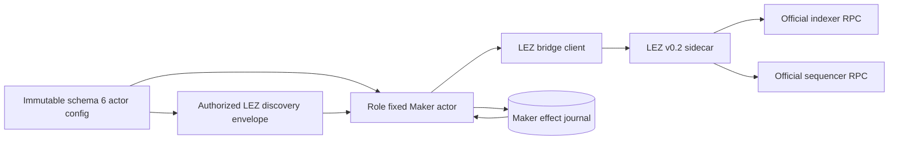
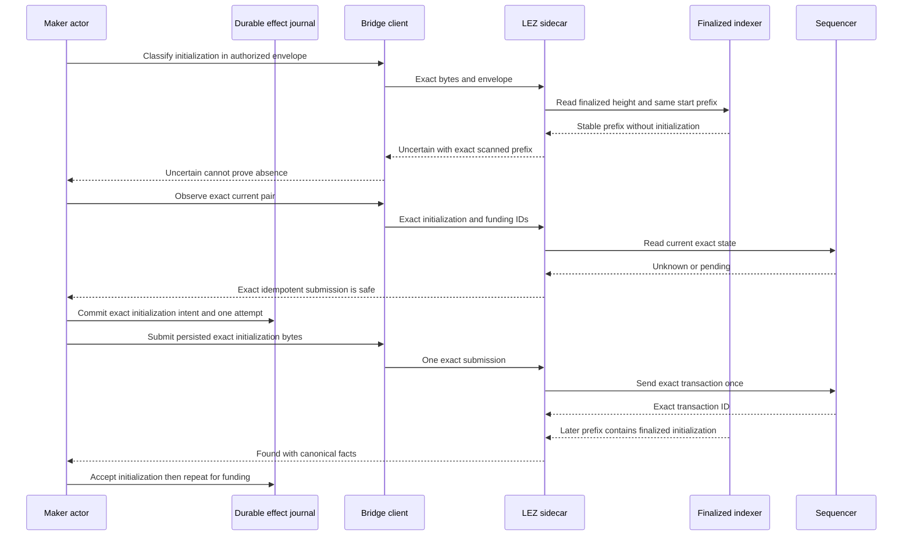

# ADR 0110: Scan immutable LEZ windows as finalized prefixes

- Status: Accepted for the native BTC application classifier boundary
- Date: 2026-07-30
- Milestone: M5 progressive application plane

## Context

ADR 0108 publishes each role-fixed schema-6 actor config once and forbids later
replacement. ADR 0109 therefore gives the native LEZ Maker one immutable
4,096-block discovery range containing both ordered Maker-lock effects. The first
actual-node replay reached the confirmed Bitcoin first lock but then waited for
the configured range end before scanning any LEZ block. That would require
thousands of irrelevant local blocks and would make an immutable authorization
range behave like a mutable polling cursor.

Shrinking or rewriting the published config would invalidate the digest-pinned
application handoff. Treating an incomplete miss as absence would be worse: it
could authorize a duplicate effect or a recovery action before all configured
history existed.

## Decision

The schema-6 discovery range is an immutable authorization envelope. On each
read-only request, the v0.2 sidecar derives the same-start prefix ending at the
smaller of the envelope end and the current finalized height. It then reuses the
fixed-window reader and independently re-reads the prefix end after decoding and
historical-state validation.

The result rules are asymmetric:

- exact initialization `Found` may be returned from a finalized prefix;
- an initialization miss in a strict prefix is `Uncertain`, never `Absent`;
- exact funding `Found` may be returned from a finalized prefix;
- a funding miss in a strict prefix is `Uncertain`, never `Absent`; and
- either `Absent` outcome requires the complete authorized range.

The client independently requires the reported scan to begin at the authorized
start, end no later than the authorized end and finalized clock, and contain any
returned transaction facts. It rejects every strict-prefix `Absent` response.
Forward finality advancement is safe when the independently re-read prefix end
is unchanged; scanned-end identity drift, regression, malformed history, or
transport uncertainty remains fail-closed.

## Native Maker-lock flow

## Atomicity argument

This decision does not claim a distributed transaction across Bitcoin and LEZ.
It preserves the narrower atomic authorities required by the swap protocol:

1. The accepted config bytes, digest, role, runtime, prepared transaction bytes,
   and 4,096-block envelope never change after no-clobber publication.
2. A strict prefix can prove only exact positive evidence or uncertainty. It can
   never create absence authority.
3. Current `UnknownOrPending` does not assert absence. It permits only the exact
   durable idempotent transaction already owned by the actor, after the effect
   journal has consumed the one-attempt authority.
4. Canonical progress requires the same exact transaction in independently
   re-read finalized history, with decoded signer, instruction, accounts, and
   historical custody state all bound to the agreement.
5. Initialization must become canonical before funding is eligible. Secret
   reveal remains downstream of the complete Maker-lock pair.

A crash before the journal commit leaves no send authority consumed. A crash
after commit replays the exact intent without inventing a second attempt. A
moving or malformed scanned endpoint yields no progress and no absence.

## Consequences

- Local and public runtimes use the same config; changing endpoints remains a
  deployment configuration change rather than a different actor protocol.
- Local tests no longer mine thousands of irrelevant blocks merely to fill an
  authorization envelope.
- Tests cover prefix `Found`, prefix initialization `Uncertain`, prefix funding
  `Uncertain`, forbidden prefix `Absent`, forward finality, and scanned-end
  drift. The exact isolated BTC application replay remains the runtime gate.
- Prefix results are an additive protocol capability that requires coordinated
  sidecar/client rollout. An older client rejects the changed response shape,
  which is a safe availability failure rather than an atomicity failure.
