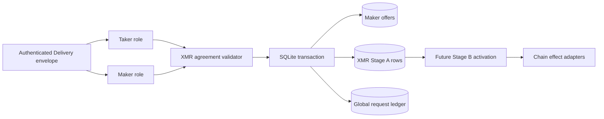
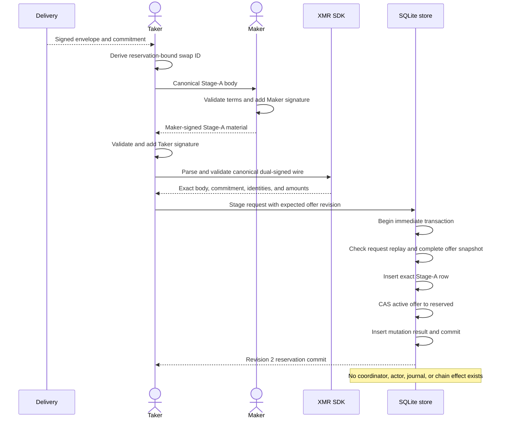
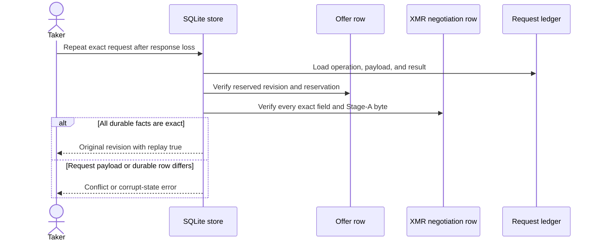

# ADR 0111: Reserve dual-signed XMR Stage A before activation

- Status: Accepted for the schema-v20 store boundary
- Date: 2026-07-30
- Milestone: M5 progressive application plane

## Context

The M4 XMR protocol already validates a canonical Stage-A agreement, separate
Maker and Taker signatures, cross-curve proofs, shared Monero address, exact
amounts, LEZ authorities, and recovery windows. It also deliberately withholds
every LEZ initialization plan until both roles complete the separate Stage-B
activation. M5 therefore cannot reuse the BTC rule that a final pair agreement
immediately creates an executable coordinator and scheduled actor.

An application reservation still needs one crash-safe linearization point. A
Delivery offer must have one winner, the chosen quote must match the signed XMR
agreement exactly, and a retry after a lost response must recover the same bytes
without granting any chain-effect authority.

## Decision

Add an XMR-specific Stage-A negotiation row to the maker SQLite store. The
public candidate retains the winning reservation, authenticated Delivery
commitment, selected piconero and LEZ amounts, trusted reservation time, and the
exact canonical dual-signed Stage-A wire. It does not expose a derived Debug
view of the potentially large agreement wire.

The application swap ID is derived with a pair-specific domain from the exact
Delivery commitment and reservation ID. Both peers can compute it before
signing; the store accepts the agreement only when its signed binary swap ID is
byte-identical to that result.

The expensive SDK validation and canonical re-encoding occur before acquiring
the SQLite write transaction. One `BEGIN IMMEDIATE` transaction then verifies
global request replay, validates the active Monero and LEZ-first offer snapshot,
inserts the Stage-A row, compare-and-swaps the offer to `reserved`, persists the
mutation result, and commits. Exact replay rechecks the complete negotiation and
offer rows rather than trusting the mutation ledger alone.

Stage A does not consume the offer, create a swap coordinator, register an
actor, write an effect journal, or call a chain adapter. Only a later validated
Stage B may cross that executable-authority boundary.

## Components

The final edge is intentionally outside this ADR. There is no edge from the
Stage-A transaction directly to an effect adapter.

## Fresh reservation flow

## Lost-response replay and conflict flow

## Atomicity argument

This decision does not claim a distributed atomic transaction across Delivery,
SQLite, Monero, and LEZ. It establishes the narrower pre-effect invariant needed
for safe application composition:

1. Both role signatures cover the same swap ID, amounts, identities, chain
   profiles, adaptor contexts, and recovery windows.
2. The swap ID covers the authenticated Delivery commitment and the winning
   reservation, so a valid Stage A cannot be moved to another offer or winner.
3. The no-rounding quote check binds the signed piconero and LEZ principals to
   the immutable offer snapshot.
4. The Stage-A insert, active-to-reserved offer CAS, and global request result
   either commit together or roll back together.
5. A concurrent second winner sees a non-active offer or stale revision and
   cannot publish another Stage-A row.
6. Exact replay verifies both the ledger and durable rows; deletion, corruption,
   or changed bytes fail closed.
7. Stage A creates no coordinator, actor, effect journal, signing capability, or
   chain call. A crash before Stage B therefore leaves only resumable negotiated
   data, never partially executable authority.

## Runtime resources and flakiness

The store boundary uses only owner-local files and SQLite. Its tests use
deterministic agreement fixtures and temporary databases. They start no Docker
project, Monero daemon, LEZ service, RPC endpoint, faucet, peer, DNS lookup, or
public network and spend no funds. DLEQ fixture generation costs local CPU but
has no timing or network dependency. Actual-node behavior remains a separate
M5 Stage-B and application-runner proof.

## Consequences

- Schema v20 adds the strict XMR Stage-A table and teaches the global mutation
  ledger the `xmr_negotiation_stage` operation while preserving schema-v19
  requests.
- The existing generic offer-consume route must reject an offer with any staged
  ZEC, BTC, or XMR negotiation, preventing a bypass around pair validation.
- Maker-node Chat, Taker role provisioning, Stage-B activation, scheduler kind,
  and local Monero plus LEZ execution remain explicit subsequent slices.
- Production Logos Delivery and Core integration is not required for this local
  deterministic boundary and remains tracked separately.
