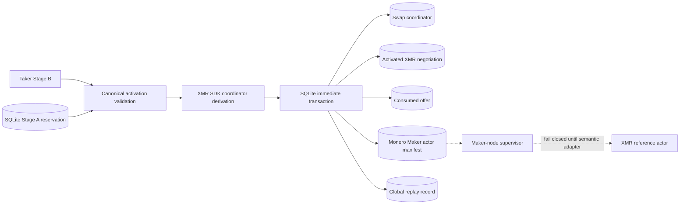
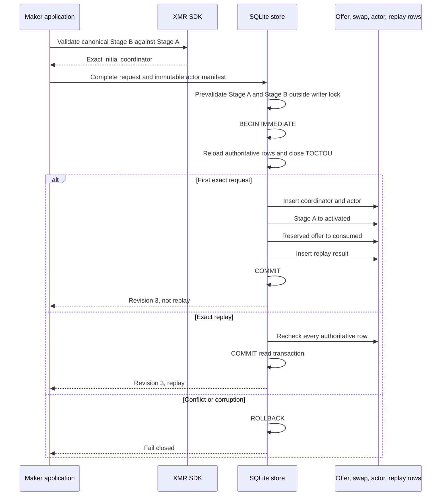
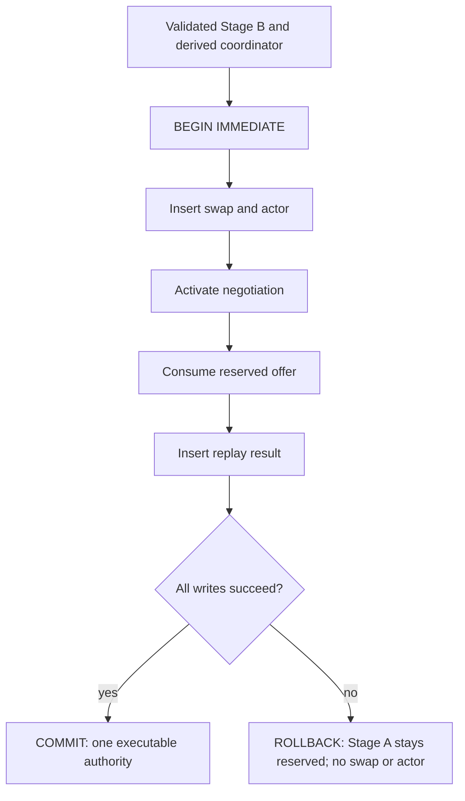

# ADR 0112: Activate XMR Stage B atomically

- Status: Accepted for the M5 application store boundary
- Date: 2026-07-30
- Milestone: M5 progressive local-functional PoC

## Context

ADR 0111 deliberately stops after canonical dual-signed Stage A reserves one
authenticated Monero offer. Stage A contains the principals, roles, direction,
recovery windows, DLEQ material, and messages, but it does not contain the
countersigned adaptor-session activation and therefore cannot create chain
effect authority.

Stage B is the first executable application boundary. A crash between offer
consumption, coordinator creation, and Maker actor registration would otherwise
either strand a reserved offer or expose an actor that is not represented by
the durable application state.

## Decision

1. Only a canonical `XmrActivatedAgreementV1` bound to the exact durable Stage A
   may derive the initial coordinator. Stage A exposes no equivalent method.
2. The SDK derives the coordinator ID as the lowercase 64-hex signed swap ID,
   fixes `Monero` plus `TakerSellsLez`, uses the signed LEZ finality policy for
   the Taker, the signed Monero confirmation policy for the Maker, and the
   canonical LEZ refund event for recovery.
3. The Maker acceptance validates canonical Stage-B bytes, the Stage-A binding,
   the SDK-derived coordinator, Maker role, and trusted acceptance time before
   the SQLite writer lock. Acceptance at the signed whole-second Maker funding
   cutoff is allowed; a later acceptance fails closed.
4. The public advertisement TTL is not reapplied after Stage A has atomically
   reserved the offer. The signed protocol cutoff governs Stage B. This prevents
   a live countersigned negotiation from racing public-listing expiry.
5. One `BEGIN IMMEDIATE` transaction inserts the coordinator, registers one
   immutable `Monero` Maker actor, changes the XMR row to `activated`, consumes
   the reserved offer, and records the global replay result.
6. Exact replay binds the immutable acceptance timestamp and actor manifest,
   reloads canonical Stage A, decodes the complete offer, rechecks route, quote,
   reservation, activation, coordinator, and actor rows, and returns the
   original revision. `actor_not_before` remains a replay-insensitive scheduling
   hint because it cannot alter an already registered immutable actor.
7. Schema 20 to 21 widens actor kind checks to `monero` while explicitly copying
   process, manual-action, and progress rows. Maker-node may inspect the new kind
   but fails closed before spawn until the semantic XMR actor adapter is added.

## Components

No node, RPC, Docker service, faucet, DNS lookup, public network, or chain funds
participate in this component slice.

## Commit and replay flow

## Atomicity argument

SQLite atomicity makes the local authority transition indivisible. It does not
make two chains one distributed transaction. Cross-chain conditional atomicity
still comes from the signed LEZ-first protocol: Stage B precommits the claim and
refund sessions, the Taker locks LEZ first, the Maker funds Monero only after
the exact finalized LEZ condition, and canonical claim or refund revelation
releases the corresponding spend-key share.

The store can validate Stage A publicly. Fully decoding Stage B requires the
role-private Monero view key, so ordinary read-only row loading shape-checks the
activation fields while completion and replay require the caller's already
validated acceptance. The immutable actor owns the private material and must
revalidate the exact Stage-A and Stage-B wires before any chain effect.

## Consequences and remaining work

- Forced failure at the final mutation insert rolls back the coordinator, actor,
  activated negotiation, and consumed offer together.
- Restart and exact replay preserve one coordinator and one actor.
- Corrupted Stage A, offer route, quote, activation, coordinator, or actor state
  cannot produce a successful replay.
- The next slice is a real daemon and Taker CLI handoff that provisions separate
  Maker and Taker XMR role bundles without accepting role-private authority from
  the peer.
- Semantic supervisor execution and actual isolated Monero plus LEZ replay remain
  separate gates; enabling the enum alone is intentionally insufficient.
