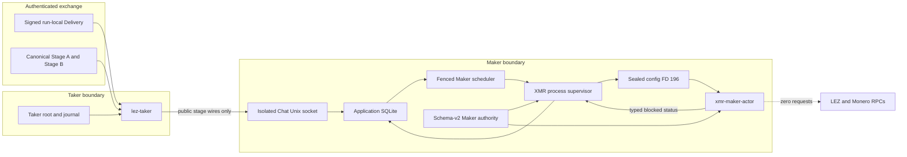
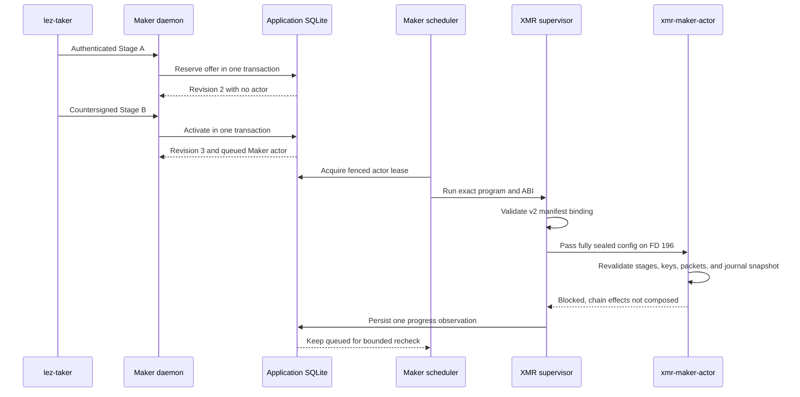
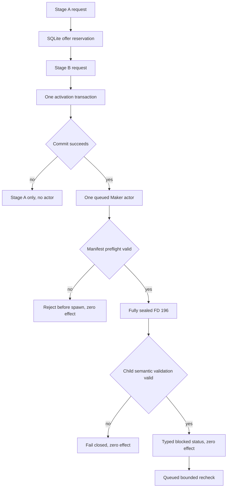

# ADR 0113: Hand off XMR stage material without crossing role authority

- Status: Accepted and pre-effect supervisor GREEN for M5
- Date: 2026-07-30
- Milestone: M5 progressive local-functional PoC

## Context

ADR 0112 makes Stage-B activation one atomic application-store transition, but
its component tests call the store directly. M5 also needs the path an actual
operator uses: authenticated offer discovery in `lez-taker`, an isolated Chat
socket on `lez-maker-daemon`, and separate Maker and Taker role material.

The existing M4 processes already produce canonical dual-signed Stage A,
canonical dual-signed Stage B, separate public role packets, and separate
role-local adaptor journals. Reimplementing that cryptography inside Chat would
duplicate a proven wheel and would expand the daemon's custody. The first M5
application PoC therefore consumes those reproducible artifacts while retaining
their role boundary.

The later M5 process slice now also reaches the normal Maker scheduler. Its
scope is intentionally pre-effect: it proves that the queued Maker actor is
started with immutable role authority, semantically revalidates that authority
inside the child process, and reports a typed blocked status without contacting
LEZ or Monero RPCs. It does not claim that the application corridor has opened
or that either chain has received an effect.

## Decision

1. The Taker discovers and authenticates a signed run-local Delivery offer,
   validates the exact `Monero` plus `TakerSellsLez` route and no-rounding quote,
   and derives the public swap ID from the offer commitment and reservation.
2. Chat accepts only the signed Delivery envelope, reservation, public
   principal, and canonical public Stage-A or Stage-B wire. Private roots,
   signing keys, Monero shares, the shared view-key file, adaptor journals, and
   the unpublished Taker claim partial never cross Chat.
3. The Maker daemon starts with a bounded registry of Maker-only authority. It
   pins the Maker agreement identity, private Monero view key, and immutable
   actor manifest for each derived swap ID. The Taker cannot supply any of
   those paths through an RPC request.
4. Stage A authenticates Delivery and rederives the route, quote, swap ID,
   agreement identity, and shared-view public key before reserving the offer.
   An exact durable replay remains valid after public advertisement expiry;
   only a fresh reservation applies the half-open Delivery TTL.
5. Stage B reloads Stage A from SQLite, validates the activation with the
   daemon-owned private view key, derives the coordinator in the XMR SDK,
   selects the daemon-owned actor manifest by that derived ID, and invokes the
   single transaction defined by ADR 0112.
6. Each role publishes a no-clobber application bundle. It copies only the
   canonical public stage wires and stores a role-fixed manifest containing
   digests of the original private root, role packet pair, view-key material,
   and role journal. Private authority and the journal remain at their original
   owner-only paths rather than being duplicated.
7. The Taker publishes its digest-bound acceptance receipt only after the Maker
   returns a durable Stage-B commit. Exact replay revalidates all sources,
   preserves published inodes, needs no Delivery advertisement, and creates no
   second coordinator or actor.
8. Owner-control RPC keeps its smaller request bound. The isolated Chat service
   has a separate bounded body limit large enough for the SDK's canonical XMR
   wire maxima plus JSON encoding overhead.

9. The role application manifest is schema v2. It pins the exact absolute
   application-bundle Stage-A and Stage-B paths and their digests, the source
   private manifest and view-key digests, both public role packets, and the
   external role journal. The published stages must be the exact
   `shared/stage-a-v1.borsh` and `shared/stage-b-v1.borsh` pair outside the
   private source root.
10. Before spawn, the supervisor validates canonical manifest bytes against the
    scheduled swap ID and role-local state database. It pins the exact
    `xmr-maker-actor` program identity and `lez_maker_xmr_pre_effect_v1` ABI,
    copies the bounded manifest into an anonymous memfd, applies all four
    required seals, and passes it only as descriptor 196.
11. The child accepts no other config descriptor. It securely rereads and
    digest-checks every referenced authority file, revalidates canonical Stage
    A and Stage B as Maker, and validates an immutable copy of the SQLite role
    journal against the signed claim and refund transcripts. The returned
    authority retains that snapshot privately and zeroizes transient view-key
    bytes.
12. This ABI truthfully reports that XMR chain effects are not yet composed.
    The supervisor records a typed blocked observation and leaves the actor
    queued; it creates no manual action, backoff failure, or public effect.

## Components and authority

The apparent public exchange does not imply public networking in the local
PoC. Delivery is a signed run-local directory and Chat is an owner-controlled
Unix socket. The dotted chain edge is a denied or future boundary, not current
I/O: the verified pre-effect process makes zero LEZ and Monero RPC requests.

## Process and replay flow

Exact Chat replay after Delivery removal still returns the original revision 3
without replacing bundle bytes or inodes. Exact supervisor re-observation does
not spin: the blocked result remains queued under the normal bounded recheck.

## Why the handoff remains atomic and fail closed

Local atomicity is the indivisible Stage-B SQLite commit. Filesystem publication
does not participate in that transaction: Maker actor material must already be
present and digest-pinned, and a Taker receipt is only an owner-local projection
published after the commit. A crash before the commit exposes no executable
coordinator; a crash after it is recovered through exact completion replay.

The process handoff adds no distributed commit. The supervisor preflight and
child semantic validation are fail-closed gates after the durable Stage-B
commit: rejecting a path, digest, seal, role, transcript, or journal sidecar can
never create a chain effect. A successful pre-effect run also creates no chain
effect; it persists one typed blocked observation and retains the queued actor.

This still is not a distributed transaction across LEZ and Monero. Cross-chain
conditional atomicity comes from the signed protocol: Stage B fixes the claim
and refund sessions, LEZ locks first, Monero funding is admitted only after the
exact finalized LEZ condition, and the successful or timeout branch reveals
only the share needed by its corresponding spend.

## Consequences and remaining work

- The first process slice reuses actual M4 role processes and does not yet turn
  Chat into an interactive nonce or partial-signature exchange.
- Both roles intentionally retain the shared Monero view key established by the
  M4 provisioning handoff; spend and agreement keys remain role-private.
- Canonical Stage A can exceed the owner-control RPC body limit, so Chat and
  control listeners must not share the same size policy.
- The schema-v2 semantic pre-effect supervisor is GREEN. The next corridor gate
  is composing actual isolated LEZ and Monero RPC effects behind the validated
  authority; this ADR does not claim those effects or M5 certification.
