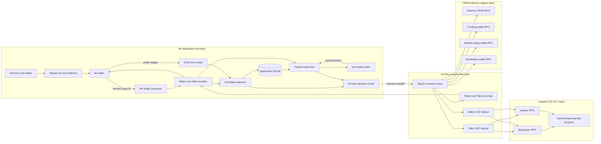
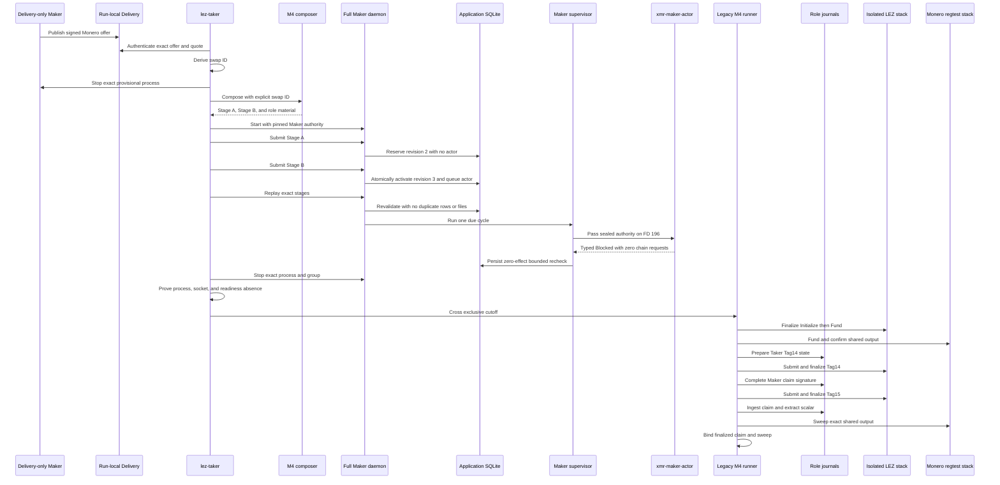
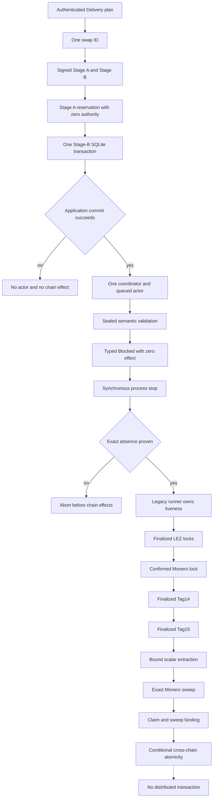

# ADR 0114: Compose the XMR application before chain effects

- Status: Proposed and in progress
- Date: 2026-07-30
- Milestone: M5 progressive local-functional PoC

## Context

ADR 0113 proves the pre-effect XMR application boundary in component and
process tests. Authenticated Delivery determines the swap ID, Chat atomically
activates canonical Stage A and Stage B in application SQLite, and a sealed
Maker child semantically validates role authority before returning typed
`Blocked`. That child contacts neither chain.

The actual M5 splice must connect that application path to the existing M4
Tag13 through Tag15 claim path without creating a second swap identity or two
concurrent effect owners. M4 role journals necessarily advance during Tag14,
Tag15, extraction, and sweep. Schema-v2 application authority pins their raw
pre-effect bytes, so the application supervisor must finish and stop before
legacy journal progression begins.

This record defines the intended composition and evidence boundary. Actual
isolated execution and evidence remain pending. This decision is not GREEN.

## Decision

1. A Delivery-only Maker publishes one signed run-local `Monero` plus
   `TakerSellsLez` offer. `lez-taker` authenticates the exact offer, reservation,
   principal, and no-rounding quote, then derives the public swap ID from the
   signed-envelope commitment and reservation ID.
2. That Delivery-derived swap ID is passed explicitly to the M4 agreement
   composer. Its receipt, decoded Stage A, Stage B, both role bundles, and all
   later receipts must bind the exact same lowercase 32-byte identifier.
   Format-only validation is insufficient.
3. The Delivery-only process stops by exact identity before the full Maker
   application starts. The full daemon receives daemon-owned Maker agreement
   identity, private view authority, and a registry entry pinning the Maker
   schema-v2 manifest, role journal, and `xmr-maker-actor` binary.
4. Maker and Taker bundles are provisioned from the same canonical stages while
   retaining role-correct private roots, packet ordering, journals, stage
   paths, and source digests. The Taker publishes its acceptance receipt only
   after durable activation.
5. Stage A reserves revision 2 without a coordinator, actor, or chain effect.
   One Stage-B SQLite transaction commits revision 3, consumes the offer,
   creates one coordinator, registers one queued Monero Maker actor, and records
   replay. Exact replay preserves those cardinalities and published inodes.
6. Before any legacy journal access, the normal supervisor executes one bounded
   due cycle. The sealed child returns typed `Blocked`, remains queued without a
   child identity or manual action, records
   `xmr_chain_effects_not_yet_composed`, and creates no RPC or public effect.
7. The full daemon and supervisor then stop synchronously using registered PID,
   start ticks, binary digest, and process-group identity. Process and group
   absence, Chat-socket and readiness-file absence, application state, and both
   pre-effect journal digests are checked. Only this durable cutoff permits
   chain effects.
8. After the cutoff, the legacy actual-chain path owns liveness and advances
   the same signed swap in this exact order: finalized LEZ Initialize, finalized
   LEZ Fund, confirmed Monero lock, prepared and finalized Tag14 authorization,
   Maker journal completion, finalized Tag15 claim, Taker ingestion and
   adaptor-scalar extraction, Monero sweep, and exact claim-to-sweep binding.
9. The original schema-v2 supervisor is not restarted after a legacy journal
   changes. Its raw-journal digest is a pre-effect authorization snapshot and
   reuse must fail closed. A future application-owned corridor needs a new
   versioned authority projection.
10. Every application process and ephemeral path enters the exact run ledger
    immediately. The in-flow cutoff does not rely on EXIT cleanup. The prior
    cleanup-reset hazard that cleared accumulated failures before final
    evaluation is addressed in source but remains unverified pending an actual
    run and cleanup evidence.

## Components, nodes, and RPC topology

Delivery and Chat are filesystem and Unix-socket transports. LEZ uses isolated
v0.2 sequencer and indexer RPCs plus authenticated role sidecars. Monero uses
an isolated official regtest daemon and authenticated wallet RPCs for funding,
shared-output observation, and destination receipt. Test funds are deterministic
local genesis or regtest funds. No public RPC, faucet, DNS lookup, deployment,
or external finality provider participates. Local process and Docker startup,
block production, wallet synchronization, and bounded finality polling can
still vary with host load and must appear in phase evidence.

## End-to-end sequence

The first legacy journal access occurs only after process absence. Canonical
stages, application bundles, and acceptance receipts remain immutable while
the source journals perform their expected protocol transitions.

## Atomicity and cutoff argument

Application atomicity completes before supervision. The Stage-B transaction
commits the negotiation, consumed offer, coordinator, actor, and replay row
together or commits none. The supervisor is a post-commit authorization check.
Its typed blocked child cannot submit chain effects, so stopping it cannot leave
a partial submission or weaken the durable application commit. The cutoff
transfers liveness, not safety.

Cross-chain atomicity is conditional, not transactional. Signed stages bind the
LEZ-first ordering and adaptor transcripts. Finalized LEZ funding gates Monero
funding, confirmed Monero funding gates Tag14, finalized Tag14 gates Maker
completion, and finalized Tag15 exposes the signature needed to recover the
checked Maker scalar and sweep Monero. Each gate has independent replay-bound
evidence.

There is no distributed transaction among application SQLite, journal SQLite,
LEZ, and Monero. The cutoff prevents concurrent effect ownership. Stopping the
supervisor can reduce liveness if the legacy runner never starts, but cannot
authorize a claim, refund, or sweep.

## Pending execution and evidence

This ADR cannot become accepted or GREEN until one isolated run proves:

- plan, composer, decoded stages, bundles, and receipts share one swap ID;
- Stage A has no executable rows and Stage B plus replay retain exactly one
  coordinator and actor without replacing published files;
- both journal bytes and inodes remain unchanged through application replay and
  the typed blocked cycle;
- supervisor status, child absence, bounded recheck, zero effects, zero chain
  RPCs, and the process cutoff are durable evidence rather than log inference;
- Tag13, funding, Tag14, Tag15, extraction, sweep, and binding all succeed for
  the application-derived swap; and
- exact cleanup removes all run-owned resources, preserves unrelated resources,
  and proves the addressed cleanup-reset hazard no longer masks failure.
