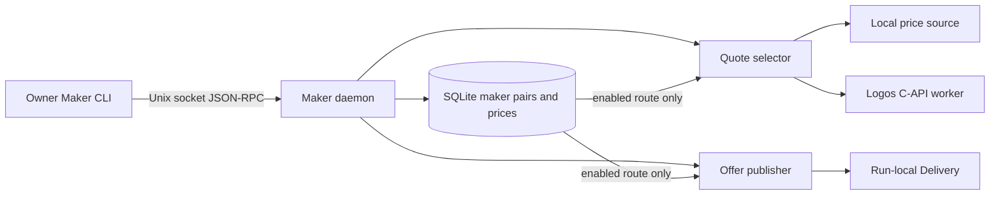
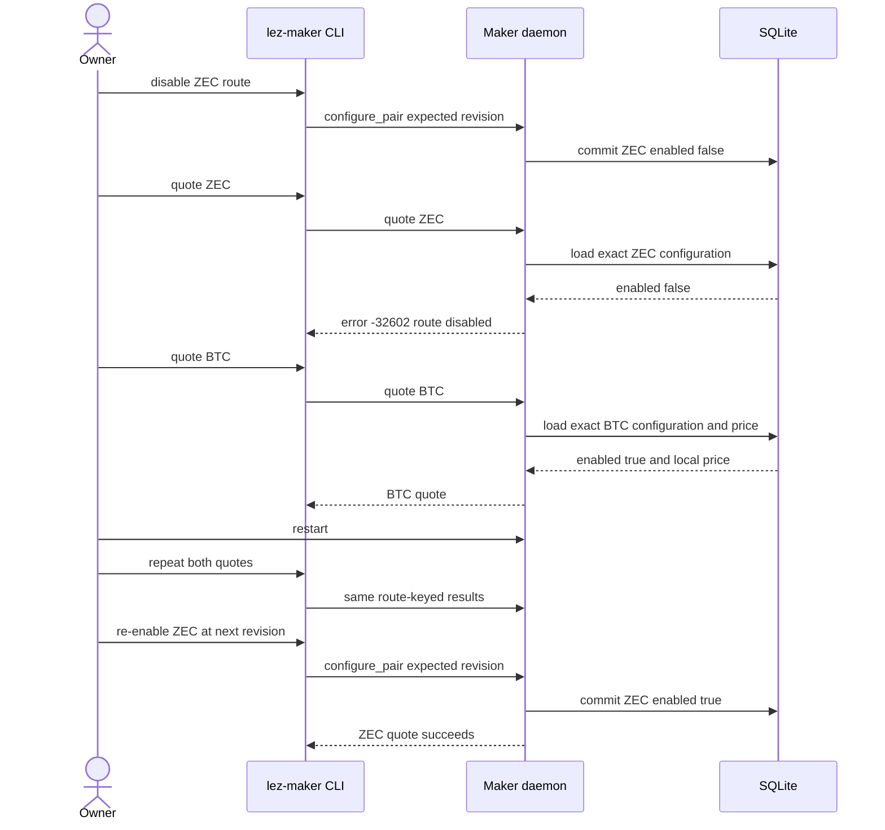
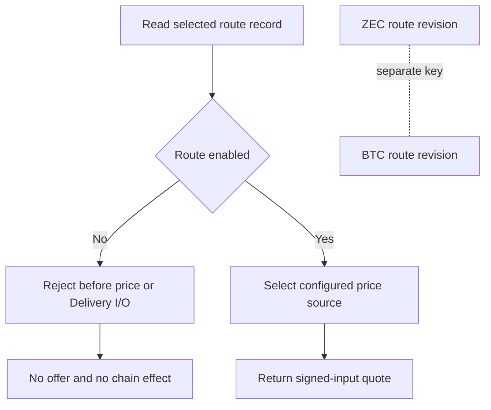

# ADR 0115: Disable only the selected maker route

- Status: Accepted for the explicit M5 local-PoC route-control boundary
- Date: 2026-07-30

## Context

Maker pair configuration already persisted an independent `enabled` flag per
pair and offer publication rejected a disabled route. Quote selection loaded
the same configuration but did not inspect that flag, so an operator could
disable Zcash publication while the owner CLI still returned a Zcash quote.
That contradicted the control surface and weakened the first executable part of
RFP-003 R3. Automatic node-health detection is a separate, still-open gate.

## Decision

Quote selection must fail with the existing stable invalid-request result
`-32602: maker route is disabled` before invoking either local or Logos C-API
pricing whenever the selected route is disabled. Publication retains its store
guard. The configuration is route-keyed, so disabling Zcash must not change an
enabled Bitcoin route. Restart must preserve both decisions, and a revisioned
operator update may re-enable the selected route.

## User-flow sequence

## Atomicity and isolation argument

This change creates no chain effect and therefore does not claim cross-chain
atomicity. Its safety property is local authorization consistency: every quote
reads one committed route record under the existing store mutex, and a disabled
record returns before price-source I/O. Offer publication independently checks
the same committed route in its transaction. Pair keys isolate configuration,
so a Zcash update cannot mutate Bitcoin state.

The black-box operator journey proves disabled Zcash quote and publication
rejection, unaffected Bitcoin quote success, restart durability, and revisioned
Zcash re-enable. It does not prove automatic detection of a missing RPC, active
offer withdrawal after node loss, mid-negotiation behavior, or an unaffected
pair completing an actual swap while another chain is unavailable. Those are
the remaining R3 composition/hardening gates.

## Consequences

- The owner sees one consistent disabled-route result for quote and publish.
- Disabled local and C-API routes cannot invoke their price source.
- Other pair configuration and pricing remain untouched.
- No new dependency, RPC, port, Docker service, faucet, or public resource is
  introduced.
- Full R3 remains partial until unavailable-node behavior is composed with a
  real unaffected-pair application journey.
