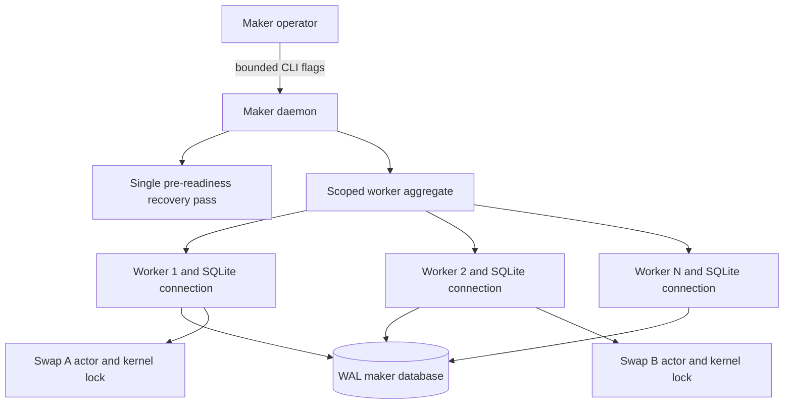
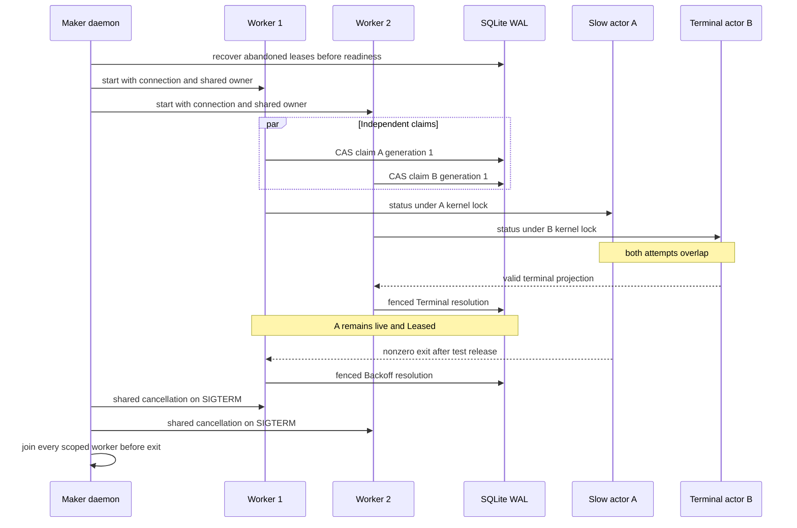
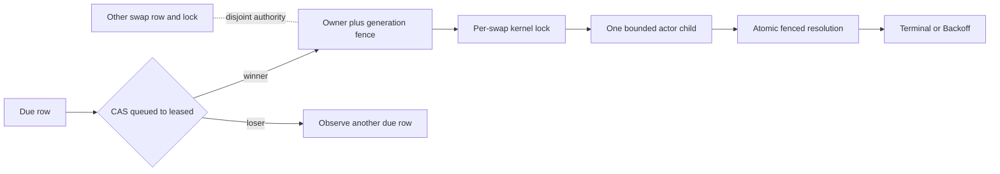

# ADR 0116: Run bounded independent maker workers

- Status: Accepted for the M5 daemon concurrency component
- Date: 2026-07-30

## Context

The maker daemon previously opened one actor-supervisor store connection and ran
one blocking scheduling loop. Two durable actors were isolated, but a slow actor
serialized every peer. RFP-003 R5 requires concurrent swaps with independent
state, escrow, and deadlines; the single loop could not satisfy the application
part of that requirement.

## Decision

Expose `--actor-worker-count` only with `--actor-supervisor`, bounded to 1 through
32 and defaulting to one. Startup performs the existing exhaustive abandoned-
lease recovery once before readiness. The daemon then opens one WAL SQLite
connection per worker, reuses one random daemon lease-owner identity, and runs
exactly that many scoped OS threads under one aggregate blocking task. Each
worker uses the existing per-row CAS, generation fence, per-swap kernel lock,
bounded child process, and shared cancellation signal.

## Overlap and failure sequence

## Atomicity and isolation argument

Concurrency does not create a cross-chain transaction. It preserves local
authority by composing existing independent linearization points:

One worker cannot claim a row already leased by another. An actor child inherits
only its own kernel-lock descriptor; cancellation kills and reaps the exact
process group and clears the fenced child identity before shutdown completes.
One worker exit or panic cancels every peer, and the aggregate joins every thread
before returning. The database remains the durable authority; worker count does
not partition or duplicate state.

## Evidence and limits

The black-box daemon journey proves a terminal actor completes while a disjoint
actor is simultaneously live and leased. Releasing the second actor to a typed
failure moves only it to Backoff. Both retain distinct manifests/state paths,
one attempt and generation, exact child cleanup, responsive owner health,
restart equality, and no new invocation. The deterministic journey passed ten
of ten repetitions in 0.49 to 0.54 seconds with no observed flake.

No chain RPC, Docker service, faucet, DNS, public network, or funds participate.
This closes daemon worker concurrency, not full R5: accepted application
agreements, distinct escrows/deadlines, actual chain effects, arbitrary load,
and crash/reorg stress remain separate gates.
