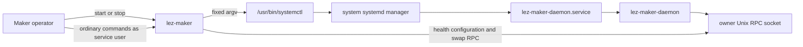
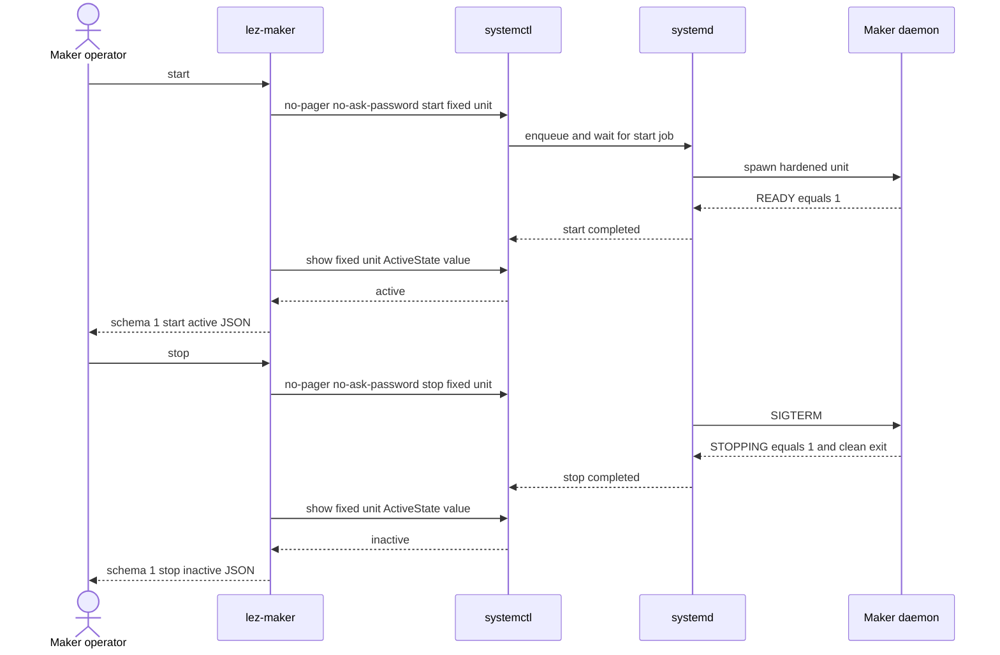
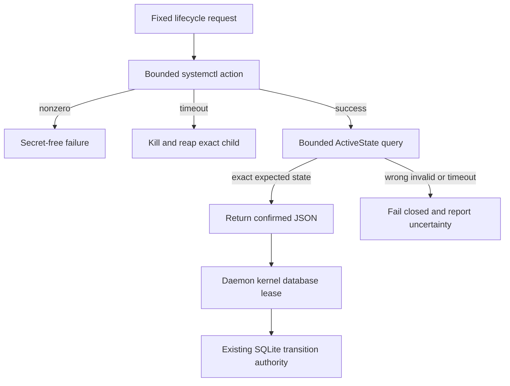

# ADR 0117: Control the fixed Maker system service

- Status: Accepted for the M5 Maker lifecycle-control component
- Date: 2026-07-30
- Milestone: M5

## Context

The packaged daemon and its hardened systemd lifecycle were already executable,
but the literal Maker CLI had no `start` or `stop` commands. Requiring operators
to switch to an unrelated command surface made the accepted F9/U3 output
incomplete. Lifecycle control must not admit a caller-selected unit, shell,
privilege command, daemon socket, or unsupported user-service package.

The repository packages only the system unit
`lez-maker-daemon.service`. The user-systemd test deliberately creates a unique
transient rehearsal unit and is not a product installation path. Therefore the
product CLI exposes only the packaged system service.

## Decision

Add `lez-maker start` and `lez-maker stop`. Both directly execute the fixed
absolute `/usr/bin/systemctl` with `--no-pager`, `--no-ask-password`, the fixed
action, and the fixed unit. The CLI does not accept service scope, unit, socket,
command, or privilege-elevation input for these subcommands.

After a successful action, the adapter runs a second fixed `show` command for
only `ActiveState`. Start requires exactly `active`; stop requires exactly
`inactive`. Both child invocations have a 30-second deadline. Action output and
all stderr are discarded. The state reader retains at most 33 bytes so it can
detect output beyond the 32-byte grammar. A timeout kills and reaps the exact
child and reports that the service state is uncertain.

## Components and authority

Lifecycle and operational authority stay separate. Start and stop never use the
Maker RPC socket. All configuration, offer, swap, monitor, claim, and refund
commands continue through the owner-only socket.

## Start and stop sequence

## Failure and atomicity argument

This is not a distributed transaction and submits no chain effect. systemd
actions are idempotent for the fixed unit, but an action or query timeout can
occur after systemd accepted the job. The CLI therefore does not claim the
opposite state; the operator may repeat the same action or inspect the fixed
unit through the host's audited administration boundary. The daemon's kernel
database lease prevents a repeated start from creating two writers, while each
swap retains its existing SQLite, generation-fence, kernel-lock, and effect-
journal linearization points.

## Privilege, isolation, and external resources

The CLI contains no `sudo`, PolicyKit rule, shell, or other elevation mechanism.
The caller must already have host authorization to manage the packaged unit.
`--no-ask-password` makes missing authorization fail rather than prompting in
an automation context. Ordinary owner RPC still runs as the dedicated
`lez-swap` service user unless the operator installs a separately audited access
policy.

Focused tests inject the systemctl runner and never start, stop, or inspect the
host unit. They prove exact argument vectors, output modes, JSON, action/query
failure, timeout mapping, state grammar, postconditions, and redaction. The
existing staged install and uniquely named transient user-systemd rehearsals
remain the executable package/readiness/crash evidence without clashing with a
real deployment.

No chain node, chain RPC, Docker service, port, faucet, funds, DNS, public
network, price feed, Delivery service, Chat service, or external finality
participates in the focused slice. It cannot be flaky from block production or
network finality. It can fail when the host lacks `/usr/bin/systemctl`, systemd,
the installed unit, or caller authorization; those are explicit deployment
preconditions.

## Consequences

- Literal Maker start/stop is available on the same operator CLI.
- The only target is the repository-packaged system unit.
- A confirmed response is tied to exact post-action `ActiveState`.
- Timeout and malformed-state paths fail closed without exposing subprocess
  output.
- This closes the service-control sub-gap, not all of F9/U3 or the M5 milestone.
