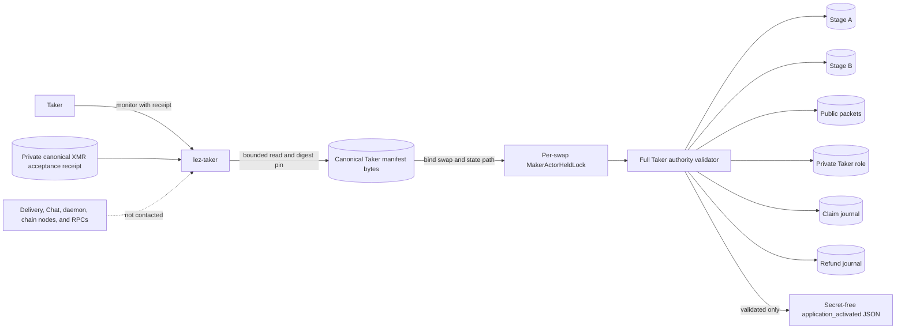
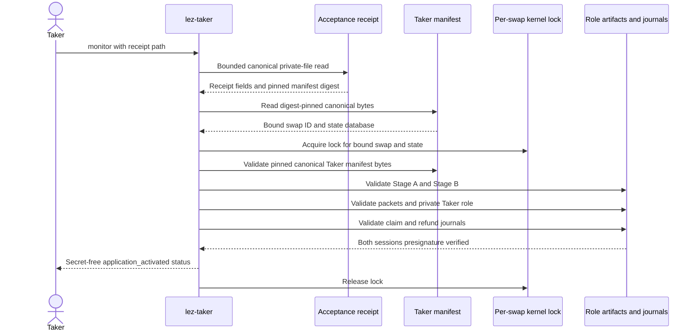
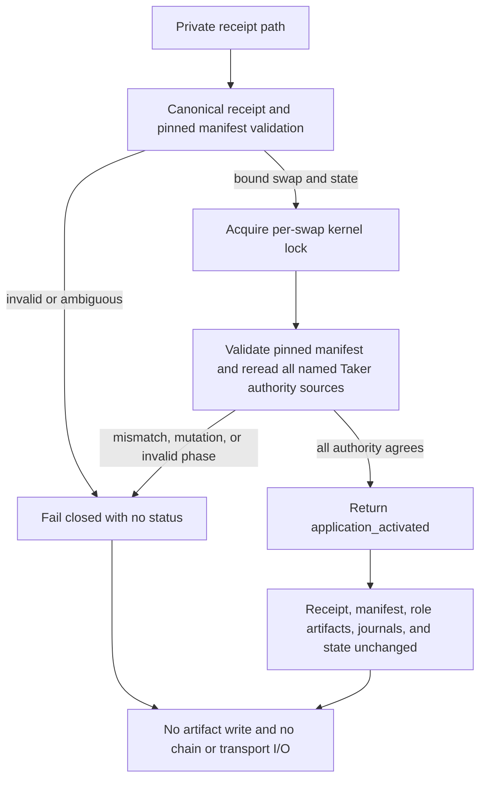

# ADR 0118: Monitor XMR Taker application state without chain authority

- Status: Accepted for the M5 XMR Taker receipt-only monitor
- Date: 2026-07-30
- Milestone: M5

## Context

XMR application acceptance already publishes an owner-private canonical receipt
after the Maker commits Stage B. The Taker CLI still lacked an offline command
that could prove which accepted application that receipt names. Reusing Maker
actor status would be dishonest: the Taker receipt names different role
authority, and the application handoff does not prove that either chain has
advanced.

The monitor must select the same per-swap lock as effect-capable actor work
without trusting an unvalidated state path. It must then validate the complete
Taker authority while that lock is held. Monitoring must not require Delivery,
Chat, a daemon, a chain node, an RPC, or any signing capability.

## Decision

`lez-taker monitor --receipt` accepts only the private canonical XMR acceptance
receipt. Before acquiring a lock, it performs a bounded canonical receipt read
and a digest-pinned canonical Taker-manifest byte validation. That validation
binds the exact swap ID and state-database path used to select the
`MakerActorHeldLock`.

With the per-swap kernel lock held, the command fully validates the pinned
canonical Taker manifest bytes and securely rereads its Stage A, Stage B,
public-packet, private-role, claim-journal, and refund-journal dependencies. The receipt and manifest must
agree on the swap, state path, stage digests, agreement commitment, and
activation commitment. The Taker claim and refund sessions must both be in the
presignature-verified phase.

Only after that validation succeeds does the command emit a fixed, secret-free
`application_activated` status. The output is an application-authority
statement, not chain progress. XMR `claim` and `refund` remain explicitly
unsupported on this Taker lifecycle surface.

## Components and authority

The receipt selects only one Taker application authority. It does not grant
Maker authority, effect submission, signing, claim, refund, or chain-observation
authority. All referenced artifacts remain owner-private inputs.

## Receipt-only monitor sequence

Delivery and Chat are intentionally absent because acceptance is already
durable. Chain nodes and RPCs are absent because this status does not observe,
submit, or infer any LEZ or Monero effect.

## Failure and atomicity argument

This monitor is read-only and creates no distributed transaction. Its
linearization boundary is the exclusive per-swap kernel lock around full
semantic validation. The pre-lock validation is used only to derive the lock
identity; it cannot authorize the returned status. A concurrent effect-capable
worker for the same swap and state cannot overlap the authoritative validation.
Every failure returns before status and leaves the receipt, manifest, role
artifacts, journals, and actor state unchanged.

The inherited secure-file readers pin and compare the reopened files, but a
path that is replaced away and later restored can still present a residual
reopen/final-equality ABA-hardening concern. Eliminating that concern with a
stronger directory or file-descriptor authority model remains production
hardening. It is not a PoC blocker because the monitor is read-only, performs
the complete semantic validation under the per-swap lock, and grants no effect
authority.

## Consequences

- A Taker can reproduce accepted XMR application status from its private
  receipt without a live Maker service.
- Status is bound to canonical Taker authority rather than a Maker actor
  projection.
- Monitoring introduces no Delivery, Chat, node, RPC, signing, or chain
  dependency and therefore no network-finality flakiness.
- The result proves application activation and verified presignature sessions
  only; it says nothing about chain funding, claim, refund, or completion.
- Effect-capable XMR Taker claim and refund composition remains later work.
