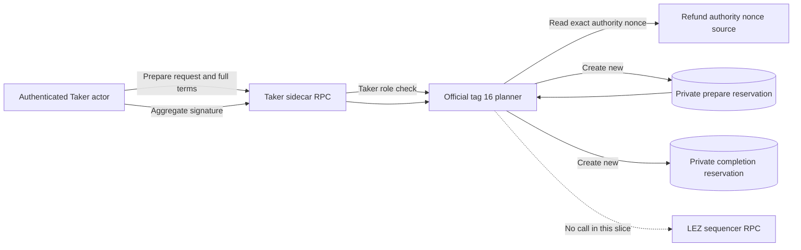
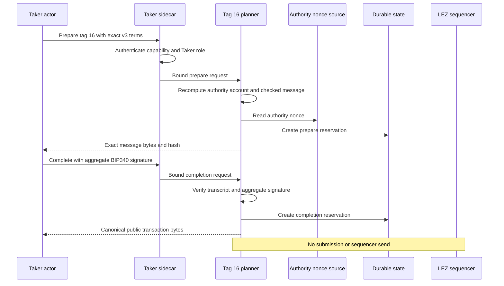
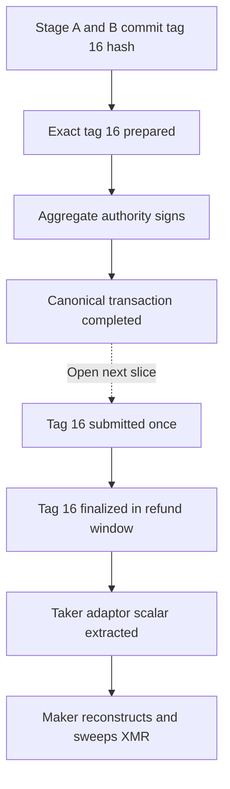

# ADR 0119: Prepare tag 16 without submission

- Status: Accepted for the M5 component boundary
- Date: 2026-07-30
- Milestone: M5 progressive local-functional PoC

## Context

The checked LEZ v0.2 guest, additive protocol, and generated client already
define native-XMR tag 16. The sidecar server previously returned `Unavailable`
for both refund preparation and completion, so a Taker actor could not obtain
the exact canonical aggregate-authority transaction. Reusing the tag-15 state
or generic submission route would alias independent effects and weaken
one-attempt ownership.

This slice enables only composition. It does not submit tag 16, classify a
finalized refund, extract the revealed Taker scalar, reconstruct the shared
Monero key, or sweep a refund to Maker.

## Decision

1. Only the authenticated Taker sidecar may prepare and complete tag 16.
2. Preparation rederives the checked guest message from the complete v3 terms:
   metadata, custody, depositor, refund-authority accounts; the authority
   nonce; and `RefundNativeXmr` with the exact swap ID.
3. The refund authority account must equal the account derived from the
   committed aggregate BIP340 public key.
4. Preparation and completion use independent create-new durable files. Exact
   replay returns identical bytes; a different request conflicts. One sidecar state directory intentionally owns one swap; concurrent swaps use distinct actor processes and state directories.
5. Completion accepts only the committed prepared transcript and a valid
   aggregate signature, then retains one canonical public transaction.
6. Startup restores preparation before completion from existing state only. It
   never regenerates a nonce or recreates a missing completion.
7. Neither method submits to the sequencer. Generic submission remains
   fail-closed, and tag 17 remains unavailable.

## Components and trust boundaries

The actor and sidecar capability are owner-private. Durable files are separate
from tag 15 and from submission state. Public transaction bytes contain no
private scalar.

## Preparation and completion flow

## Conditional atomicity boundary

This component prevents the sidecar from inventing or mutating the recovery
message, but completion alone is not a refund and proves no cross-chain
atomicity. Conditional refund atomicity requires one-attempt submission,
canonical finalized classification within `[refund_at, punish_at)`, extraction
of the precommitted adaptor scalar, checked spend-key reconstruction, and a real
