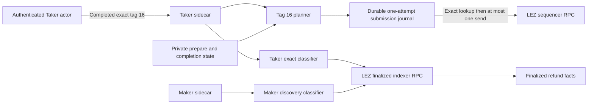
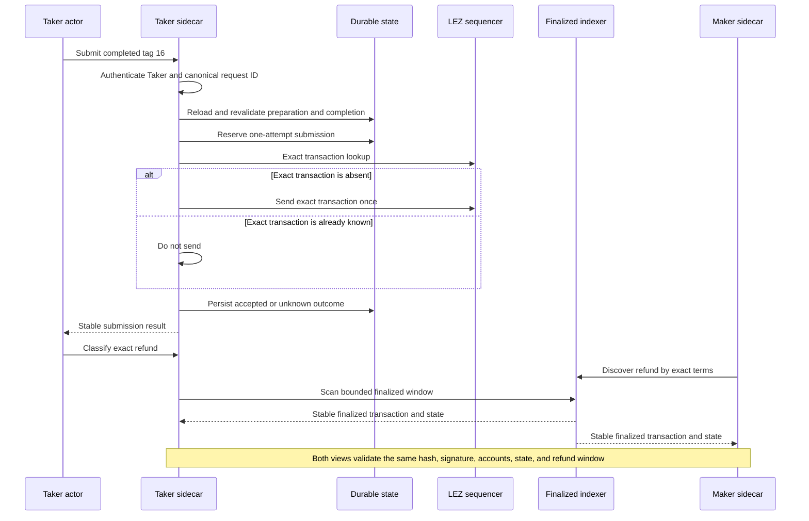
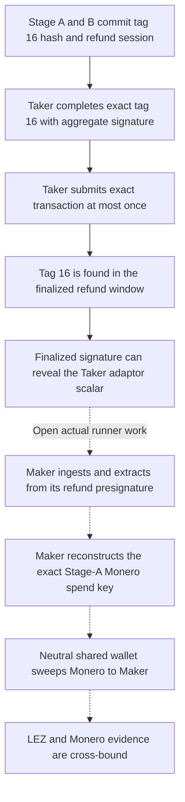

# ADR 0120: Submit and classify tag 16 once

- Status: Accepted for the M5 component checkpoint
- Date: 2026-07-30
- Milestone: M5 progressive local-functional PoC

## Context

ADR 0119 made the exact generated native-XMR tag 16 message durably
preparable and completable under authenticated Taker authority, but deliberately
left submission and finalized observation closed. The next safe boundary must
admit only those already completed bytes, preserve the existing one-attempt
submission policy across restart, and let each role classify the same finalized
refund without turning observation into authority.

This checkpoint is component-tested with authenticated sidecars, a controlled
sequencer, and finalized-indexer fixtures. It is not an actual local-devnet
refund run. Maker ingestion of the finalized aggregate signature, extraction of
the Taker adaptor scalar, reconstruction of the Stage-A Monero spend key, a real
Monero sweep to Maker, cross-chain evidence binding, tag 17, and milestone
certification remain open.

## Decision

1. The authenticated Taker sidecar is the only tag 16 submission owner.
2. Generic submission admits tag 16 only when the exact transaction matches
   both create-new durable preparation and completion state. Runtime, run,
   role, terms, signature, canonical bytes, and transaction identity are
   revalidated before node access.
3. The canonical submission request ID is derived from the completed
   transaction ID. A fresh arbitrary request ID fails closed.
4. Submission performs an exact lookup before at most one sequencer send.
   Accepted replay performs no node I/O. An ambiguous one-attempt result stays
   unknown across restart and is never automatically resent.
5. The Taker may classify its exact owned tag 16 transaction. The Maker may
   independently discover tag 16 by the complete v3 terms. Other role and
   effect combinations fail closed.
6. A `Found` result binds the exact public transaction bytes, refund message
   hash, ordered metadata, custody, depositor, and refund-authority accounts,
   sole aggregate authority signer, aggregate BIP340 signature, `Refunded`
   metadata state, zero custody balance, containing block, and stable finalized
   scan coverage.
7. The containing block timestamp must be in the half-open interval
   `[refund_at, punish_at)`. Both endpoints are checked explicitly.
8. Classification is read-only and never submits. Tag 17 remains unavailable.

## Components and trust boundaries

The sidecar capability and durable planner state remain role-private. The
sequencer is an effect boundary; the indexer is an observation boundary. Maker
discovery receives no Taker submission capability and does not consume private
Taker state.

## One-attempt submission and finalized observation

An accepted replay is a journal read, not a second submission. If the first
send cannot be classified safely, restart preserves `Unknown` and requires
later reconciliation rather than another send.

## Conditional atomicity boundary

The implemented solid path proves that one exact timeout-refund signature can
be submitted once and recognized only as the finalized tag 16 effect committed
by the agreement. The aggregate signature is the public cryptographic input
needed by Maker, but this checkpoint does not yet ingest or extract it.
Therefore it proves neither the Monero recovery effect nor conditional
cross-chain refund atomicity.

## Consequences

- Tag 16 no longer aliases legacy generic refunds or tag 15 ownership.
- Accepted and ambiguous outcomes retain the same at-most-once behavior across
  restart.
- Exact-owner and counterparty-discovery views agree on the finalized effect,
  while their authorities remain separate.
- The next PoC slice must run the role-correct local-devnet refund tail:
  finalized Maker ingestion, adaptor extraction from the precommitted refund
  presignature, symmetric spend-key reconstruction, neutral shared-wallet
  sweep to Maker, Taker-mined Monero confirmations, and cross-chain binding.
- No M5 tag or milestone certification is justified by this component
  checkpoint.
