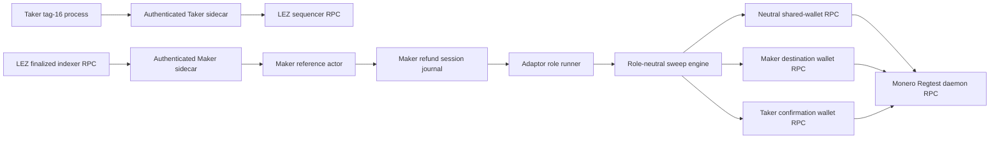
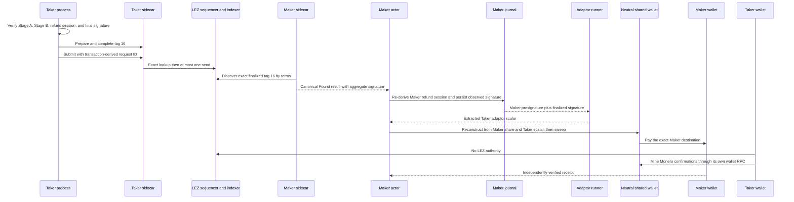
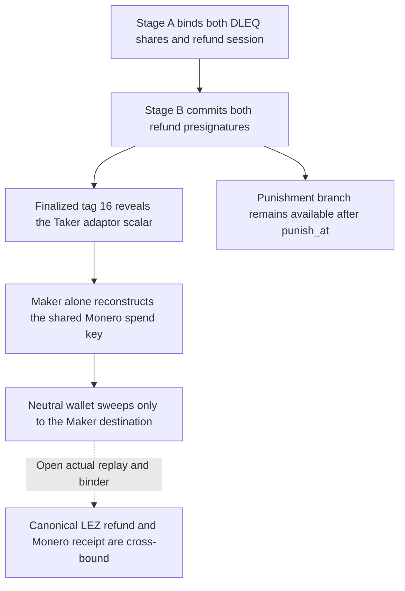

# ADR 0121: Ingest and reconstruct the XMR refund by role

- Status: Accepted for the M5 component checkpoint
- Date: 2026-07-30
- Milestone: M5 progressive local-functional PoC

## Context

ADR 0120 closes one-attempt tag-16 submission and finalized classification, but
stops before the public refund signature becomes Maker-owned recovery
authority. The application needs one role-fixed continuation from the Taker
driver through Maker ingestion and adaptor extraction to a Monero sweep. The
existing claim sweep already contains the correct reconstruction and official
wallet RPC boundary, so the refund path must reuse that engine without
preserving claim-only economic roles.

This decision is component-tested. It does not claim an actual LEZ/Monero
refund replay or a cross-chain binding.

## Decision

1. A real Taker process validates Stage A, Stage B, the refund session, and the
   aggregate final signature before it asks the authenticated Taker sidecar to
   prepare, complete, and submit tag 16.
2. Prepare and complete request IDs must be distinct. Submission uses only the
   transaction-derived canonical request ID and inherits the sidecar's
   one-attempt/no-automatic-retry journal.
3. Only a Maker process may ingest the finalized `DiscoverByTerms` tag-16
   result. It re-derives the exact refund session and writes the aggregate
   signature through the existing role-local, journal-linked packet writer.
4. Maker extraction uses its precommitted refund presignature to recover the
   Taker adaptor scalar.
5. One sweep engine serves both reveal branches. Claim reconstructs from the
   Taker share plus Maker scalar and sweeps to Taker; refund reconstructs from
   the Maker share plus Taker scalar and sweeps to Maker.
6. The shared-wallet RPC remains a neutral effect boundary. The opposite role's
   wallet mines confirmations, so the destination wallet does not also provide
   confirmation authority.
7. Legacy claim CLI and evidence remain byte-shape compatible. Refund requires
   explicit `--journey refund`, mutually exclusive refund key inputs, and an
   honest v3 evidence schema.

## Components and RPC boundaries

The sequencer is the LEZ effect boundary and the indexer is the finalized LEZ
observation boundary. The neutral shared wallet owns only the reconstructed
Monero spend effect. Maker receives the refund; Taker supplies confirmation
mining. No component receives both role-private shares.

## Refund continuation

The sequence is the intended composed runner flow. The component boundary
currently ends at validated role selection and serialized evidence; the actual
devnet and cross-chain-binding gate remains open.

## Conditional atomicity argument

Before tag 16 finalizes, Maker lacks the Taker scalar and cannot reconstruct the
shared spend key from its retained share. Once the exact signature finalizes in
the signed refund window, the precommitted adaptor relation gives Maker the
missing scalar, while the sweep engine fixes the destination to Maker. This is
conditional atomicity, not a distributed transaction: chain reorganization,
RPC honesty, timelock margins, and the later punishment path remain explicit
assumptions. Until a fresh actual local-devnet run reaches `C`, M5 refund
atomicity is not certified.

## Consequences

- The refund continuation now has real role-fixed process surfaces rather than
  a plan-only handoff.
- Claim compatibility is preserved while refund roles are explicit and tested
  before file or RPC access.
- No public RPC, faucet, peer, or funds participate in this component proof.
- The next slice must wire the runner, add the refund binder, execute the exact
  isolated LEZ/Monero journey, retain cleanup evidence, and then assess tag 17
  and the remaining literal M5 outputs.
