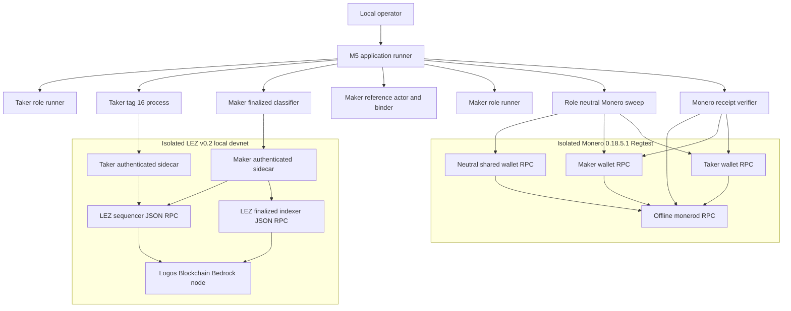
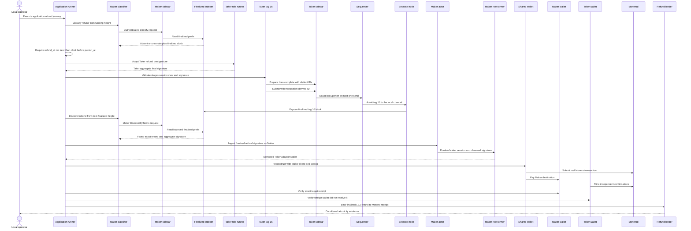
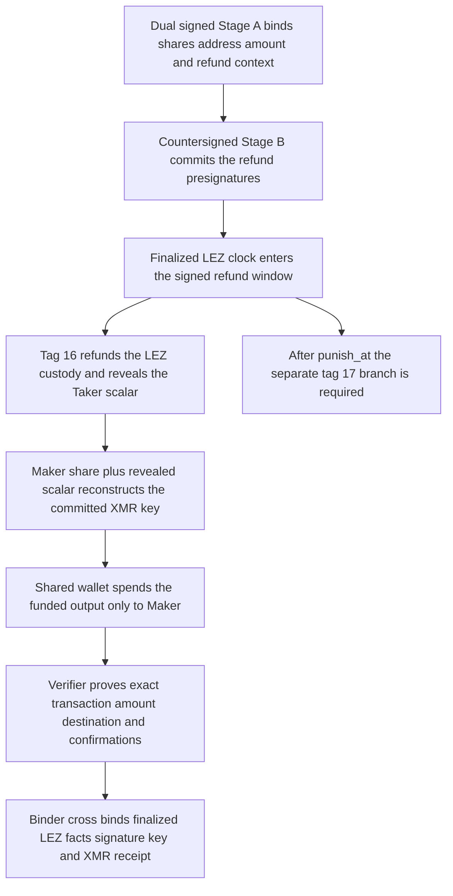

# ADR 0122: Compose the XMR refund runner tail

- Status: Accepted for the M5 runner-wiring checkpoint
- Date: 2026-07-30
- Milestone: M5 progressive local-functional PoC

## Context

ADR 0121 establishes the role-correct refund components but does not connect
them through the application runner. The composed path must wait on the
finalized LEZ clock rather than host time, exercise tag 16 through the
authenticated Taker boundary exactly once, transfer only finalized public
evidence to Maker, reconstruct the Monero authority under the Maker role, and
bind both chain effects without claiming a distributed transaction.

The existing claim path remains the default. The new path is selected only by
`M5_XMR_APPLICATION_MODE=1` and `M5_XMR_JOURNEY=refund`. It uses a bounded
refund delay of 10 to 60 minutes, with a 15-minute default, and a fixed
10-minute punishment interval. This decision records implemented runner and
binder behavior. It does not claim that the fresh isolated two-devnet replay
has completed.

## Decision

1. The application runner starts the exact local LEZ v0.2 stack and official
   Monero 0.18.5.1 Regtest stack under unique run identities. All host RPC
   publications use dynamically allocated `127.0.0.1` ports.
2. The LEZ stack contains a Logos Blockchain Bedrock node, the pinned LEZ
   sequencer, and the pinned finalized indexer. Separate authenticated Maker and
   Taker sidecars expose only role-scoped capability files to host processes.
3. The Monero stack contains one offline `monerod` and three authenticated
   `monero-wallet-rpc` processes: neutral shared-funds, Maker, and Taker. The
   shared wallet performs the reconstructed spend, Maker is the refund
   destination, and Taker mines confirmations through its separate wallet
   boundary.
4. Before tag 16, the Maker classifier polls its authenticated sidecar for an
   absent or uncertain refund result and consumes only the returned finalized
   chain clock. The runner proceeds only while
   `refund_at <= finalized_timestamp < punish_at`, then begins the exact refund
   discovery window at the next finalized height.
5. The Taker role runner adapts the Stage-B Taker refund presignature with the
   Taker share. The tag-16 process validates Stage A, Stage B, the Taker refund
   session, the view key, and final signature before distinct prepare and
   complete calls and one transaction-derived submission request.
6. Maker discovers the exact finalized refund by signed terms. The Maker actor
   ingests its aggregate signature, and the Maker role runner extracts the
   Taker adaptor scalar from the durable Maker refund presignature.
7. The shared wallet reconstructs from the Maker share and extracted Taker
   scalar and sweeps to the Maker wallet. The post-sweep verifier checks the
   exact transaction, destination, amount, confirmations, and absence from the
   foreign Taker wallet.
8. The refund binder re-derives the Maker lifecycle and session, verifies the
   classifier signature against the observed packet, verifies the extracted
   scalar against the durable journal, reconstructs the public spend key, and
   requires exact accounting `funded = received + fee`. It writes a new
   owner-private mode-0600 evidence file only after every check succeeds.
9. The claim branch and its legacy evidence shape remain unchanged. Neither
   branch performs an automatic chain-submission retry.

## Full component, RPC, and local-node topology

Bedrock, sequencer, and indexer share one run-scoped Docker bridge with IP
masquerading disabled. Their container ports 18080, 3040, and 8779 are
published on dynamic loopback host ports. The Monero containers share a
different run-scoped bridge, also without IP masquerading. `monerod` port 18081
and each wallet port 18083 are published on separate dynamic loopback host
ports. Sidecars are host processes on dynamic loopback endpoints protected by
per-role capability files; only a sidecar receives a LEZ signing key.

## Exact role-correct refund sequence

No private Taker share crosses into Maker storage. Maker learns only the adaptor
scalar revealed by the exact finalized aggregate refund signature. Conversely,
the Taker process does not receive Maker wallet authority.

## Conditional atomicity argument

The path is conditionally atomic for a successful refund because the Maker
cannot reconstruct the shared Monero spend key before the Taker finalizes the
precommitted refund signature, while that same signature is carried by the
exact finalized tag-16 LEZ refund. After finalization, the adaptor relation
reveals exactly the missing Taker scalar to the Maker, whose own retained share
reconstructs the Stage-A public spend key. The sweep is accepted only when it
pays the Maker destination and the receipt accounts for the entire funded
amount as received value plus an exact positive fee. The binder hashes and
cross-checks the finalized LEZ classifier result, aggregate signature, observed
packet, reconstructed public key, sweep evidence, and receipt.

This is not a two-phase commit or an unconditional distributed transaction.
Its guarantee assumes the signed `refund_at` and `punish_at` margin remains
adequate, the classifier's finalized prefix is canonical, Monero Regtest
confirmations remain stable, role-private files and authenticated local RPC
boundaries are not compromised, and the process completes before the
punishment branch becomes authoritative. The binding also states that the
owner-private Maker destination is verified at the wallet boundary but is not
committed in Stage A. It expressly makes no future-reorganization guarantee.

## External-resource and fidelity boundary

All chain endpoints are ephemeral loopback services. LEZ actor balances are
distinct deterministic genesis allocations. Monero funds are deterministic
local Regtest outputs mined inside the isolated stack. There is no public RPC,
faucet, public peer, public fund, DNS dependency, or outbound chain route in
this journey. Both Docker bridges disable IP masquerading, and runtime evidence
requires the Monero peer count to be zero.

Loopback does not mean the chains are mocked. The path executes the pinned
upstream LEZ sequencer and indexer against a real Logos Blockchain Bedrock
node, including transaction preparation, proof execution, admission, block
production, and finalized-prefix queries. It also executes the official pinned
`monerod` and `monero-wallet-rpc` binaries, constructs and submits a real
Regtest transaction, mines it, scans it through independent wallets, and
checks confirmations and exact accounting. Deterministic funding removes
faucet and public-network availability from the test without bypassing chain
state-transition code.

The isolated proof does not establish public routing, behavior under public
peer latency or adversarial peers, public economic finality, production
credential custody, production fee selection, long-horizon reorganization
survival, production proof settings or proof performance, or deployment of a
public service. The local Bedrock node uses its explicit proof-development
mode. The proof also does not close the tag-17 punishment path. A fresh
composed replay, retained evidence, and cleanup proof are required before this
runner checkpoint can be promoted to an actual local-functional refund PoC.

## Consequences

- The M5 application runner now has distinct, role-correct claim and refund
  tails while preserving claim as the default behavior.
- Host time is not refund authority; the signed interval is checked against the
  authenticated finalized LEZ clock.
- One evidence artifact joins both real-chain effects without overstating
  atomicity or destination commitment.
- Actual isolated replay, tag 17, failure recovery, and remaining literal M5
  outputs remain subsequent work.
