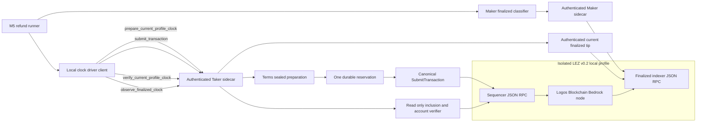
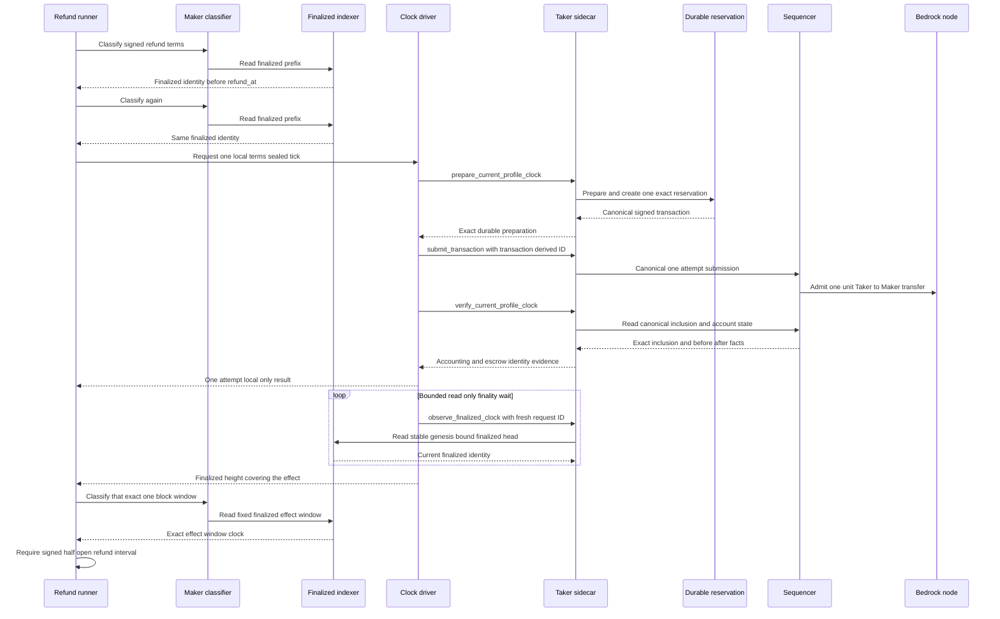
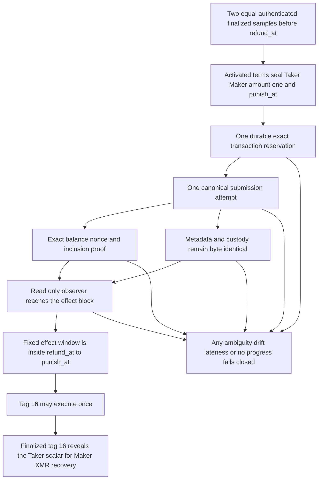

# ADR 0123: Drive the local finalized clock with one sealed effect

- Status: Accepted and focused runtime GREEN; corrected actual replay pending
- Date: 2026-07-31
- Milestone: M5 progressive local-functional PoC

## Context

ADR 0122 correctly makes the authenticated finalized LEZ classifier, rather
than host time, authoritative for the signed XMR refund window. The first clean
refund attempt exposed a local-profile liveness gap. Diagnostic run
`m5xmrrefund8c10cd7a` reached accepted application state, finalized tag 13, and
verified Maker-funded Monero output, then observed the same authenticated
finalized LEZ identity for more than two minutes:

- height `120`;
- block hash
  `5b352c7a318afc82ef60cd079bc76eb1102d3bb947a48c2e8eb638ebc97e0a5d`;
- timestamp `1785471692986` milliseconds.

The signed terms used `refund_at = 1785472429000` and
`punish_at = 1785473029000`. Later evidence corrected the initial diagnosis:
Bedrock did advance and finalize descendants, but the runner repeatedly asked
the effect classifier for the immutable one-block window ending at height 120.
That classifier reports the requested window end, not the current finalized
head, so it could never become a live clock. Host time eventually passed the
interval without becoming authority. The stopped and cleaned run is retained
diagnostic RED evidence, not a successful refund or M5 evidence run.

A second clean replay, `m5xmrrefund827a5d4a`, ran from pushed commit
`827a5d4`, passed both local-devnet setup, exact LEZ deployment, role-correct
application composition, finalized tag 13, and Maker-funded Monero verification.
At the signed refund threshold it failed before preparation because the thin
client encoded `clock-prepare-` plus a 64-character swap ID into a request ID
whose protocol maximum is 64 characters. No clock transaction or tick-evidence
file existed, and scoped cleanup removed every run-owned Docker resource. The
TDD repair derives distinct prepare and verify IDs as 64-character SHA-256
digests over a fixed version domain, operation domain, and full 32-byte
identity. This is bounded integration RED evidence, not a completed swap.

A third clean replay, `m5xmrrefund842610ca`, admitted exactly one terms-sealed
Taker-to-Maker native-unit transfer. The sequencer advanced from height 193 to
194 with exact balance and nonce deltas, byte-identical escrow state, and one
submission. Bedrock produced the configured ten finalized descendants in about
16 seconds. The runner nevertheless kept classifying fixed block 120 and hit
its progress bound. This proved that the real liveness effect works and that
the remaining defect was observation semantics, not finality. The focused RED
then required an authenticated current-finalized-tip method; the GREEN uses the
existing genesis-bound official indexer reader and performs no sequencer read
or submission. This run remains diagnostic because it stopped before tag 16.

Increasing a sleep or trusting host time would weaken the protocol boundary.
The local profile instead needs one narrow, auditable chain effect that can
cause block production while leaving escrow custody and metadata unchanged.
That effect must not expose a signing key to the runner, be repeatable, admit an
arbitrary recipient, or become a public-route behavior.

## Decision

1. The facility is enabled only for the literal-loopback LEZ v0.2 profile,
   after the XMR application has activated the exact signed Stage A/B terms,
   and only in the refund journey. It is unavailable on the dormant public
   route. Server-owned activated terms remain optional when starting legacy
   M2/M3 sidecars, but a server must own those exact terms before it can expose
   this local-only prepare and verify facility. The existing canonical submit
   method remains unchanged.
2. The runner first obtains at least two byte-identical authenticated finalized
   classifier samples. Host time may indicate that the local profile needs a
   liveness transaction, but it never decides refund eligibility.
3. A thin local clock-driver client calls authenticated
   `lez_bridge.v1.prepare_current_profile_clock` on the Taker sidecar. The
   request is sealed to the server-owned activated terms: the sender is the
   Taker depositor account, the recipient is the Maker claimant account, the
   authenticated-transfer program is terms-bound, the amount is exactly one
   native unit, and `punish_at` is the exclusive upper bound. No caller may
   choose another signer, role, amount, program, or recipient.
4. The sidecar prepares one exact signed transaction under one create-once
   durable per-swap reservation. Preparation binds the run, runtime, terms,
   recipient, cutoff, nonce, canonical transaction bytes, and transaction ID.
   An unequal replay fails closed.
5. The client passes that exact preparation to the existing canonical
   `lez_bridge.v1.submit_transaction` boundary with its transaction-derived
   request ID. There is one node-submission attempt and no automatic retry.
   An ambiguous result remains ambiguous and cannot authorize another send.
6. The client then calls read-only
   `lez_bridge.v1.verify_current_profile_clock`. Canonical inclusion and account
   snapshots must prove Taker balance minus one, Taker nonce plus one, Maker
   balance plus one, unchanged Maker nonce, and byte-identical escrow metadata
   and custody accounts. The observed chain identity must advance and remain
   before `punish_at`.
7. The driver polls authenticated read-only
   `lez_bridge.v1.observe_finalized_clock` until the genesis-bound official
   indexer head covers the transaction block, with a 60-second early-exit
   bound. Every request has a fresh bounded identity; polling never submits.
8. The runner gives the Maker classifier the exact newly finalized height as a
   one-block effect-discovery window. Tag 16 is permitted only when that fixed
   window reports `refund_at <= finalized_timestamp < punish_at`.
9. At most one clock transaction is allowed for a swap. A bounded
   post-submission wait, unchanged finality, a late guard, invalid accounting,
   escrow drift, or any uncertain result fails the journey closed.

The protocol, client, live runtime/server, finalized-indexer read, clock driver,
and runner contracts are focused GREEN. Tests prove strict wire decoding,
runtime/capability binding, moving finalized observations independent of fixed
effect windows, zero observer submissions, and bounded request IDs. The fresh
corrected actual-node replay remains the integration gate. This must not be
described as a working PoC until a fresh pushed-commit
two-devnet replay retains the exact clock effect, finalized tag 16, Monero
recovery, binding, and scoped cleanup evidence.

## Components and RPCs

The driver receives a capability file, runtime descriptor, public sealed terms,
the Maker recipient identity already fixed by those terms, and a cutoff. It
does not receive the Taker signing key. The sidecar remains the only signing
boundary. Its server-owned terms are optional for unchanged legacy M2/M3
operation, but the local clock prepare and verify methods remain unavailable
unless the server owns the activated terms. The existing canonical submit
method retains its legacy behavior. The sequencer is the effect and
canonical-inclusion boundary; the indexer behind the Maker classifier remains
the finality boundary.

## Proposed bounded liveness sequence

The runner never loops through another effect. After the single submission it
polls only the current finalized tip, then uses the classifier once for fixed
effect discovery at the returned finalized height.

## Liveness and conditional atomicity

The one-unit transfer is not part of the swap consideration and does not decide
the refund. It is an explicit local liveness cost paid by the Taker account to
the already terms-bound Maker account. Exact before and after accounting makes
that cost visible. Byte-identical escrow metadata and custody facts prove the
driver does not claim, refund, punish, or otherwise mutate the swap escrow.

Conditional XMR refund atomicity remains the ADR 0122 argument: only finalized
tag 16 reveals the Taker adaptor scalar that the Maker combines with its
retained share to recover the committed Monero output. The liveness transaction
does not reveal a share or grant tag-16 authority. The finalized classifier,
signed half-open window, tag-16 one-attempt journal, and later cross-chain
binder remain independent gates.

This is not a distributed transaction, future-reorganization guarantee, public
network finality claim, or general block-production API. A crash after an
accepted but not yet observed clock transaction is intentionally sticky: the
durable reservation prevents another effect, and an operator must reconcile
canonical chain state rather than retry.

## Local resources, fidelity, and flakiness

Runtime uses only the run-scoped Bedrock node, LEZ sequencer, finalized indexer,
and authenticated Maker/Taker sidecars on ephemeral loopback endpoints.
Accounts use deterministic local genesis funds. There is no public RPC, faucet,
peer, DNS dependency, public fund, or outbound chain route. Cold provisioning
can still require the repository's pinned Cargo, Git, Risc0, circuits,
rapidsnark, image, and Monero archive inputs, but those are setup dependencies
and do not participate in runtime consensus or finality.

The RED demonstrates an integration-boundary defect, not a mock limitation:
the fixed-window classifier was incorrectly reused as a current-tip clock.
Actual Bedrock descendants finalized the admitted transaction under the
configured security parameter. The bounded effect executes the real
authenticated-transfer program, canonical submission, inclusion, account
transition, and finalized-indexer path. It exposes transaction, nonce, balance,
consensus, timestamp, finality, and RPC integration failures. It does not model
public validator topology, adversarial peers, congestion, fee markets, public
economic finality, or production credentials.

Remaining flake and failure sources include host CPU or disk pressure, cold
build latency, local block and finality cadence, failure to finalize the one
tick within its bounded wait, and an insufficient signed punishment margin.
Every attempt needs a fresh run ID. Partial evidence must never be reused.

## Consequences

- Finalized consensus time remains the sole refund authority.
- The local profile gains one narrow liveness mechanism without exposing the
  signing key or altering escrow state.
- The one-unit balance change and consumed Taker nonce are intentional,
  auditable protocol-test costs.
- Focused GREEN evidence is protocol 46 of 46, client 38 of 38, live current-
  clock runtime 3 of 3, and clock-driver 1 of 1, plus the full root and sidecar
  test suites. Strict Clippy, warning-fatal Rustdoc, compatibility, repository-
  wide lint/security, Docker-isolation, and dependency-policy gates pass. The
  dependency audit found `RUSTSEC-2026-0220` in transitive `ruint 1.19.0`; the
  sidecar lockfile now uses fixed `1.20.0`, and its complete suite and strict
  gates pass on that graph. A fresh pushed-commit replay, retained evidence,
  and exact cleanup are still open. M5 remains untagged and its literal score
  is unchanged.
