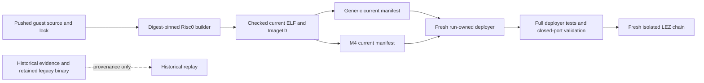
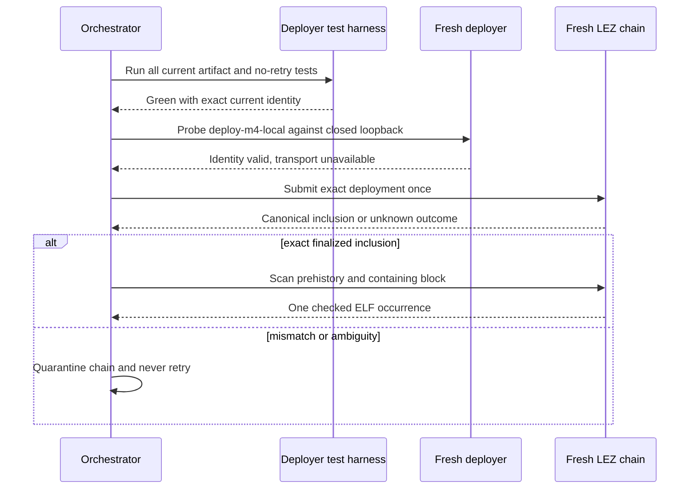

# ADR 0124: Align current deployer manifests with the embedded guest

Status: Accepted on 2026-07-31

## Context

The repository keeps historical M3 and M4 deployment evidence, but the
buildable deployer must describe the guest that it embeds today. After the
repository-wide `ruint` remediation, the current Risc0 guest became ELF
`ade4af84...bbcee`, ImageID `b7f87278...b0433`, with 18 append-only
instructions. The generic deployment manifest still described the historical
13-instruction F7 guest. A stale retained deployer therefore submitted the old
guest once on a disposable local chain, and the exact deployment-evidence gate
correctly rejected it.

The same replay exposed two mock happy-path timeouts that allowed only 100 ms
to hash and submit a 685 KB debug deployment. The deliberate timeout and
ambiguous-outcome tests also use 100 ms, but for a different purpose.

## Decision

The generic current deployment manifest binds the exact ELF, ImageID,
little-endian ProgramId words, public IDL hash, and 18-instruction interface.
The M4 artifact manifest independently binds the exact ELF and ImageID,
instruction count, appended XMR variants, and hashes the generic manifest plus
the artifact runner. Historical identities remain in historical evidence,
milestone prose, explicit historical M3 compatibility paths, and retained
legacy binaries.

The current generic interface remains append-only: its original 13
instructions keep their variants, and XMR variants 13 through 17 are appended.

Deployment certification uses a fresh run-owned Cargo target. Before any chain
effect, the exact deployer must pass the complete suite and the
`deploy-m4-local` path must pass immutable validation against a closed loopback
port. A failed or mismatched deployment contaminates that local chain; the
chain is stopped and never retried.

Only the two in-process mock happy paths receive a two-second ceiling. The
100 ms timeout and ambiguous-outcome tests remain unchanged, so no-retry
behavior stays exercised at the tighter boundary. Production deployment keeps
its explicit caller-selected bounded timeout.

## Consequences

- Current source builds cannot silently mix a historical manifest with a new
  embedded guest.
- Historical evidence remains truthful and is not rewritten as a current
  deployment.
- A clean target costs more on the first build, but prevents mutable build
  output from crossing certification runs.
- Live `.e2e` state currently causes unnecessary Risc0 context invalidation;
  the generated Docker-ignore boundary remains measured follow-up iteration
  work.
- Conditional deployment atomicity is fail-before-effect for every identity
  and source-boundary mismatch detected before submission. After the sole send,
  an exact finalized inclusion is retained as success; any ambiguous or
  mismatched outcome quarantines the disposable chain and is never retried.
  Application-level cross-chain escrow atomicity is a separate proof boundary.
