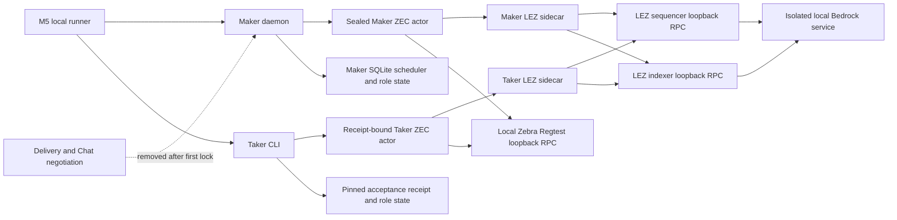
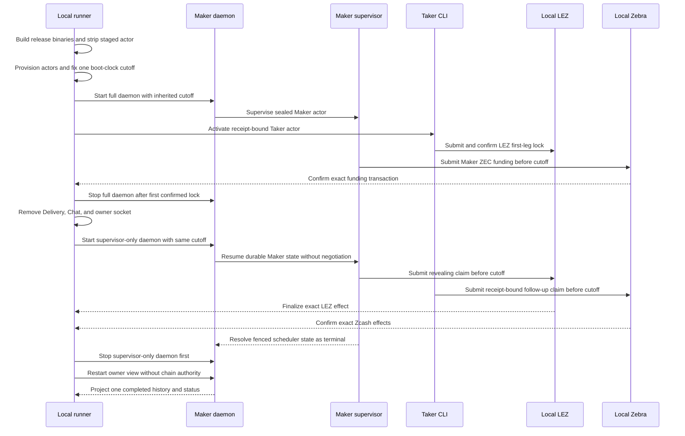
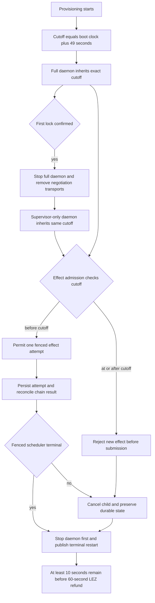
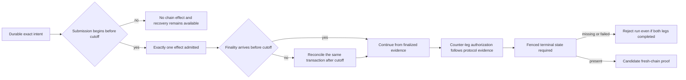

# ADR 0125: Bound daemon-driven ZEC effects across transport cutover

Status: Accepted on 2026-07-31 by exact pushed-commit run `m5zec432dapp1`
at `432d1f7dabbb573b9642794155066e37ee95e75d`

## Context

M5 must exercise the ZEC corridor as an operator would: a Maker daemon owns the
Maker actor, the Taker CLI owns the Taker actor, negotiation transports vanish
after the first confirmed lock, and durable role state carries both actors to a
terminal restart. The runner also has to preserve the ten-second safety margin
between its application-effect window and the local LEZ escrow refund.

Earlier diagnostic runs exposed two iteration hazards. Debug executables made
each sealed actor incarnation expensive to start, and a fixed child-attempt
timeout could outlive the corridor budget. The application-only release build
moves compilation before provisioning and strips the privately staged actor.
The measured release artifacts are 15,641,768 bytes for the ZEC actor,
16,078,120 bytes for the Maker daemon, 26,440,912 bytes for the Taker, and
15,512,408 bytes for the LEZ sidecar; `strip --strip-all` reduces the staged
actor to 12,646,768 bytes. One cold ZEC release build took 5 minutes 40 seconds,
but that work is outside the protocol clock and warm-cache timing is explicitly
not treated as correctness evidence.

Diagnostic run `m5zecb416appf` reached both chain-leg completion, but the
scheduler ended in `failed` rather than the required fenced `terminal` state.
That historical run remains rejected: it has no certification result, is not
GREEN, and did not raise the literal M5 score. Exact pushed-commit run
`m5zec432dapp1` subsequently completed the fresh-chain replay of the complete
decision below in 25,030 milliseconds and raised the literal score to `4/7`.

## Decision

The M5 application path uses only isolated loopback services. LEZ consists of a
local sequencer, indexer, and Bedrock service; Zcash uses a local Zebra Regtest
RPC with deterministic local outputs. Sidecars are loopback adapters, and
Maker/Chat/supervisor control uses run-private Unix sockets. No public RPC,
faucet, public testnet, or externally supplied test funds participate.

Release compilation and actor staging finish before the runner records the
provisioning start. Provisioning then creates the exact absolute cutoff in the
Linux boot-clock domain. The runner derives that domain from `/proc/uptime` and
passes the same absolute millisecond value as the
`actor-effect-cutoff-boottime-milliseconds` argument to both daemon
incarnations. Each supervisor compares it with `CLOCK_BOOTTIME`; restart does
not grant a new window.

The corridor is capped at 49 seconds from provisioning. The signed local LEZ
refund delay is 60 seconds. Whole-second truncation means the 49-second cap
retains a true minimum ten-second margin rather than claiming an eleven-second
margin. Every runner poll, bounded CLI call, status retry, and daemon child
effect uses the one absolute deadline. Cleanup is daemon-first: stop the owned
Maker daemon and its supervised child, then stop the two owned sidecars. It
never relies on removing unrelated processes, containers, networks, or images.

The 49-second boundary is an effect-admission cutoff, not a promise that a
chain will finalize every admitted effect before that instant. A transaction
submitted before the cutoff may enter a mempool or sequencer and finalize
later. Cancellation cannot and must not pretend to retract it. Durable
one-attempt intent and exact transaction identity make that already-admitted
effect reconcilable after restart; no new submission is allowed at or beyond
the cutoff.

Conditional atomicity follows from the existing ZEC protocol ordering plus the
application fence, not from treating the two chains as one transaction:

- the exact first lock is confirmed before negotiation is removed;
- only the daemon supervisor can create Maker effects after application
  handoff, while the Taker CLI is bound to the immutable acceptance receipt;
- revealing-claim evidence authorizes the counter-leg claim, and each effect
  has durable at-most-once intent and exact observation;
- the shared cutoff prevents a restarted daemon from extending effect
  authority into the LEZ refund margin; and
- certification additionally requires the scheduler to resolve as fenced
  `terminal`, exact terminal actor projections, no duplicate submission, and a
  successful chain-authority-free owner restart.

## Consequences and proof gate

- Release builds improve actor-start iteration without weakening the protocol
  clock because compilation is excluded but provisioning is not.
- A daemon cutover preserves the cutoff, actor hash, config hash, state path,
  and scheduler generation; it removes Delivery and Chat rather than silently
  re-enabling negotiation.
- A pre-cutoff ambiguous submission remains an explicit recovery obligation.
  Later finalization is acceptable only when it reconciles the exact durable
  transaction; a second submission is forbidden.
- Any failed scheduler state, missing fenced terminal state, post-cutoff new
  effect, surviving negotiation transport, duplicate transaction, or failed
  terminal restart rejects the run and quarantines its disposable chain.
- Exact pushed-commit run `m5zec432dapp1` accepts this ADR. Its fresh isolated
  LEZ and Zebra replay completed Maker and Taker at revision 4, resolved the
  scheduler as `terminal` at generation 24 after 24 attempts with no child,
  and retained daemon-only Maker effect authority through the post-lock
  transport cutover. The Taker claim remained bound to the pinned acceptance
  receipt. The terminal owner restart made no chain RPC, cleanup removed every
  exact owned resource, and no public RPC, faucet, testnet, or external funds
  participated. The retained packet is
  `docs/evidence/m5-zec-daemon-supervisor-certification-20260731.json`.
- This acceptance certifies one additional literal M5 output and moves the
  score from `3/7` to `4/7`. It does not claim an M5 completion tag.
