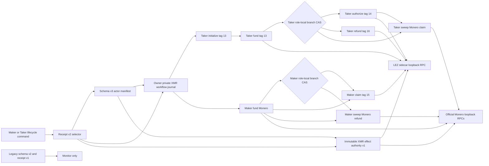
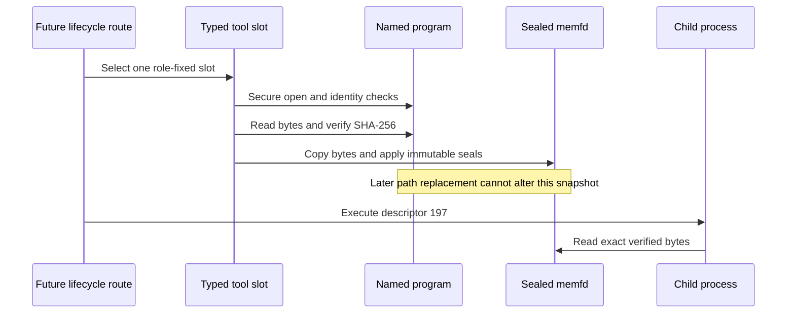
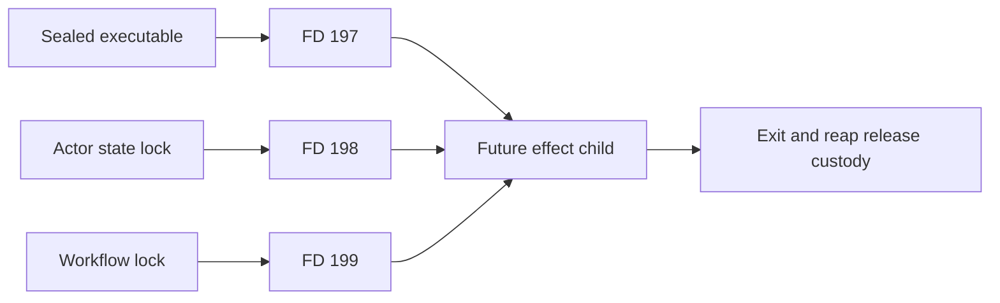
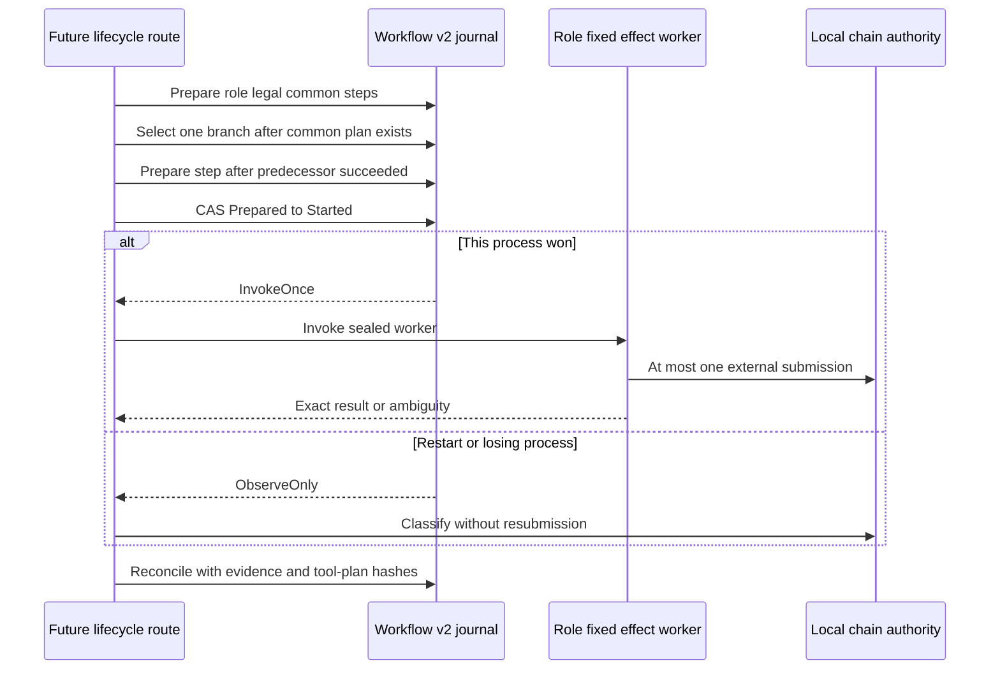
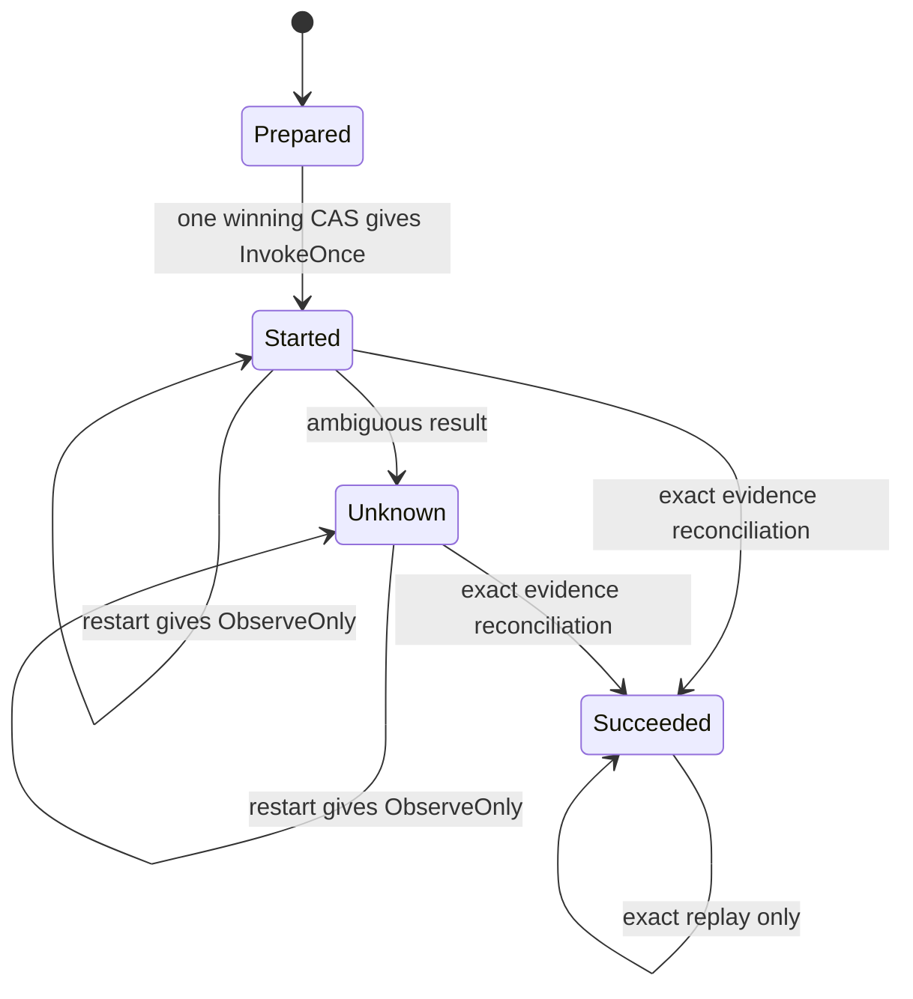

# ADR 0126: Separate XMR workflow authority from adaptor and sidecar journals

Status: Accepted for the durable journal, schema-v3 authority, receipt-v2
locked-monitor boundary, typed effect-plan view, sealed-executable primitive,
workflow-v2 catalog, and dual-lock command boundary on 2026-08-02; lifecycle-route effect execution and actual-node application
replay remain in progress

## Context

The accepted XMR application boundary in ADR 0114 intentionally stops before
chain effects. Its schema-v2 actor manifest and receipt-v1 Taker handoff prove
activation and allow offline monitoring, but they must never gain claim or
refund authority by reinterpretation.

M5 still needs role-correct Maker and Taker lifecycle commands. Those commands
must survive process death without invoking a possibly completed effect twice,
and selecting the successful branch must permanently exclude the refund branch
and vice versa. The existing adaptor journal is an immutable Stage-A/Stage-B
transcript authority. The tag-15 and tag-16 sidecar journals already own their
respective one-attempt LEZ sends. Reusing either as an application workflow
journal would conflate different authorities and make restart reasoning
ambiguous.

## Decision

Introduce a separate owner-private schema-v2 SQLite workflow journal. Schema
v1 is rejected rather than migrated or reinterpreted. The schema-v3 actor
manifest now binds its normalized absolute path and the SHA-256 of a separate
immutable effect-authority manifest. Schema-v2 manifests and receipt-v1
handoffs remain monitor-only.

The journal binds one singleton identity: swap ID, local role, run ID, agreement
commitment, activation commitment, and effect-authority digest. It selects
exactly one claim or refund branch by an immediate SQLite compare-and-set.
Role-fixed steps are not free-form strings. Schema v2 contains the complete
eight-effect catalog:

| Protocol order | Step | Fixed role | Scope |
|---|---|---|---|
| 1 | Initialize LEZ tag 13 | Taker | Common |
| 2 | Fund LEZ tag 13 | Taker | Common |
| 3 | Fund Monero shared output | Maker | Common |
| 4 | Authorize LEZ tag 14 | Taker | Claim |
| 5 | Claim LEZ tag 15 | Maker | Claim |
| 6 | Sweep Monero claim | Taker | Claim |
| 7 | Refund LEZ tag 16 | Taker | Refund |
| 8 | Sweep Monero refund | Maker | Refund |

Preparation is role-local. Taker LEZ funding requires succeeded tag-13
initialization; tag-14 authorization and tag-16 refund require succeeded LEZ
funding. Maker tag-15 claim and Monero refund sweep require succeeded Monero
funding; the Taker Monero claim sweep requires succeeded tag-14 authorization.
The first Taker initialization and Maker Monero-funding steps have no local
predecessor. Before the irreversible branch CAS, every Common step for that
local role must already have a durable Prepared-or-later row. Thus a branch
cannot be selected while its role-local common plan is incomplete. These
predecessors do not prove cross-role or global protocol ordering. The future
route must bind each local transition to finalized LEZ evidence or confirmed
Monero wallet evidence before treating a counterparty effect as satisfied.

The validated authority is now exposed as a typed execution plan rather than
raw JSON. Its LEZ authority contains one literal-loopback sidecar root, an
absolute runtime-identity path plus pinned SHA-256, and an absolute capability
file path. Its Monero authority contains four distinct typed endpoint roles:
daemon, Maker funding wallet, neutral shared wallet, and local-role destination
wallet. Every endpoint is an HTTP literal-loopback root with an explicit
nonzero port and separate absolute username/password file paths. URL userinfo,
queries, fragments, non-root paths, DNS names, and non-loopback addresses fail
closed. This checkpoint validates endpoint and credential-path structure; it
does not open a socket or read, snapshot, or authenticate a credential file.

Each role has exactly five tool slots. Every slot carries one normalized
absolute program path, a nonzero lowercase SHA-256, and the fixed ABI below;
Maker and Taker profiles cannot cross or coexist in one authority.

| Role | Slot | Fixed ABI |
|---|---|---|
| Maker | Monero fund | `lez_xmr_monero_fund_v2` |
| Maker | LEZ claim | `lez_xmr_tag15_claim_v1` |
| Maker | finalized classifier | `lez_xmr_finalized_classifier_v1` |
| Maker | Monero refund sweep | `lez_xmr_monero_refund_sweep_v3` |
| Maker | Monero verify | `lez_xmr_monero_verify_v2` |
| Taker | tag-14 authorize | `lez_xmr_tag14_authorize_v1` |
| Taker | finalized classifier | `lez_xmr_finalized_classifier_v1` |
| Taker | Monero claim sweep | `lez_xmr_monero_claim_sweep_v2` |
| Taker | Monero verify | `lez_xmr_monero_verify_v2` |
| Taker | tag-16 refund | `lez_xmr_tag16_refund_v1` |

`XmrEffectToolV1::verify_program_at_use` supplies the first executable
TOCTOU-resistant primitive. It securely opens with no symlink traversal,
requires a canonical trusted non-writable parent and a single-link regular
root-or-euid-owned executable, bounds the bytes to 512 MiB, revalidates the
opened/named identity around the read, and checks the pinned SHA-256. It then
copies the verified bytes into a mode-0700 anonymous memfd carrying write,
grow, shrink, and seal seals. `PinnedExecutable::into_command` executes only
that snapshot through child FD 197; it does not reopen the named program.

The replay and race guarantee is exact but deliberately narrow. Once a tool is
pinned, replacement, unlink, or mutation of the named path cannot change the
bytes executed by that `PinnedExecutable`. A later independent verification
observes the then-current named path and fails on digest, symlink, mode, link,
owner, parent, size, or identity drift. The primitive does not itself decide
whether an effect may be retried, retain either application lock, validate the
runtime/capability bytes, read credentials, or reconcile an ambiguous external
effect. Those remain responsibilities of the workflow and lifecycle route.

The dual-lock command primitive closes the descriptor-custody half of that
boundary. It validates both held-lock path/device/inode identities immediately
before command construction, rejects aliases and descriptor collisions, and
installs the sealed executable as FD 197, actor/adaptor-state lock as FD 198,
and distinct workflow lock as FD 199 in one descriptor-mapping operation. The
child retains both lock descriptors for its lifetime, so competing processes
cannot acquire either lock until the child exits and is reaped. Changed named
locks, crossed-swap locks, unsafe lock-root changes, aliased kernel files, or
mapping drift fail before spawn.

This component performs no chain or network I/O. It uses the already locked
rusqlite dependency and SQLite WAL, FULL synchronous writes, foreign keys, and
secure deletion. Creation is exclusive and mode 0600; an existing safe file
returns a typed no-clobber error and an unsafe alias fails closed. Existing
open never creates or migrates a database. The dedicated application ID,
schema version, exact canonical CREATE TABLE definitions, STRICT checks,
foreign-key check, and quick_check must all match.

Before invoking a process, the application commits Prepared to Started and
increments the only attempt counter. Only the transaction that wins that
compare-and-set receives InvokeOnce. Reopened Started and Unknown rows return
ObserveOnly and can never be rearmed. Evidence-free `mark_succeeded` is always
rejected. Only `reconcile_succeeded` may move Started or Unknown to Succeeded,
and it must atomically persist a nonzero SHA-256 of canonical external-effect
evidence, a nonzero SHA-256 of the exact tool-plan identity, and either the
`lez_finalized_event` or `monero_wallet_transaction` source. Exact succeeded
replay is idempotent; any evidence, plan, or source drift is rejected. Every
persisted step row is parsed and checked against its fixed catalog role, scope,
state, counters, revisions, and reconciliation fields whenever the journal is
opened or revalidated.

Atomicity is deliberately layered. SQLite makes common-plan presence, branch
choice, predecessor gating, local invocation authority, and evidence-bound
reconciliation atomic within the journal. A tag-specific or wallet journal
remains authoritative for its actual send, and canonical finalized-chain or
wallet-history observation remains authoritative for completion. No transaction
is claimed across those layers.

## Evidence and limits

The focused RED first failed because the journal API did not exist. GREEN proves
restart-sticky Started and Unknown states, losing-branch rejection, and
role-crossed step rejection. A second RED proved that copied application
headers and table names could forge the initial validator; exact schema
comparison made it GREEN. Eight concurrent creators now produce one new
journal, and eight concurrent authorizers produce one InvokeOnce plus seven
ObserveOnly decisions. The complete lez-swap-store all-target/all-feature suite
is GREEN at 156 tests, with strict Clippy and warning-fatal Rustdoc.

The journal trusts its owner and the owner-private filesystem hierarchy; it is
not an authenticated rollback anchor against a hostile same-UID writer or
backup restore. The current path check enforces a normalized absolute path,
owner-private immediate parent, and a single-link owner-only terminal file;
deployment must also keep every ancestor private. Schema-v3 now directly binds
the run ID, immutable effect-authority path and
digest, and separate workflow path while reconstructing schema-v2 only through
its original parser. The semantic loader rereads and validates the complete
Stage A/B role authority, exact effect bytes, role/swap/agreement/activation/run,
and the already initialized workflow identity. Publication is owner-private,
atomic create-new, and never overwrites schema v2 or an existing schema-v3 file.
The full role-process integration test proves digest tamper, run crossing, legacy
v2 execution, workflow drift, and output collision fail closed.

Receipt v2 now digest-pins schema v3, the effect authority, workflow identity,
and run. The selector semantically revalidates those bytes under the per-swap
and workflow locks, and locked monitor is implemented without chain I/O.
Receipt v1 remains monitor-only. Claim and refund still reject before effect
execution. Focused Taker authority tests are GREEN at 3 of 3 and the combined
Maker/Taker authority pair is GREEN at 4 of 4. Both full package suites,
`lez-swap-store --all-targets` and
`xmr-reference-actor --all-targets --all-features`, strict all-target/all-
feature Clippy, warning-fatal Rustdoc, rustfmt, and diff hygiene are GREEN.

The workflow-v2 and dual-lock focused suites are GREEN: maker process 17 of 17,
workflow concurrency 2 of 2, workflow hardening 1 of 1, restart/no-rearm regression 1 of 1, and workflow-v2 catalog/reconciliation 3 of 3. They prove schema-v1
rejection, catalog and row validation, predecessor and branch gates, one-winner
invocation, exact evidence replay, drift rejection, descriptor separation,
lock-alias, cross-swap, root, and identity rejection, and child custody through
reap.

The typed endpoint/tool views, use-time program pinning, workflow-v2 journal,
and dual-lock command construction are component-GREEN, but no Maker or Taker
lifecycle route calls the executor. Use-time runtime-file and capability
verification, credential secure-open and custody, actual classifier-to-evidence
composition, Maker effect composition, receipt-v2 claim/refund routing, and
fresh isolated LEZ plus official Monero Regtest proof remain open. The route
must also prove that its own supervision keeps the mapped child and both locks
under custody through every exit and cancellation path. This checkpoint does
not authorize a chain send. Literal M5 therefore remains 4 of 7.
