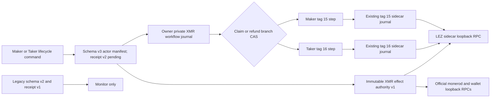
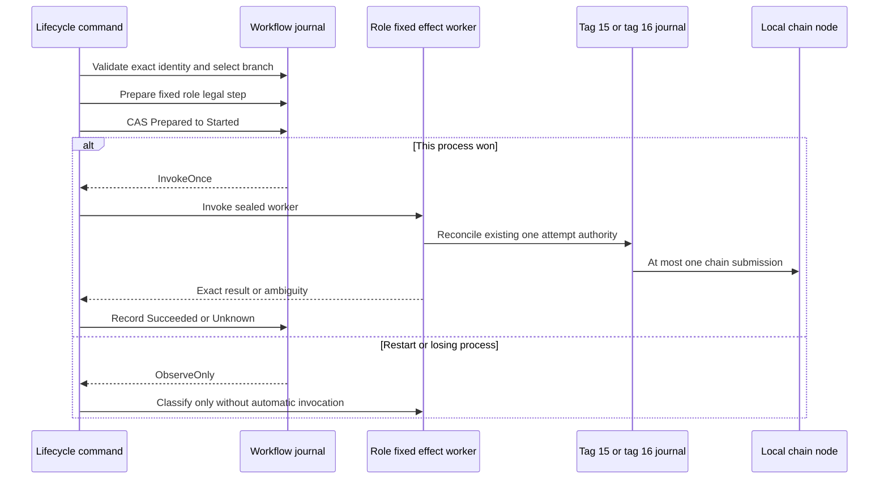
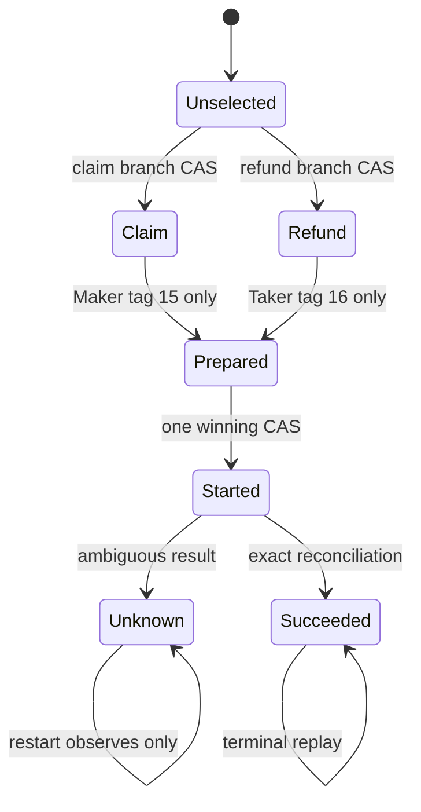

# ADR 0126: Separate XMR workflow authority from adaptor and sidecar journals

Status: Accepted for the durable journal and schema-v3 authority boundary on
2026-08-02; receipt-v2 lifecycle commands and actual-node application replay
remain in progress

## Context

The accepted XMR application boundary in ADR 0114 intentionally stops before
chain effects. Its schema-v2 actor manifest and receipt-v1 Taker handoff prove
activation and allow offline monitoring, but they must never gain claim or
refund authority by reinterpretation.

M5 still needs role-correct Maker and Taker lifecycle commands. Those commands
must survive process death without invoking a possibly completed effect twice,
and selecting the successful branch must permanently exclude the refund branch
and vice versa. The existing adaptor journal is an immutable Stage-A/Stage-B
transcript authority. The tag-15 and tag-16 sidecar journals already own their
respective one-attempt LEZ sends. Reusing either as an application workflow
journal would conflate different authorities and make restart reasoning
ambiguous.

## Decision

Introduce a separate owner-private schema-v1 SQLite workflow journal. The
schema-v3 actor manifest now binds its normalized
absolute path and the SHA-256 of a separate immutable effect-authority manifest.
Schema-v2 manifests and receipt-v1 handoffs remain monitor-only.

The journal binds one singleton identity: swap ID, local role, run ID, agreement
commitment, activation commitment, and effect-authority digest. It selects
exactly one claim or refund branch by an immediate SQLite compare-and-set.
Role-fixed steps are not free-form strings: the first composed steps are Maker
tag-15 LEZ claim and Taker tag-16 LEZ refund.

This component performs no chain or network I/O. It uses the already locked
rusqlite dependency and SQLite WAL, FULL synchronous writes, foreign keys, and
secure deletion. Creation is exclusive and mode 0600; an existing safe file
returns a typed no-clobber error and an unsafe alias fails closed. Existing
open never creates or migrates a database. The dedicated application ID,
schema version, exact canonical CREATE TABLE definitions, STRICT checks,
foreign-key check, and quick_check must all match.

Before invoking a process, the application commits Prepared to Started and
increments the only attempt counter. Only the transaction that wins that
compare-and-set receives InvokeOnce. A reopened Started or Unknown step returns
ObserveOnly; it can never return to Prepared. Only exact external
classification may advance a started step to Succeeded.

Atomicity is deliberately layered. SQLite makes branch choice and local
invocation authority atomic. The tag-specific journal remains authoritative
for the actual LEZ send. Canonical chain observation remains authoritative for
completion. No transaction is claimed across those layers.

## Evidence and limits

The focused RED first failed because the journal API did not exist. GREEN proves
restart-sticky Started and Unknown states, losing-branch rejection, and
role-crossed step rejection. A second RED proved that copied application
headers and table names could forge the initial validator; exact schema
comparison made it GREEN. Eight concurrent creators now produce one new
journal, and eight concurrent authorizers produce one InvokeOnce plus seven
ObserveOnly decisions. The complete lez-swap-store all-target/all-feature suite
is GREEN at 156 tests, with strict Clippy and warning-fatal Rustdoc.

The journal trusts its owner and the owner-private filesystem hierarchy; it is
not an authenticated rollback anchor against a hostile same-UID writer or
backup restore. The current path check enforces a normalized absolute path,
owner-private immediate parent, and a single-link owner-only terminal file;
deployment must also keep every ancestor private. Schema-v3 now directly binds
the run ID, immutable effect-authority path and
digest, and separate workflow path while reconstructing schema-v2 only through
its original parser. The semantic loader rereads and validates the complete
Stage A/B role authority, exact effect bytes, role/swap/agreement/activation/run,
and the already initialized workflow identity. Publication is owner-private,
atomic create-new, and never overwrites schema v2 or an existing schema-v3 file.
The full role-process integration test proves digest tamper, run crossing, legacy
v2 execution, workflow drift, and output collision fail closed. No CLI command
or actual-chain effect is composed by this checkpoint, so literal M5 remains
4 of 7.
