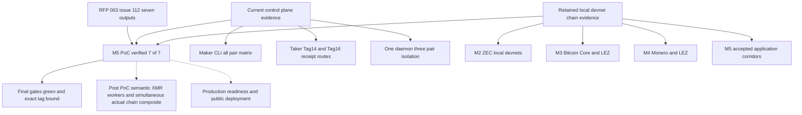
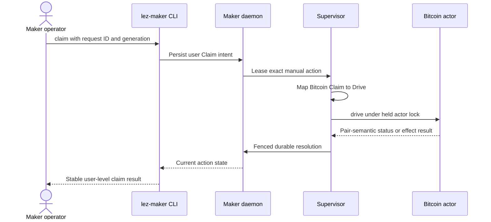

# ADR 0127: Layer M5 PoC evidence and map Bitcoin claim intent to Drive

Status: Accepted and verified for the M5 local-functional PoC on 2026-08-02;
bound by `m5-poc-complete`

## Context

The current accepted RFP-003 issue #112 names seven M5 deliverables: daemon,
Maker CLI, Taker CLI, coordinator persistence/crash/concurrency, price sources,
Delivery/Chat degradation, and fuzzing. Earlier scorecards treated fresh
all-pair lifecycle and simultaneous actual-chain composites as additional
literal outputs. Under the progressive-JPEG policy, those are valuable
hardening gates but must not silently redefine the accepted milestone.

The real all-pair Maker CLI matrix also exposed a Bitcoin manual Claim failure
at JSON-RPC code `-32602`. The user intent is valid, but the Bitcoin actor
protocol advances claims through its semantic `drive` command rather than a
generic `claim` command.

## Decision

Count the seven literal outputs only when each has reproducible process or
retained chain evidence. Keep evidence types explicit and composable:

Marker-backed matrices prove the real CLI, daemon, RPC, SQLite, scheduler,
fencing, child custody, failure isolation, and replay contracts. They do not
prove chain submission or finality. Chain-effect claims remain attached to the
retained isolated-node evidence.

Translate manual actions at the supervisor boundary by pair semantics:

For ZEC and XMR, Claim maps to Claim. Refund maps to Recover for every pair.
The durable row continues to store the user intent, not the internal actor verb.

## Consequences

The M5 PoC score is verified 7/7 after the final repository gates and is bound by
tag `m5-poc-complete`. This is not production readiness and does not claim
public deployment. Semantic receipt-v2 XMR adapters and a fresh simultaneous
accepted-application actual-chain composite remain QA, chaos, security, and
production-hardening work after PoC.
