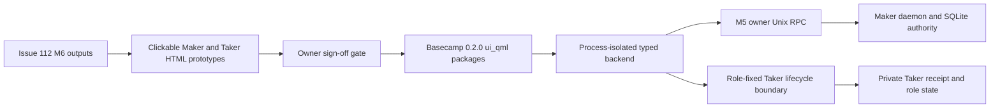
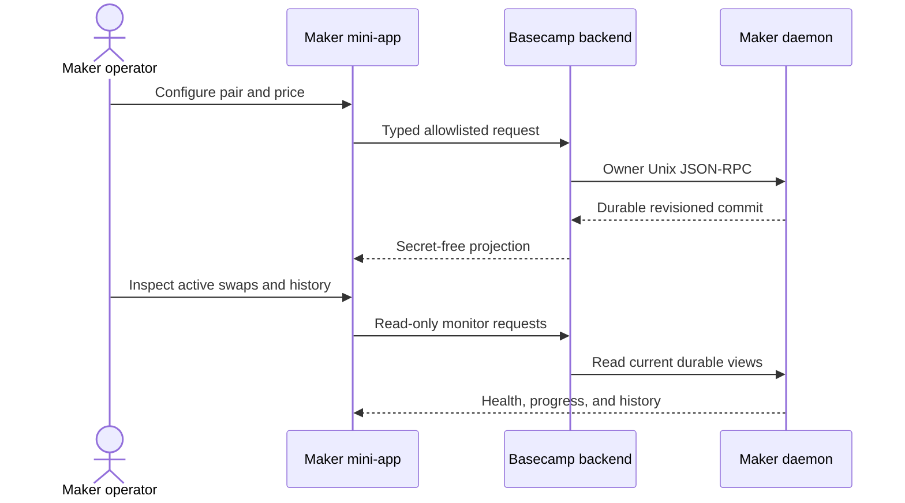
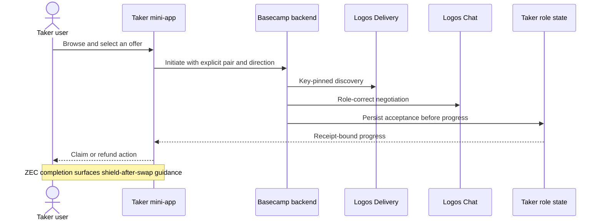

# ADR 0128: Enter M6 through current Basecamp QML

Status: Accepted and implemented for the M6 local-functional PoC on 2026-08-04

## Context

Accepted Gateway issue #112 names four M6 outputs: interactive HTML prototypes
for both roles, a Maker mini-app, a Taker mini-app, and Basecamp-loadable source
with downloadable assets and local-build instructions. The proposal described
the production UI as TypeScript. Current Basecamp 0.2.0 instead loads
`ui_qml` packages whose metadata selects a QML view and whose reproducible Nix
build emits an `.lgx` package. QML cannot contact the owner Unix socket
directly through an invented browser API; it must use a supported
process-isolated backend or Logos module boundary.

The repository owner explicitly approved prototype commit `0abdbc2` on
2026-08-04 after the unchanged-input 6/6 browser revalidation at `17573cd`.
The sign-off gate in this ADR is therefore released for implementation.

## Decision

Use a progressive two-surface delivery:

The HTML prototypes are deterministic, local, and secret-free. They model the
exact user journeys and terminology but never claim daemon or chain effects.
After sign-off, production QML uses the official module-builder 0.2.0 shape and
Logos design-system controls. A process-isolated backend translates only an
allowlisted GUI contract to the existing role-correct M5 surfaces. The UI never
opens SQLite, owns chain keys, or bypasses request IDs, generations, receipts,
or actor locks.

## PoC exit gates

1. Both clickable prototypes cover every accepted screen and can be reproduced
   with one documented local command.
2. Maker flow covers pair/price configuration, active monitoring, and history.
3. Taker flow covers browsing, initiation, progress, terminal action, and the
   ZEC shield-after-swap pattern.
4. Official-QML metadata and pinned build definitions produce both local
   packages; a role-correct UI test drives the same user journeys.
5. Architecture, manual steps, assets, external-resource/flakiness notes,
   license policy, CI vulnerability checks, and milestone metrics stay current.

Production readiness, public-chain execution, and upstream Basecamp API drift
remain later hardening. M6 UI evidence cannot upgrade the chain evidence of
M2-M5.

## Implementation status

All five PoC exit gates are GREEN. The owner approved the 6/6 clickable
prototype replay. Consumer-locked Maker and Taker `ui_qml` packages now produce
module, LGX, developer-install, and official integration outputs and load in the
pinned Basecamp 0.2.0-RC3 product. The Maker product test exercises the real
daemon's health, atomic route save, and history. The Taker product test exercises
the real service's health, offer list, prepared initiation, exact replay, swap
list, and monitor, followed by a direct durable registry assertion. ADR 0147
records the final component, sequence, role, and conditional-atomicity boundary.

Actual-node Claim and Refund remain layered service/actor certificates. The
Basecamp product run is not represented as the source of those chain effects.
