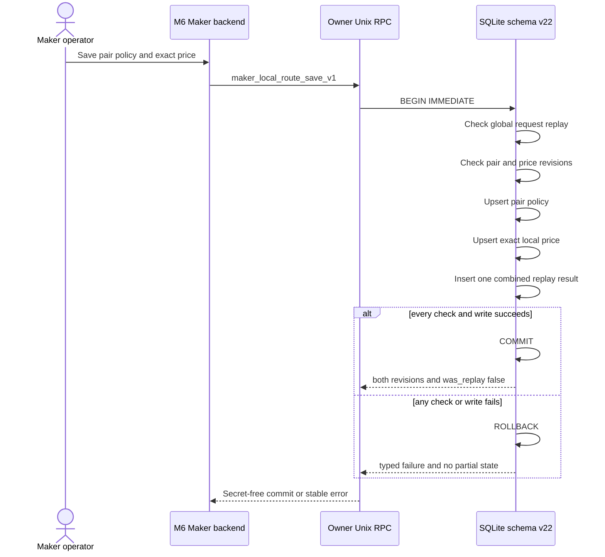
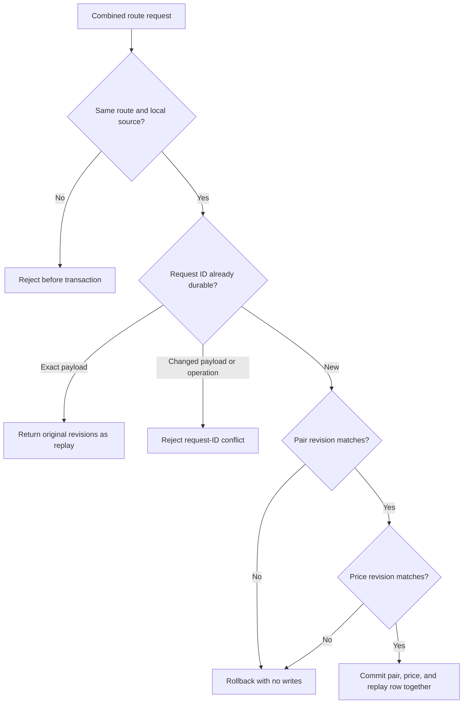

# ADR 0129: Save a Maker local route atomically

Status: Accepted and implemented for M6 at `8c6a7db`

## Context

The original owner API exposed pair configuration and local-price changes as
separate replay-safe mutations. A new enabled local route therefore required
three durable calls: create a disabled route, set its price, then enable it.
Those individual calls were correct, but a one-click Maker UI could crash or
lose transport between them and leave a valid yet unintended intermediate
state. Reusing one request ID was impossible because all Maker mutations share
one global request ledger.

## Decision

Add strict owner-only RPC `maker_local_route_save_v1`. Its typed request carries
one global request ID, both expected route-local revisions, one local-source
pair policy, and one exact reduced integer price for the same route. The daemon
commits both rows and one combined replay result in a single schema-v22
`SQLite` immediate transaction.

Atomicity rests on four local invariants:

1. policy, price, and replay record share one transaction and one writer;
2. route keys must match and the policy must select the local price source;
3. separate pair and price compare-and-swap expectations prevent either family
   from silently overwriting a newer owner edit; and
4. exact request-ID replay returns the original two revisions, while changed
   payload or operation reuse conflicts.

The UI backend must persist the complete pending request envelope before send
when it needs crash-safe retry after an ambiguous response. It retries the
identical envelope; it must not synthesize compensating calls.

## Failure flow

## Consequences and scope

This closes atomicity for one Maker database operation; it is not a distributed
transaction with Delivery, Chat, a wallet, or either chain. Publishing an offer
and executing a swap retain their existing independent idempotency and
lifecycle boundaries.

Focused tests prove fresh enabled-route creation, exact replay, changed-payload
conflict, restart durability, rollback when the second CAS is stale, strict
unknown-field rejection, and one owner-RPC round trip. The complete
`lez-swap-store --all-targets` suite, strict Clippy, warning-fatal Rustdoc,
formatting, and diff hygiene were GREEN before push.
