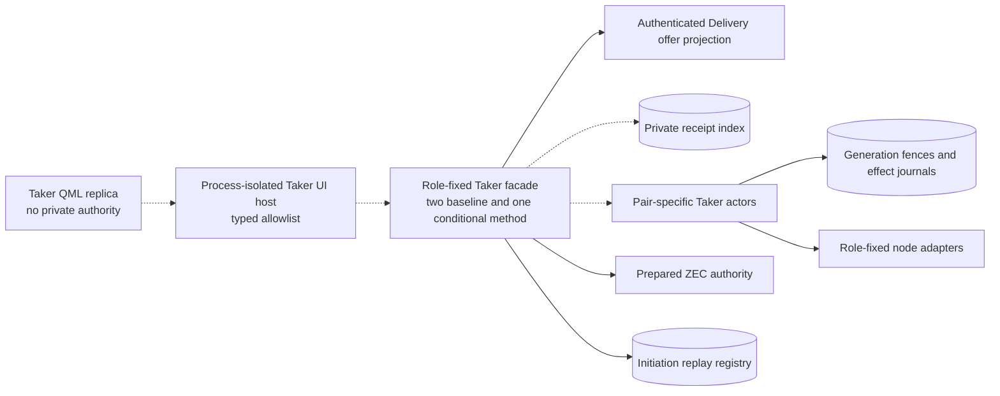
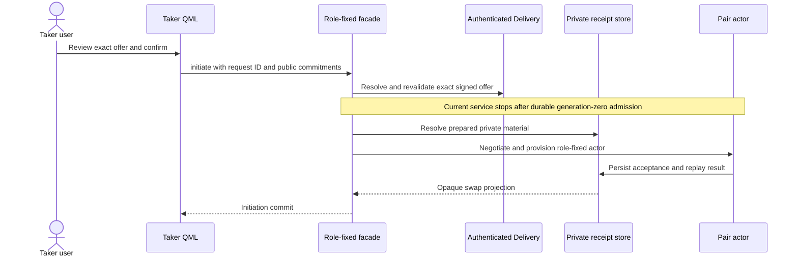
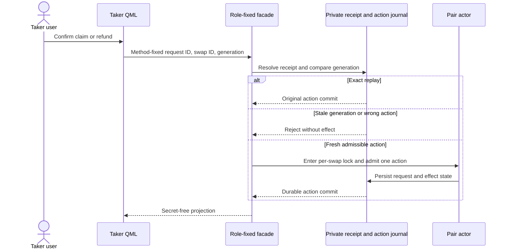

# ADR 0130: expose a strict role-fixed Taker facade

- Status: Accepted; contract, reads, and admission implemented through `1664c41`
- Date: 2026-08-03
- Scope: M6 nonvisual backend boundary

## Context

The Taker UI must browse authenticated offers, initiate one reviewed swap, recover
progress after restart, and request one admissible terminal action. Existing
pair actors already own private receipts, sealed files, keys, node adapters,
effect journals, and per-swap locks. Giving QML a receipt path, socket path,
generic command, raw wire, key, or node endpoint would move authority into the
least trusted process and would bypass the role contracts proven in M2 through
M5.

The current pairs are not semantically identical. Bitcoin and Zcash have
receipt-bound lifecycle commands. The current Monero receipt-v2 work exposes
role-fixed tag checkpoints, but one tag marker is not proof of terminal
cross-chain completion. The facade must report this difference instead of
normalizing it away.

## Decision

The first facade contract is an exact seven-method allowlist:

- `taker_health`;
- `taker_offer_list_v1`;
- `taker_swap_list_v1`;
- `taker_swap_initiate_v1`;
- `taker_swap_monitor_v1`;
- `taker_swap_claim_v1`; and
- `taker_swap_refund_v1`.

Every request is schema-versioned and rejects unknown fields. Initiation carries
only the selected offer ID, exact route, validated compressed Maker identity,
signed-envelope commitment, and reviewed integer amounts. Monitor and terminal
requests carry an opaque swap ID. Claim and refund are different request types,
each with a global request ID and observed generation; the caller cannot choose
a generic action string.

Private material is resolved by the role-fixed service from owner-controlled
configuration and prepared slots. It is never supplied by QML. Health reports
Bitcoin and Zcash terminal routes as full lifecycle and Monero routes as effect
checkpoints only until semantic terminal workers exist.

Reads and prepared admission are solid. QML, QtRO, receipt/lifecycle, and actor
edges remain planned. The typed contract and admission grant no chain-effect
authority by themselves.

## Target execution and terminal flows

## Atomicity argument

The DTO layer is not itself an atomic-swap protocol and makes no chain-effect
claim. It preserves conditional atomicity by refusing to create a second
authority path. ADR 0134 now reuses pair validation, current authenticated
Delivery, persist-before-response admission, and the global replay ledger.
Future execution and terminal methods must additionally enter the per-swap
kernel lock, generation fence, and one-attempt effect journal. Exact request
replay returns the original commit; changed request reuse, stale generation, wrong pair,
wrong direction, or unavailable terminal action fails before a new effect.

For Monero, checkpoint-only capability prevents a tag marker from being shown as
`Completed` or `Refunded`. Production semantic workers remain an upstream
readiness item, not a reason to overstate this M6 contract.

## Consequences

- The UI surface is small, typed, versioned, and auditable.
- Pair and direction substitution cannot be hidden in a generic command.
- QML cannot select filesystem, socket, executable, evidence, or key material.
- Prepared private material is an explicit current initiation limitation.
- Execution workers, receipt/lifecycle resolution, Basecamp host wiring, and
  actor-real E2E remain M6 work after prototype sign-off.

## Amendment — 2026-09-01

Health was overstating Bitcoin Node lifecycle. `taker_health` now reports
Bitcoin initiation, claim, and refund as `owner_cli_or_demo`, and Monero
initiation the same way. Zcash remains `full_lifecycle` on this Node when
initiation is configured. `taker_swap_initiate_v1` rejects a non-Zcash route
with `initiation_unsupported_pair` before touching the registry.

Bitcoin Basecamp continues to drive settlement through the demo controller
(`btcSwapAction`). Bitcoin CLI continues to use `lez-taker-cli` Chat/actor
commands. Those surfaces are unchanged.
