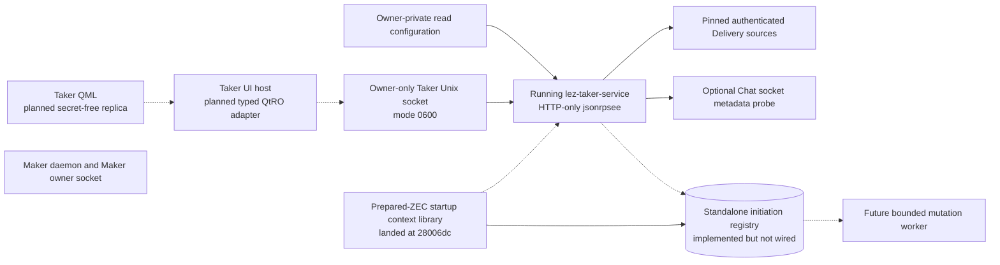
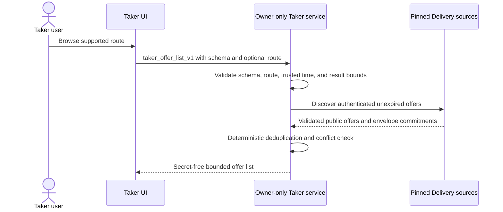
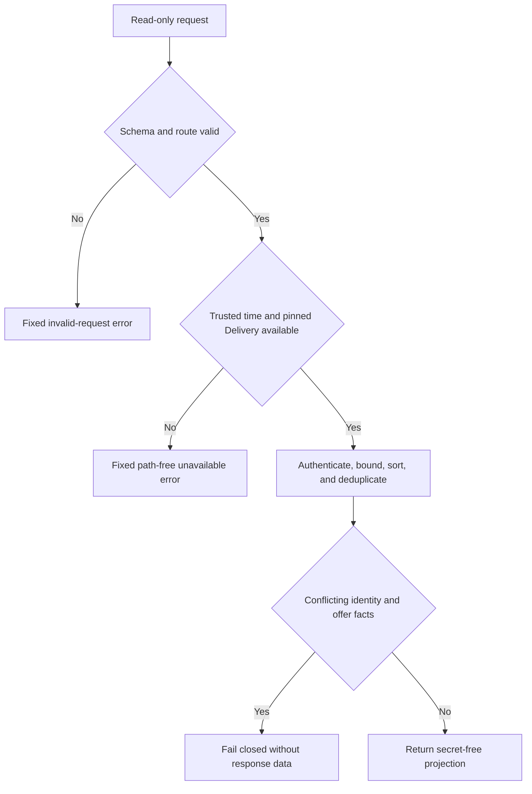

# ADR 0131: isolate the Taker facade on an owner-only service socket

- Status: Accepted; read-only process through `ad088f8`, prepared context library through `28006dc`
- Date: 2026-08-03
- Scope: M6 Taker application deployment

## Context

The Maker daemon owns Maker configuration, offers, negotiation, and Maker actor
state. The Taker application owns different private receipts, signing material,
prepared drafts, pair actors, and recovery authority. Adding Taker UI methods
to the Maker daemon would merge compromise domains and make the Maker owner
socket a generic route into Taker authority. Letting QML call Maker Chat or the
existing CLI would expose raw paths, commands, or protocol material.

The repository already uses jsonrpsee over Tokio Unix HTTP/1, strict typed
parameters, an end-to-end bounded client, owner-owned mode-0700 runtime
directories, mode-0600 sockets, bounded bodies and connections, disabled
batches, and inode-safe cleanup. Reusing that boundary is smaller and easier to
audit than introducing TCP, WebSocket, bearer tokens, or another RPC framework.

## Decision

The dedicated `lez-taker-service` now runs on a distinct owner-only Unix
socket and reuses the library `owner_rpc_server` boundary. It never registers
Maker, Chat, generic command, raw payload, or path-selected methods.

The executable registers only methods backed by real logic: `taker_health`
and `taker_offer_list_v1`. The target seven-method contract remains fixed by
ADR 0130. Swap list, initiate, monitor, claim, and refund are method-not-found,
not a dishonest success or placeholder.

Health reports this exact deployment boundary: health and offer-list are
registered; swap-list, initiate, monitor, claim, and refund are not. Pair-level
capability metadata describes reusable actor support and is not presented as
evidence that an RPC is registered.

Startup configuration is an owner-private, maximum-512-KiB, strict schema-v1
JSON file. The secure loader accepts exact mode 0400 or 0600 on an owner-owned
single-link regular file. It binds zeroizing bytes to the same descriptor's
device, inode, and length, revalidates length around the read, and reopens the
path to reject replacement. The schema accepts only zero to 32 pinned Delivery
source directories and compressed Maker public keys, an optional absolute Chat
socket used for a metadata-only availability probe, and `maximum_offers` from
1 through 1024. The service does not yet accept a registry path, prepared pair
material, receipt selector, actor path, wallet credential, or node endpoint.
None of its configured paths, identities, parser details, or adapter errors
cross the RPC response.

The absence of an edge between the Taker service and Maker denotes separation:
the Taker service does not enter the Maker owner socket. Solid edges are implemented components. The QML, QtRO, registry wiring, mutation worker,
and actor edges remain planned. The prepared context is component-GREEN but
remains dashed to the executable: the legacy backend loader rejects rather than
silently discards initiation authority, so it does not alter the current method
set. Negotiation continues only through existing
authenticated Delivery and role-fixed Chat protocol boundaries.

## Read-only request flow

## Transport and isolation rules

- Socket paths are absolute and their real parent directory is euid-owned mode
  0700.
- Existing endpoint paths are never replaced.
- The bound endpoint is rechecked as an euid-owned mode-0600 Unix socket.
- Cleanup removes only the captured device and inode.
- The server is HTTP-only with batches disabled, at most 16 connections, and a
  64 KiB request/response bound for this secret-free control surface.
- The typed client has one 30-second end-to-end timeout and aborts its Hyper
  connection driver on timeout.
- There is no TCP, WebSocket, bearer-token, generic JSON, CLI shell-out, or
  direct UI-to-Chat/node fallback.

## Atomicity argument

Health and offer listing are read-only and perform no swap or wallet effect.
They fail before returning a partial or unauthenticated offer set when a pinned
source fails, a result cap is exceeded, or duplicate immutable facts conflict.
This does not prove cross-chain atomicity.

ADR 0132 implements a standalone SQLite initiation-admission foundation:
one transaction commits exact public facts, private authority, and the request
and result ledger. It is not wired to this process. A future initiation method
must resolve and revalidate its authority, use that registry, and return only
after the admission is durable. A later bounded worker must enter the existing
receipt validator, per-swap lock, generation fence, and one-attempt pair effect
journal. Until those connections exist, every mutation method remains absent.

## Consequences

- Maker and Taker compromise domains stay process- and socket-separated.
- The actual read-only service, private startup loader, health, offer list,
  SIGTERM cleanup, restart, and replacement-inode preservation are process-GREEN.
- The implementation reuses maintained dependencies and already tested custody.
- The standalone registry is a separate library foundation, not a service
  capability.
- Initiation and terminal RPCs, workers, durable ZEC composition, Basecamp host,
  QML, actor-real UI test, and owner prototype sign-off remain M6 work.
