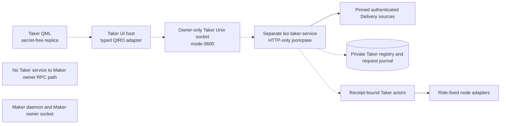
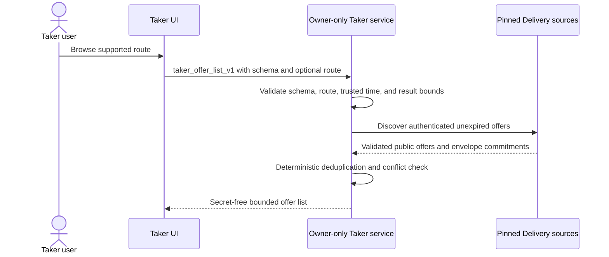
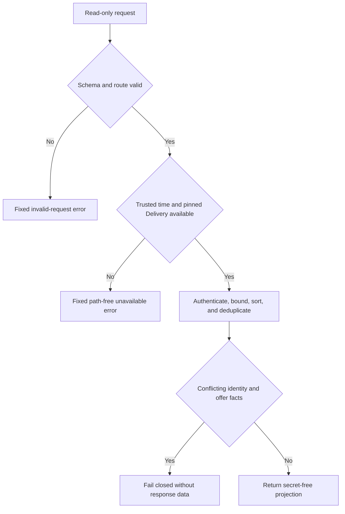

# ADR 0131: isolate the Taker facade on an owner-only service socket

- Status: Accepted; reusable transport custody and read-only backend implemented
- Date: 2026-08-03
- Scope: M6 Taker application deployment

## Context

The Maker daemon owns Maker configuration, offers, negotiation, and Maker actor
state. The Taker application owns different private receipts, signing material,
prepared drafts, pair actors, and recovery authority. Adding Taker UI methods
to the Maker daemon would merge compromise domains and make the Maker owner
socket a generic route into Taker authority. Letting QML call Maker Chat or the
existing CLI would expose raw paths, commands, or protocol material.

The repository already uses jsonrpsee over Tokio Unix HTTP/1, strict typed
parameters, an end-to-end bounded client, owner-owned mode-0700 runtime
directories, mode-0600 sockets, bounded bodies and connections, disabled
batches, and inode-safe cleanup. Reusing that boundary is smaller and easier to
audit than introducing TCP, WebSocket, bearer tokens, or another RPC framework.

## Decision

Run a dedicated `lez-taker-service` process on a distinct owner-only Unix
socket. It will reuse the library `owner_rpc_server` and `call_local_rpc`
boundaries. It will never register Maker, Chat, generic command, raw payload, or
path-selected methods.

The first executable service slice registers only the methods backed by real
logic: health and authenticated offer listing. Mutation methods are added only
after the private durable registry and request journal implement exact replay,
expected-generation fencing, and one-winner terminal admission. The target
seven-method contract remains fixed by ADR 0130; absent methods fail as method
not found rather than returning a dishonest success or placeholder.

Startup configuration is owner-private. It supplies pinned Delivery sources,
Chat availability, prepared pair material, registry storage, and receipt
selectors. None of those paths, credentials, or errors cross the RPC response.

The absence of an edge between the Taker service and Maker denotes separation:
the Taker service does not enter the Maker owner socket. Negotiation continues
only through the existing authenticated Delivery and role-fixed Chat
protocol boundaries.

## Read-only request flow

## Transport and isolation rules

- Socket paths are absolute and their real parent directory is euid-owned mode
  0700.
- Existing endpoint paths are never replaced.
- The bound endpoint is rechecked as an euid-owned mode-0600 Unix socket.
- Cleanup removes only the captured device and inode.
- The server is HTTP-only with batches disabled, at most 16 connections, and a
  64 KiB request/response bound for this secret-free control surface.
- The typed client has one 30-second end-to-end timeout and aborts its Hyper
  connection driver on timeout.
- There is no TCP, WebSocket, bearer-token, generic JSON, CLI shell-out, or
  direct UI-to-Chat/node fallback.

## Atomicity argument

Health and offer listing are read-only and perform no swap or wallet effect.
They fail before returning a partial or unauthenticated offer set when a pinned
source fails, a result cap is exceeded, or duplicate immutable facts conflict.
This does not prove cross-chain atomicity.

Future initiation and terminal methods must first commit their exact request and
result in the service-owned SQLite journal, then let a bounded worker enter the
existing receipt validator, per-swap lock, generation fence, and one-attempt
pair effect journal. A disconnected RPC therefore replays a durable admission
rather than resubmitting an effect. Until that exists, mutation methods remain
absent.

## Consequences

- Maker and Taker compromise domains stay process- and socket-separated.
- The implementation reuses maintained dependencies and already tested custody.
- Read-only UI integration can proceed without inventing mutation semantics.
- Startup configuration and registry design remain private service concerns.
- The actual Taker service binary, durable ZEC vertical, Basecamp host, and
  actor-real UI test remain M6 work.
