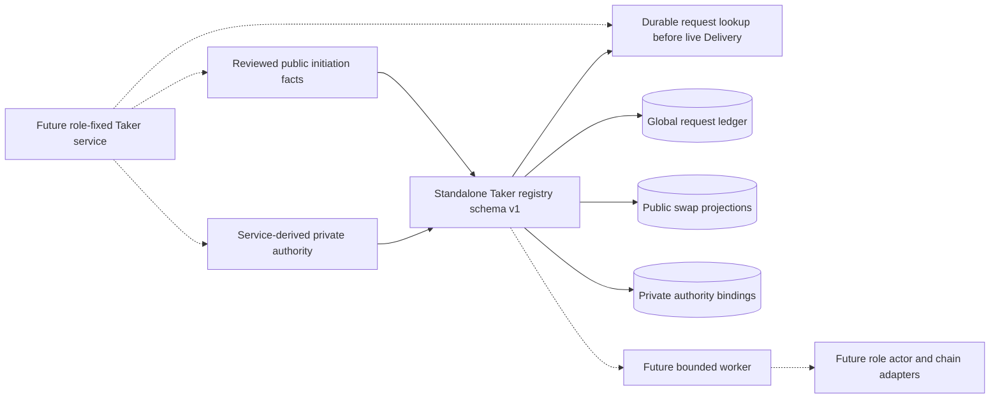
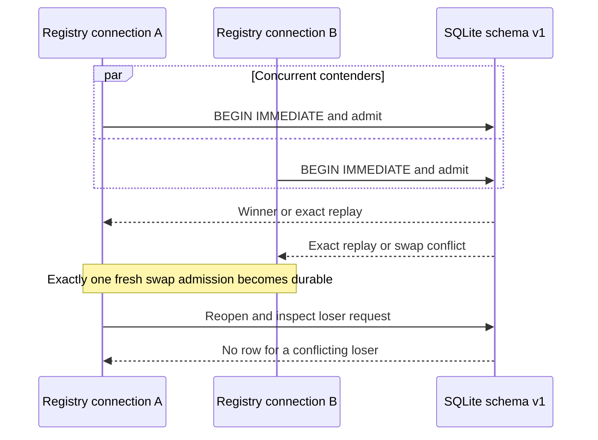
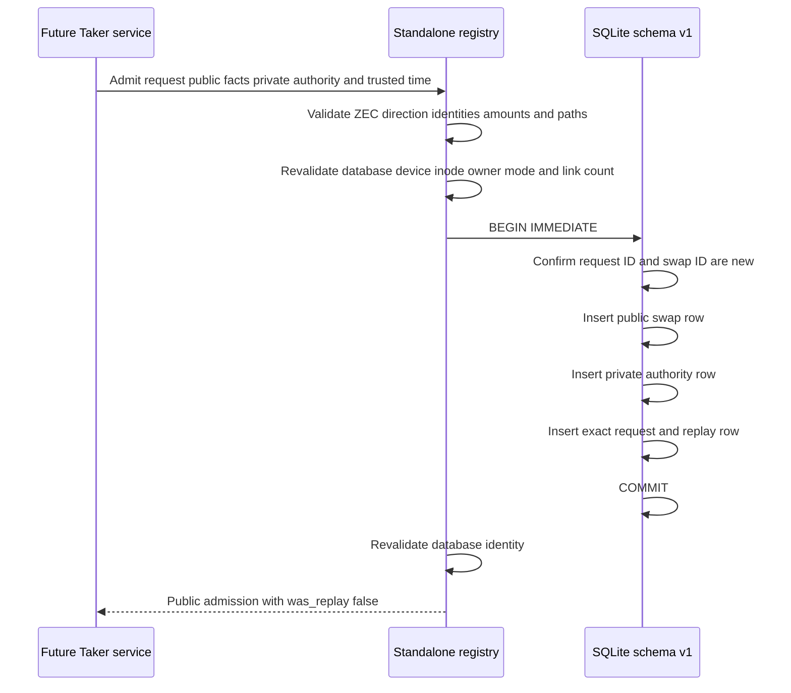
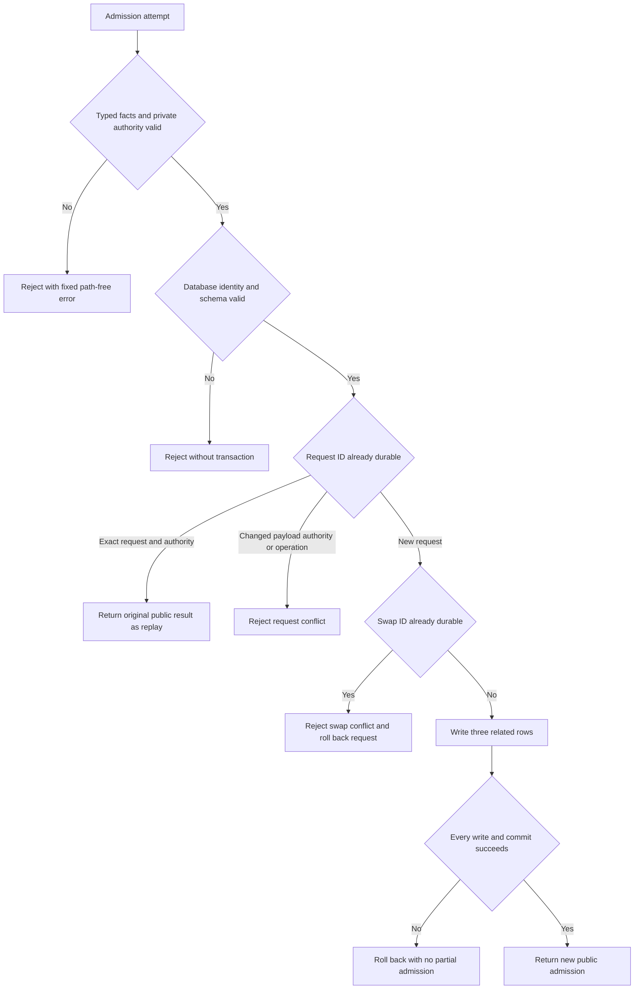
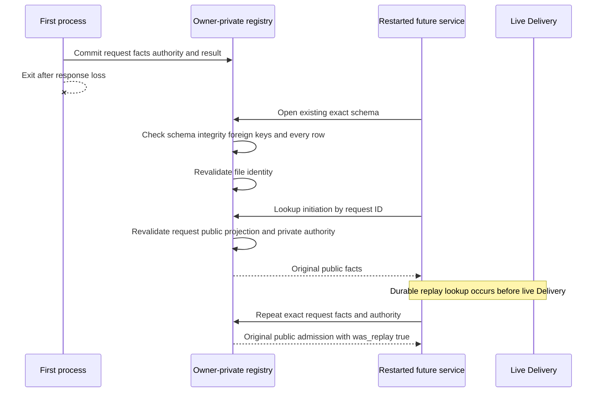

# ADR 0132: persist Taker initiation admission in a standalone registry

- Status: Accepted and implemented as a standalone M6 foundation through `9820400`
- Date: 2026-08-03
- Scope: M6 nonvisual Taker initiation persistence

## Context

The target Taker facade needs exact initiation replay after an ambiguous response
without giving the UI a receipt path, signing key, draft, actor directory, or
generic command. The Maker database is the wrong owner because Maker and Taker
authority must remain process-separated. The read-only `lez-taker-service`
also cannot honestly register an initiation method until durable admission and
a bounded worker are composed behind it.

This first slice therefore owns only a separate Taker schema-v1 SQLite registry.
It accepts public immutable facts for the current ZEC `TakerSellsLez` vertical
and service-derived private authority bindings. It deliberately contains no
service wiring, worker, actor, Chat, chain, claim, refund, or effect authority.

## Decision

Create `SqliteTakerFacadeStore` as a distinct owner-private database, not a
table in the Maker schema-v22 store. Exclusive creation and reopen use
`openat2` with no-symlink resolution, require a normalized absolute path, and
pin an effective-UID-owned regular mode-0600 file with one link and stable
device and inode. The schema uses a fixed application ID, schema version one,
strict tables, foreign keys, WAL, `synchronous=FULL`, and secure delete.

One immediate transaction binds all of these values:

- exact global request ID and operation `initiate`;
- public swap, offer, route, Maker identity, signed-envelope commitment, and
  integer amounts;
- private source, reservation, file identity, digest, actor-root, agreement,
  and receipt-output authority; and
- the exact durable public replay result.

Only ZEC with direction `TakerSellsLez` is admitted in this schema. Public
listing returns only validated public facts in stable swap-ID order. Durable
`lookup_initiation` accepts a request ID, revalidates the request, public row,
and private authority row, and returns only public facts. It performs no live
Delivery or trusted-time check, so future service wiring can resolve durable
replay before consulting an offer that may have expired or disappeared.
Private authority has no public getters, redacts `Debug`, and never appears in
errors or replay results.

## Components

Solid edges are implemented library boundaries. The service, worker, actor, and
chain edges are dashed because `9820400` does not wire the registry into
`lez-taker-service` and does not register `taker_swap_initiate_v1`.

## Concurrent admission evidence

Pushed commit `9820400` exercises two independently opened SQLite connections,
not two calls serialized through one Rust owner. Identical requests converge to
one fresh result plus one exact replay. Different request and authority values
for the same swap converge to one winner plus one `SwapConflict`; after reopen,
the loser has no request row and can be reused for a different swap.

The full registry suite is GREEN 12/12. The two concurrent cases passed 40
repeated invocations, for 80 concurrent-test executions. This is local database
concurrency evidence only; it neither wires the service nor starts a worker.

## Admission success

No public result contains the stored paths, signing-key binding, private source
identity, or receipt location.

## Conflict and failure

A losing same-swap request leaves no request row, so that request ID can still
be used later for a different valid new swap. Reopen additionally rejects
missing, extra, version-drifted, or cross-inconsistent public, authority, and
request rows.

## Restart and exact replay

An unknown request returns no durable facts. A changed public fact, private
authority binding, operation, or runtime projection is not replay. Lookup or
admission fails closed as conflict or corruption without consulting Delivery.

## Atomicity argument

The registry provides local crash atomicity for initiation admission only. The
public swap row, private authority row, and exact request/result row commit in
one `BEGIN IMMEDIATE` transaction, or none of them become durable. Exact
request replay verifies all three representations and returns the original
public result. The durable lookup separately revalidates those representations
and private authority before returning public facts, with no live dependency.
An existing swap rejects a second owner, and the rejected transaction does not
consume the losing request ID. File and schema identity are revalidated before
and after operations and again on reopen.

This preserves the future swap's single admission authority and prevents an
ambiguous RPC response from authorizing a second initiation. It does not itself
negotiate, publish an actor, submit a transaction, observe finality, or make the
two chains atomic. Cross-chain conditional atomicity remains in the
pair-specific agreement, taker-first ordering, timelocks, canonical observation,
per-swap lock, generation fence, and one-attempt effect journals that a future
worker must reuse.

## Limitations and consequences

- The registry is not connected to `lez-taker-service`; initiation RPC remains
  method-not-found.
- Only ZEC `TakerSellsLez` initiation facts are accepted.
- No worker consumes the stored authority and no chain or wallet call occurs.
- Swap list, monitor, claim, and refund service methods remain absent.
- Claim/refund rows are reserved by the schema vocabulary but have no API or
  implementation.
- Private authority is stored by the owner process. Production custody,
  encryption, backup, deletion, process-kill matrices, and malicious-owner
  hardening remain later work.
- Owner prototype sign-off still gates QML and QtRO implementation.
