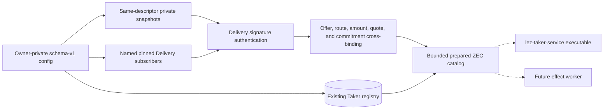
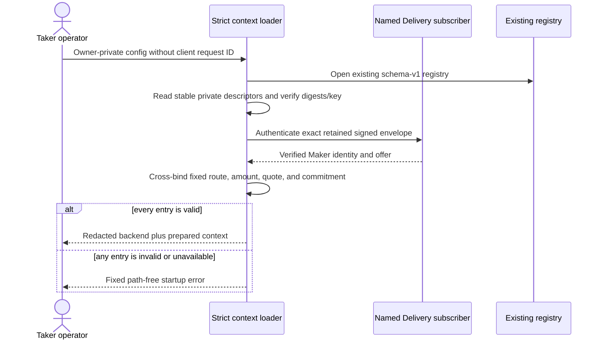

# ADR 0133: bind prepared ZEC service authority before admission

- Status: Accepted and component-GREEN at `28006dc`
- Date: 2026-08-03
- Scope: M6 nonvisual Taker authority loading

## Context

The Taker facade request deliberately contains only reviewed public facts and a
dynamic request ID. Drafts, signing keys, actor configuration, output paths,
Maker reservations, and registry selection must remain service-owned. A digest
alone would pin bytes without proving that the retained Delivery envelope was
signed by the named Maker or described the configured offer and quote.

The current executable remains read-only. This decision prepares authority for
the next admission slice without registering a mutation method or performing a
Chat, actor, wallet, node, or chain effect.

## Decision

A strict optional schema-v1 initiation object opens one existing standalone
registry and at most 256 static ZEC `TakerSellsLez` entries. Delivery source
IDs are optional for legacy reads, but every prepared entry references a valid,
unique named source. Swap, offer, reservation, source, amounts, and private
paths are operator-fixed. Dynamic client request IDs, caller-selected Maker
identity, and caller-selected route are unknown fields and fail parsing.

Each private input is read from one owner-owned, single-link, mode-0400-or-0600
regular descriptor. Device, inode, and length are stable across the bounded
read and path re-open. Immutable inputs also match canonical lowercase SHA-256;
the signing input is exactly one valid 32-byte secp256k1 secret.

The retained signed envelope is authenticated by the referenced Delivery
subscriber. Its Maker identity, offer ID, ZEC `TakerSellsLez` route, exact
integer quote for the configured foreign amount, and envelope commitment must
all match before an authority enters the in-memory catalog.

Solid edges are component-GREEN library work. Dashed edges are absent: the
legacy backend loader rejects initiation authority rather than dropping it,
the executable still registers only health and offer list, and no worker exists.

## Load and failure flow

## Atomicity and trust argument

Loading is effect-free and all-or-nothing to the caller: it neither creates nor
migrates the registry, never writes an admission row, and returns no partial
context when any source, file, digest, key, envelope, quote, identity, bound, or
path fails. Same-descriptor checks prevent bytes from being validated against
metadata collected from another file. Real Delivery authentication prevents a
well-digested but unsigned or wrong-Maker envelope from becoming authority.

This is not swap atomicity and not live worker authority. Files may change after
startup. The future admission path must resolve durable replay before Delivery
or time, and the future worker must re-open and revalidate every stored
device/inode/digest binding immediately before Chat or actor use under a durable
work lease and the existing per-swap kernel lock.

## Consequences

- Legacy read-only configuration remains compatible without source IDs.
- The configuration bound is 512 KiB so the explicit 256-entry catalog bound is
  representable; RPC request and response bodies remain independently 64 KiB.
- Paths, private bindings, reservation IDs, parser details, and adapter errors
  do not cross Debug or fixed startup errors.
- The current executable still rejects the optional context and reports
  initiation unregistered.
- Service admission, restart replay, worker progress, actor lifecycle, QML,
  Basecamp loading, and actor-real E2E remain M6 work.
