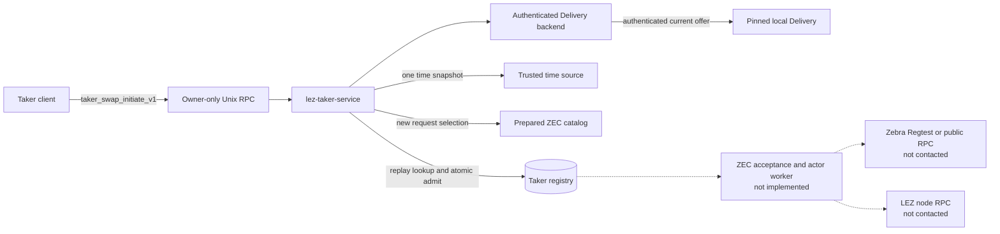
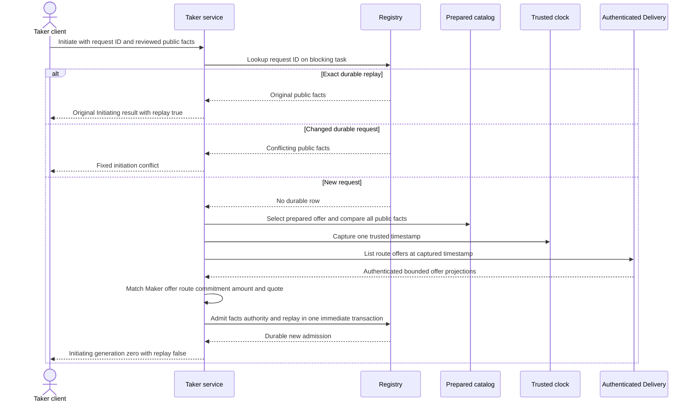

# ADR 0134: admit Taker initiation before starting any effect worker

- Status: Accepted and service/process/concurrency GREEN through `e7a7e2b`
- Date: 2026-08-03
- Scope: M6 replay-first ZEC Taker service admission

## Context

ADR 0132 created an atomic owner-private initiation registry and ADR 0133
created a strict prepared-ZEC authority catalog. Keeping both outside the
running service left taker_swap_initiate_v1 unavailable. Wiring initiation
must preserve exact retry after Delivery expiry or removal, prevent caller
selection of private authority, avoid blocking the async runtime on SQLite, and
avoid presenting admission as a completed or even started cross-chain swap.

## Decision

lez-taker-service loads the complete validated service context. It always
registers health and authenticated offer listing. It registers
taker_swap_initiate_v1 only when the optional initiation context loaded
successfully, and health reports that exact method set.

The initiation handler validates the schema and performs these operations in
order:

1. look up the request ID in the existing registry on a blocking task;
2. return the original public result for an exact durable replay, or reject a
   changed reuse as initiation_conflict;
3. for a new request, select the operator-prepared entry by offer ID and compare
   every public request fact;
4. capture one trusted-time snapshot and authenticate current Delivery offers
   at that exact timestamp;
5. require an exact Maker, offer, route, envelope commitment, foreign amount,
   and integer LEZ quote match; and
6. atomically admit public facts, private authority, and replay result in one
   immediate SQLite transaction before returning Initiating generation zero.

SQLite and mutex work runs in spawn_blocking. The prepared entry is cloned
under the mutex, and no mutex guard is retained across Delivery await.

## Components

Solid arrows are implemented. Dashed arrows are the remaining execution
vertical; admission grants no Chat, actor, wallet, signer, Zebra, LEZ, claim,
refund, or other chain-effect call.

## Replay-first admission flow

Replay deliberately precedes catalog, clock, and Delivery. Therefore a process
restart can return the committed result after the offer file is removed or its
TTL expires. A new request never bypasses current authenticated Delivery.

## Atomicity argument

The local admission is atomic because the registry transaction commits the
public projection, private authority, and global request/result replay row
together. The RPC returns success only after commit. Any failed write or commit
rolls back all three records. Concurrent exact requests converge to one new
admission and replay; different requests for the same swap produce one winner
and one conflict without consuming the losing request ID.

Delivery authentication and SQLite commit are not one distributed transaction.
An offer can be removed after the service authenticated its exact bytes and
before the local commit. This does not substitute another offer: the admitted
facts and prepared authority remain bound to the same signed-envelope SHA-256,
Maker identity, route, offer, amount, and quote. It also creates no external
effect. The single trusted timestamp is reused for both TTL selection and the
registry creation time, avoiding a second clock sample.

This is admission atomicity, not swap atomicity. The response state is
Initiating only. No Chat exchange, countersigned agreement, Taker actor,
Zebra transaction, LEZ transaction, claim, or refund is started. Cross-chain
conditional atomicity remains the responsibility of the existing countersigned
agreement and role actors once a future durable worker composes them.

## Consequences

- Empty/read-only configurations remain backward compatible and register only
  health and offer listing.
- Configurations with validated prepared authority truthfully register
  initiation as the third method.
- RPC errors expose fixed codes and categories, not paths, reservation IDs,
  keys, credentials, parser details, or private authority.
- Exact process restart replay is independent of live Delivery.
- The next nonvisual M6 slice must compose the real ZEC acceptance path
  extracted at `0afb6da`, revalidate stored private bindings at use time,
  persist worker progress or leases, and drive receipt-bound actors before swap
  list, monitor, claim, or refund can be registered.
