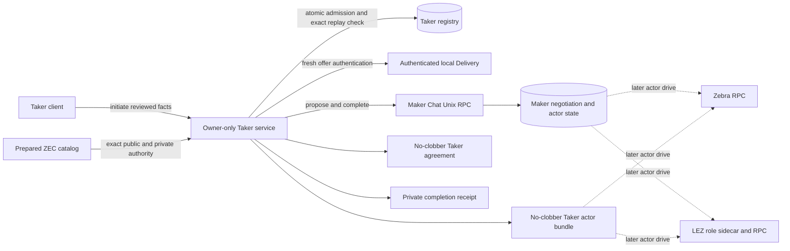
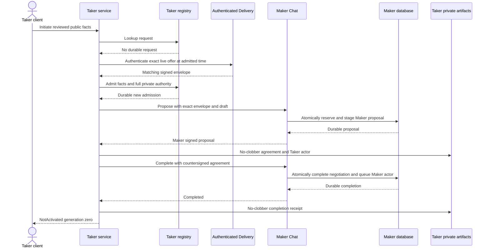
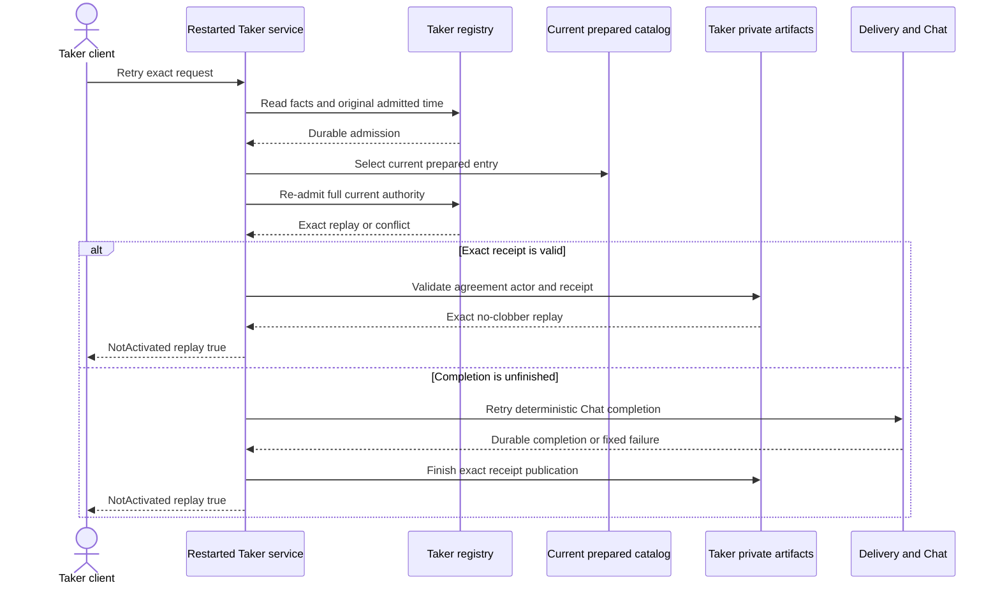

# ADR 0135: Complete prepared ZEC acceptance before service response

- Status: Accepted and implemented at `5536dd0`
- Date: 2026-08-03
- Scope: M6 nonvisual Taker ZEC happy path
- Extends: ADRs 0092, 0093, 0132, 0133, and 0134

## Context

ADR 0134 stopped after durable admission and returned `Initiating`. The real
ZEC taker path already authenticated Delivery, negotiated over the disjoint
Maker Chat socket, countersigned the agreement, provisioned a role-fixed actor,
and published a private receipt, but the owner service did not invoke it. M6
needs the same role and process boundary an eventual Taker mini-app will use,
including a reproducible restart after transport loss.

Execution must not weaken replay-first admission. A restart must use the
original trusted admission time, must not substitute current private authority,
and must not reopen a digest-checked actor config after the check.

## Decision

A prepared ZEC catalog entry may opt into execution with
`execute_prepared_zec: true`. The service admits the exact public facts and
full private authority first. It then calls the reusable exact-offer acceptance
path and returns `NotActivated` generation zero only after the countersigned
agreement, Taker actor bundle, Maker completion, and Taker receipt are durable.

On an exact restart replay the service:

1. reads the durable facts and original admission timestamp;
2. selects the current prepared entry;
3. reuses `admit_initiation` to compare its full private authority with the
   existing private row;
4. retries acceptance at the original timestamp; and
5. accepts an offline result only when the exact completion receipt and actor
   artifacts revalidate.

The service loads the source `ActorConfig` once with its pinned digest and
passes that object into config-based actor provisioning. The legacy CLI path
retains its path-loading behavior.

## Components



The node edges are dashed because this checkpoint starts neither actor and
performs no chain, wallet, signer, faucet, or public-network call.

## Fresh acceptance sequence



If any step after registry admission fails, the RPC returns a fixed dependency
error and retains the admission. The same request resumes through deterministic
Chat request IDs and no-clobber outputs; it does not create a second swap.

## Restart and transport-loss sequence



The tested offline branch removes the Delivery offer and makes the Chat socket
unavailable after completion. It succeeds from the durable receipt without
rewriting agreement, actor config, or receipt bytes and inodes.

## Why this is atomic, and where it is not

- Admission is one immediate SQLite transaction over public facts, private
  authority, and global replay identity. A same-swap loser rolls back.
- Maker proposal staging commits before its response. Maker completion commits
  the final agreement, consumed offer, coordinator, binding, claim material,
  queued actor, and replay result in one Maker transaction.
- Taker artifacts use create-new or exact-replay publication. A crash after
  agreement or actor creation converges by validating exact bytes; divergent
  pre-existing outputs fail closed.
- The completion receipt is published only after Maker completion. Therefore an
  offline receipt is evidence of a previously completed Maker handoff, not an
  inference from a local agreement file.
- The service response follows all of those durable boundaries. Response loss
  is replayable and does not repeat a non-idempotent admission or Chat action.

This is not a distributed cross-chain commit. Neither role actor starts here,
so no Zcash lock, LEZ transfer, claim, or refund occurs. Cross-chain atomicity
continues to come from the validated agreement, hashlock and timelock
construction, role-separated keys, durable effect journals, finalized
observation, and claim-or-refund actor state machines when later lifecycle
work drives them.

## Reproducible evidence

```bash
cargo test --locked -p lez-maker-node --test zec_chat_process \
  service_initiation_completes_real_chat_before_not_activated_response \
  -- --exact --nocapture

cargo test --locked -p lez-maker-node \
  --test zec_chat_process \
  --test taker_initiation_config \
  --test taker_initiate_rpc \
  --test taker_service_process \
  --no-fail-fast
```

The first command is the actual-process happy path. The affected set is GREEN
14/14. Strict all-target Clippy, warning-fatal Rustdoc, formatting, and diff
hygiene were also GREEN before `5536dd0`.

## Consequences and remaining hardening

- No public RPC, faucet, peer, DNS, or public funds are used. The proof uses
  run-unique owner-private files, SQLite, Unix sockets, and deterministic keys.
- Fresh acceptance needs local Delivery and Chat. Completed receipt replay
  needs neither offer content nor a live Chat exchange, although startup still
  opens the configured Delivery directory.
- Draft and signing-key bytes are rechecked before execution, but the current
  acceptance API rereads their paths. Direct retained-byte handoff plus exact
  use-time device and inode enforcement remains a production hardening item.
- Admission-only prepared catalogs currently still require a configured Chat
  socket and retain execution material; making execution authority optional is
  a compatibility and least-authority hardening item.
- Swap list, monitor, actor driving, claim, refund, QML, QtRO, and actor-real UI
  composition remain later M6 work.
