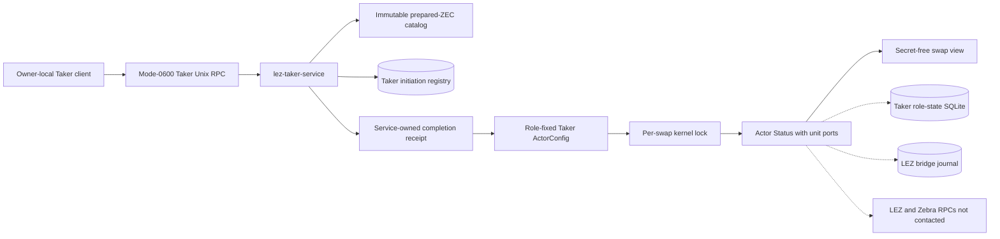
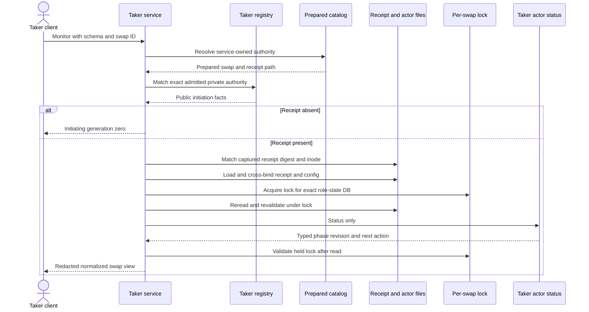
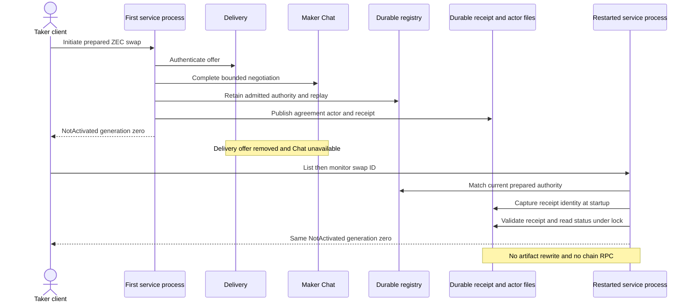

# ADR 0136: Project admitted ZEC swaps under the actor lock

- Status: Accepted at `e9393cf`; receipt/lock hardening at `3307dca`
- Date: 2026-08-03
- Scope: M6 receipt-bound Taker swap list and monitor

## Context

ADR 0135 leaves an accepted ZEC swap in durable Taker and Maker custody but
does not expose it after the initiation response. A UI-facing read must not
accept caller-selected receipt, actor, database, socket, or node paths. It
must also avoid racing the actor worker and must remain usable after Delivery
and Chat disappear.

## Decision

When a validated prepared-ZEC catalog is present, `lez-taker-service` registers
`taker_swap_list_v1` and `taker_swap_monitor_v1` beside health, offer list,
and initiate. Claim and refund remain unregistered.

The service resolves a swap only through its immutable prepared catalog and
requires the exact admitted private authority in the Taker registry. A missing
completion receipt projects `Initiating`. A present receipt is captured by digest, device, and inode at startup or
acceptance, loaded only from the service-owned prepared path, cross-bound to the prepared actor root
and swap ID, and used to select the role-state lock. The service rereads and
revalidates the actor configuration after acquiring that lock, invokes only
`ActorCommand::Status`, validates the lock again, and converts the typed actor
status into the secret-free Taker DTO. Unknown swap IDs and offer-ID
substitution receive the same fixed `swap_not_found` response.

## Fresh monitor sequence

## Restart and offline sequence

## Read atomicity and race argument

This read is not a distributed transaction and does not make the cross-chain
swap atomic. Its consistency boundary is nevertheless explicit:

1. the service, not the caller, selects the prepared authority and receipt;
2. the registry admits facts, private authority, and replay atomically before
   the receipt can exist, and monitoring requires that exact authority;
3. the receipt must match its process-incarnation digest, device, and inode;
4. the receipt and actor configuration are cross-bound before locking, then
   reread after the per-swap kernel lock is held;
5. actor workers use the same lock, so a worker cannot commit role-state
   progress concurrently with the status read;
6. the lock is validated after `Status`, and `Status` uses unit ports and
   performs no chain, wallet, Delivery, or Chat call; and
7. the RPC writes no registry, receipt, actor configuration, state, journal,
   or chain artifact.

One list response is a stable swap-ID-ordered series of individually locked
projections, not one cross-swap SQLite snapshot. That is sufficient for a UI
inventory but callers must use each view's generation rather than infer a
global instant.

The process-incarnation receipt fence rejects same-byte inode replacement.
The remaining production hardening is explicit: receipt and role-state rollback
across restart still need a durable monotonic incarnation binding rather than
trusting the files present at the next startup. Claim and refund must later consume an observed generation through their own one-attempt,
role-fixed effect boundaries. Neither gap permits this read path to issue an
effect, but both prevent an M6 completion claim.

## Evidence and consequences

The real service-connected ZEC test first completes acceptance, then removes
the Delivery offer and makes Chat unavailable. Health reports exactly five
registered methods; list and monitor return the accepted swap as
`NotActivated`, generation zero, with no action. Unknown and substituted IDs
return fixed redacted errors. Agreement, actor configuration, and receipt
bytes and inodes remain unchanged. Hardening `3307dca` additionally proves that
same-byte receipt inode replacement and actor-lock contention fail closed, then
the exact monitor recovers after the canonical inode and lock are restored.
Commit `9cf1a34` additionally proves bound deletion, coherent
receipt/config cross-tamper, and corrupt role-state make monitor and the whole
list unavailable, while never-published custody remains `Initiating`.

Owner prototype sign-off still gates production QML and QtRO. Actor driving,
generation-fenced claim/refund, actor-real UI composition, Basecamp packages,
final gates, the M6 completion decision, and the M6 tag remain pending.
