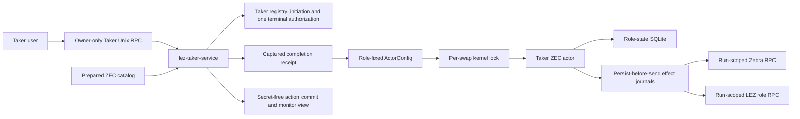
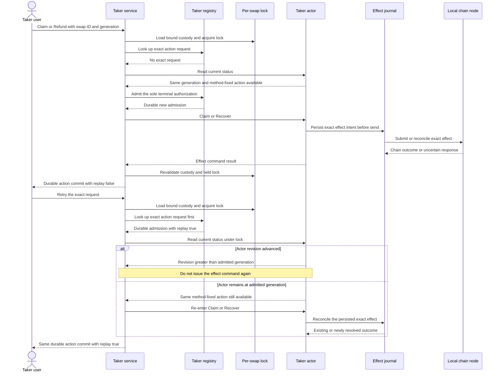
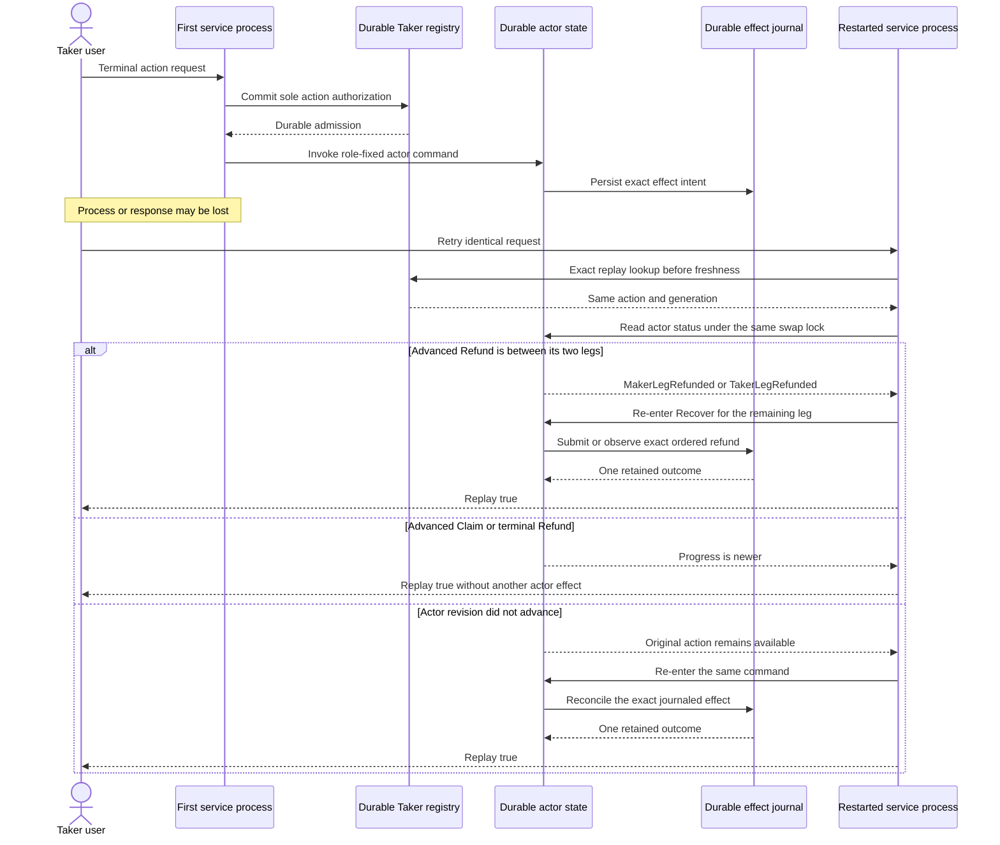

# ADR 0137: Authorize one Taker terminal action before effects

- Status: Accepted and locally proven for the service-driven
  `TakerSellsLez` claim happy path through `0c32200`
- Date: 2026-08-03
- Scope: M6 prepared-ZEC Taker claim and refund authorization
- Extends: ADRs 0130, 0131, and 0136

## Context

ADR 0136 projects one accepted ZEC swap from service-owned custody under the
same per-swap lock used by its actor. It deliberately stopped before terminal
effects. The owner service now needs to accept a user-visible Claim or Refund
without allowing a stale screen, a retried response, a concurrent request, or a
replacement private artifact to authorize conflicting irreversible work.

The service and actor have different durable responsibilities. The service
must remember which terminal intent it admitted before calling an effectful
actor command. The actor retains its existing persist-before-send journals and
reconciles an exact command after response loss. Treating either boundary alone
as an exactly-once distributed transaction would be incorrect.

## Decision

When a validated prepared-ZEC initiation context exists,
`lez-taker-service` registers all seven role-fixed methods, including
`taker_swap_claim_v1` and `taker_swap_refund_v1`. Each terminal request contains
only a request ID, swap ID, and expected progress generation. The service, not
the caller, resolves the prepared authority, completion receipt, actor
configuration, role-state database, bridge journal, and node capabilities.

The service handles a terminal request while retaining the exact actor's
per-swap kernel lock:

1. match the swap to the current prepared catalog and exact private initiation
   admission;
2. require the captured receipt digest, device, and inode, cross-bind its actor
   configuration, acquire the actor lock, then reload and revalidate custody;
3. look up an exact durable action request before consulting current progress;
4. for a new request, require the actor revision to equal the requested
   generation and the actor's available action to equal the method-fixed Claim
   or Refund;
5. commit the request, action, swap, and generation in one immediate Taker
   registry transaction before invoking the actor;
6. reject every different terminal authorization for that swap, including the
   opposite action at a later generation; and
7. map Claim to `ActorCommand::Claim` and Refund to
   `ActorCommand::Recover`, retaining the lock through the command and a final
   custody and lock validation.

The action row is an irreversible service authorization, not evidence that a
chain transaction finalized. Monitor and list overlay its nonterminal actor
view as `ClaimInProgress` or `RefundInProgress`, remove the available action,
and suppress completion privacy guidance. The underlying actor remains the
authority for effect journaling, observation, state revision, and terminal
classification.

## Components

The service has no caller-selected edge to state, journals, keys, or nodes.
Node effects remain behind the role-fixed actor and its journal authority.

## Fresh action and exact replay sequence

Exact replay intentionally precedes the freshness check. Otherwise a request
whose first effect advanced actor state but lost its RPC response would be
mistaken for a stale new action. If replay finds an unchanged revision and the same action remains available,
the service re-enters the actor so its persist-before-send journal can reconcile
unfinished or response-unknown work. Advanced Claim replay never re-enters. An
already-admitted Refund additionally re-enters only while the actor is in
`MakerLegRefunded` or `TakerLegRefunded`, because the agreement-ordered second
refund must still be submitted or observed before terminal `Refunded`. Every
other advanced phase returns the durable replay without another actor effect. A
revision below the admitted generation, an unavailable same-generation action,
corrupt status, or failed lock validation fails closed.

## Response-loss and restart sequence

## Conditional atomicity and race argument

This design does not create a distributed atomic commit across SQLite, the
actor store, Zebra, and LEZ. It provides narrower safety properties that the
cross-chain protocol composes:

1. **Generation fencing.** A new request is admitted only for the exact actor
   revision and action observed while the per-swap lock is held.
2. **Claim-or-refund exclusion.** One immediate registry transaction durably
   selects at most one terminal action for the swap. Concurrent exact requests
   converge to one admission and one replay; changed request IDs, actions,
   swaps, or generations conflict. Once selected, the opposite action cannot be
   admitted at a later generation.
3. **Authorization before effect.** The service action row commits before the
   actor command. A failure after that commit leaves an in-progress
   authorization that only the exact request may resume.
4. **Persist before send.** The role actor owns exact effect intent and outcome
   journals. Re-entering an admitted command delegates duplicate-send avoidance
   and unknown-response reconciliation to those existing journals rather than
   inventing service-side chain logic.
5. **One lock domain.** Status validation, action admission, actor invocation,
   and post-command custody validation occur under the actor's per-swap lock, so
   a worker cannot advance the same role state concurrently.
6. **Terminal evidence remains actor-owned.** A service action commit proves
   admitted intent only. Completion or refund still requires the actor's
   validated chain observations and durable terminal transition.

Cross-chain atomicity therefore remains conditional on the countersigned
agreement, hashlock and timelock ordering, role-separated keys, finalized
observation, exact effect journals, and the claim-or-refund state machines. The
construction prevents the service from authorizing both terminal branches and
prevents an exact retry from blindly duplicating an effect. It does not make
node availability, finality, reorganization behavior, or the two chains one
transaction.

## Fail-closed boundaries and limitations

- Unknown swaps, missing receipts, private-authority mismatch, replaced receipt
  identity, crossed actor files, corrupt or future actor state, registry drift,
  and lock contention return fixed redacted errors before new authorization.
- Stale generations and unavailable method-fixed actions are rejected before
  admission. Request-ID reuse or any second terminal action conflicts.
- After admission, an actor or node failure does not erase the action row and
  does not re-enable the opposite action. This favors conflicting-effect safety
  over automatic recovery; operational resolution and liveness policy remain
  production-hardening work.
- The process-incarnation receipt identity fence does not provide a durable
  monotonic receipt, registry, and role-state rollback fence across restart.
- An actor command can return unavailable while its journal retains
  response-unknown work. Only exact replay is authorized to reconcile it.
- The current service path is prepared ZEC only. It does not generalize these
  terminal methods to BTC or XMR.
- QML, QtRO, actor-real UI composition, and owner prototype sign-off are now
  GREEN under ADRs 0128 and 0147. They compose this nonvisual authority rather
  than changing its one-winner and exact-replay rules.

## Current proof status

Repository commits `c3ca1de`, `9b19881`, `951fd38`, `8ecfc7a`, `0d2f30b`,
`3b7d927`, `6eb9523`, `0c32200`, and `0ed6a59` implement and exercise the private action
registry, seven-method service registration, generation fencing,
one-action-per-swap exclusion, in-progress monitor overlays, registry
initialization, custody refresh after status replay, and action-specific exact
replay behavior, including the two intermediate Refund phases. Commit `e5b4c32` corrects future summary
reporting for the service-owned authority; the retained certificate predates
that reporting-only change. Commit `4cadbb0` added the isolated
local-devnet runner that drives the Taker ZEC claim through the service.

Fresh run `m6cert20260803164006` completed the `TakerSellsLez` corridor in
35.100 seconds from provisioning. At actor generation three the owner service
returned a new durable Claim authorization, Zebra's isolated mempool changed
from empty to exactly transaction
`6b65cdff60f821717ba1e4cc862cec197ef16b0f7bccff4eb8c7e3d93ed11b70`,
and the immediate identical request returned the same authorization with
`was_replay: true`. The mempool remained the same one-element set. The runner
then mined that claim, both actors reached `Completed`, and the observed order
was confirmed ZEC funding, LEZ revealing claim, then ZEC follow-up claim.

The certificate reused already isolated actual local LEZ v0.2 run
`m6lez20260803155817` and paired it with fresh Zebra Regtest run
`m6zec20260803164006`; both used deterministic local genesis/Regtest funds. No
public RPC, faucet, or public funds participated. The pinned Bedrock process may
make best-effort UDP NTP requests through `pool.ntp.org` at stack startup, so
this evidence does not claim universal DNS/NTP silence. A separate fresh LEZ
stack was deployed and onboarded successfully afterward, but it was not used by
this certificate. The private evidence root is
`/tmp/lez-atomic-swaps-m6cert20260803164006`; it is local run evidence, not a
checked-in release artifact and not proof of public deployment.

Fresh service-driven actual-node Claim regression `m6claim0ba41aba` and Refund
certificate `m6refund8f76d87a` now prove both terminal branches, opposite-action
conflict, exact replay, canonical Zcash membership, and finalized LEZ effects.
The Maker and Taker Basecamp packages and prepared acceptance/replay/list/monitor
product journey are separately GREEN under ADR 0147. Evidence remains layered:
the Basecamp product run does not claim to have emitted the certified terminal
transactions. This ADR continues to define the nonvisual terminal authority;
the combined M6 user-journey claim is made only by the milestone evidence set.
