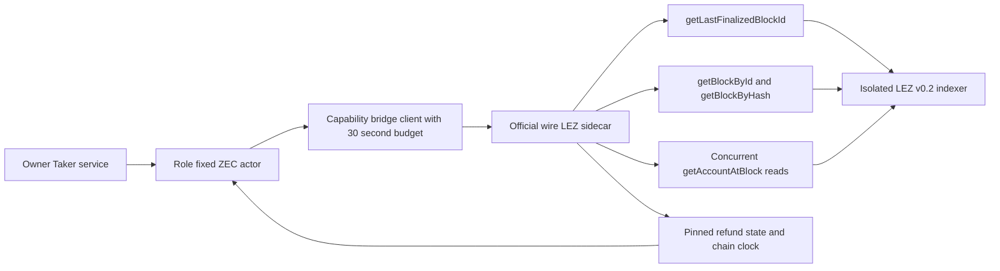
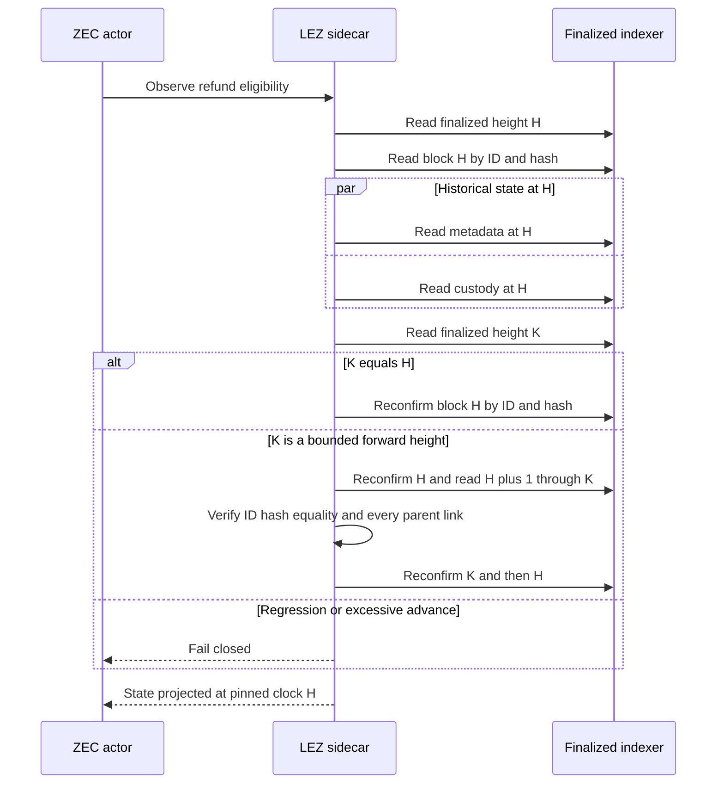

# ADR 0138: Pin refund snapshots across forward finality

- Status: Accepted and component GREEN
- Date: 2026-08-03
- Scope: M6 ZEC refund liveness without weaker finalized evidence
- Extends: ADRs 0015, 0033, 0102, and 0137

## Context

The first service-driven Refund runs reached the signed LEZ deadline but the
Taker actor repeatedly returned dependency unavailable. Retained evidence
separated two facts that initially looked like one failure:

- an official LEZ v0.2 `getAccountAtBlock` read took about 9.78 seconds while
  deterministic-local ZEC actor configs allowed only 10 seconds for the whole
  bridge request; and
- a nonterminal refund observation rejected any forward movement of the
  finalized height, even when every returned fact was read at an older pinned
  finalized block and the newer blocks formed a verified descendant chain.

Slowing the devnet would mask both production liveness problems. Removing the
snapshot checks would weaken the evidence boundary. Neither is acceptable.

## Decision

Deterministic-local ZEC actor configs use a finite 30-second bridge request
budget. The existing validator still rejects zero or more than 60 seconds, and
the ordinary bridge client retains its independent 120-second ceiling.

Refund observation continues to read metadata and custody concurrently at one
exact finalized block. If finality advances during that read, the observer may
return the old pinned clock only after it proves all of the following:

1. the finalized height did not regress;
2. the advance is at most the protocol discovery bound;
3. the original pinned block is unchanged by both ID and hash;
4. every intervening finalized block is available by both ID and hash;
5. every descendant links to its predecessor; and
6. the original pin remains unchanged after the descendant scan.

These rules now apply equally to `StateOnly`, exact or discovered misses, and a
found refund. Same-height replacement, ABA replacement, broken ancestry,
ID/hash disagreement, regression, and an unbounded advance still fail closed.

## Components and RPCs

No public RPC, faucet, new chain service, or cadence override is introduced.

## Verified-forward sequence

## Atomicity and liveness argument

Forward finality cannot rewrite an already finalized block under the accepted
indexer model. Returning facts explicitly bound to height H is therefore safe
when H is revalidated and every newly reported finalized block is proven to be
its descendant. A refund or claim landing after H is not hidden: the response
states H, and the next repeatable observation reads a later pin. Before the
deadline this can only delay authorization. After the deadline a conflicting
spend after H still causes the prepared refund to be rejected or observed on
chain; it does not create a second service authorization or send authority.

The service registry still selects Claim or Refund once before effects. Actor
and bridge journals still persist exact public effects before submission and
reconcile retries without minting another attempt. This ADR changes observation
liveness only; it does not claim a distributed transaction across LEZ, Zebra,
and SQLite.

## Evidence and consequences

- The timeout encoder regression is RED at 10 seconds and GREEN at 30 seconds.
- All 26 finalized native refund-observer tests pass, including pin
  replacement, ABA, ancestry, ID/hash, regression, and maximum-advance cases.
- The complete ZEC reference actor suite passes after the timeout change.
- Actual-node service Refund remains the next M6 proof; component GREEN is not
  a completed cross-chain journey.
- Logos v0.2 historical account lookup latency remains an upstream production
  performance item. A batched multi-account-at-block RPC would remove the
  dominant observed delay. Per the project blocker policy, this upstream Logos
  limitation is recorded but does not prevent local milestone certification.
- Coalescing identical in-flight repeatable observations after a client timeout
  remains production hardening. Repeatable observations must not become stale
  durable terminal results.
