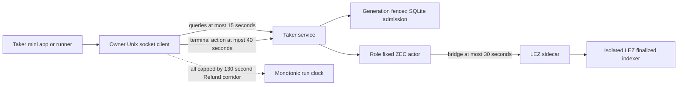
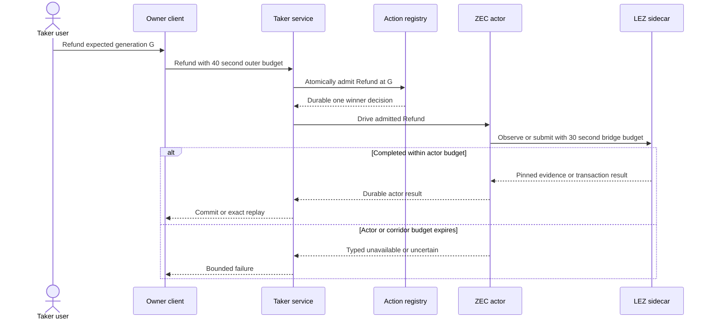

# ADR 0139: Bound service actions above actor bridges

- Status: Accepted; focused runner contract GREEN
- Date: 2026-08-03
- Scope: M6 ZEC terminal-action liveness and bounded cancellation
- Extends: ADRs 0137 and 0138

## Context

A fresh isolated Refund journey reached `refund_available`, both actors were
at `both_legs_locked`, and the finalized LEZ timestamp exceeded the signed
refund deadline. The owner service then began the generation-fenced Refund,
but its Unix-socket client stopped waiting after 15 seconds. ADR 0138 had
correctly raised the actor's inner LEZ bridge budget to 30 seconds because one
historical account read alone measured about 9.78 seconds.

The outer caller therefore had a shorter deadline than the operation it asked
the actor to perform. The run stopped after two Taker LEZ submissions
(Initialize and Fund); no third Refund submission appeared before cleanup.
Retrying the spent swap is forbidden, so the live correction requires fresh
identities, chain allocations, and output roots.

## Decision

Read-only and normally local service calls retain a 15-second query budget.
Terminal Claim and Refund calls receive a finite 40-second action budget. The
service RPC helper accepts the explicit budget, caps it to the unchanged
monotonic corridor deadline, and retains the one-second Unix-socket connection
bound.

Forty seconds strictly dominates the generated actor's 30-second bridge
request while retaining ten seconds for process scheduling, JSON-RPC framing,
durable service admission, and response delivery. It does not extend the
signed chain deadline, retry a submission, or permit work beyond the corridor
clock.

## Components and clocks

## Refund sequence

## Atomicity and consequences

The service still commits Claim-versus-Refund selection before actor I/O.
Actor and sidecar journals still own effect idempotency and uncertain-send
reconciliation. Enlarging only the caller wait cannot create a second effect;
