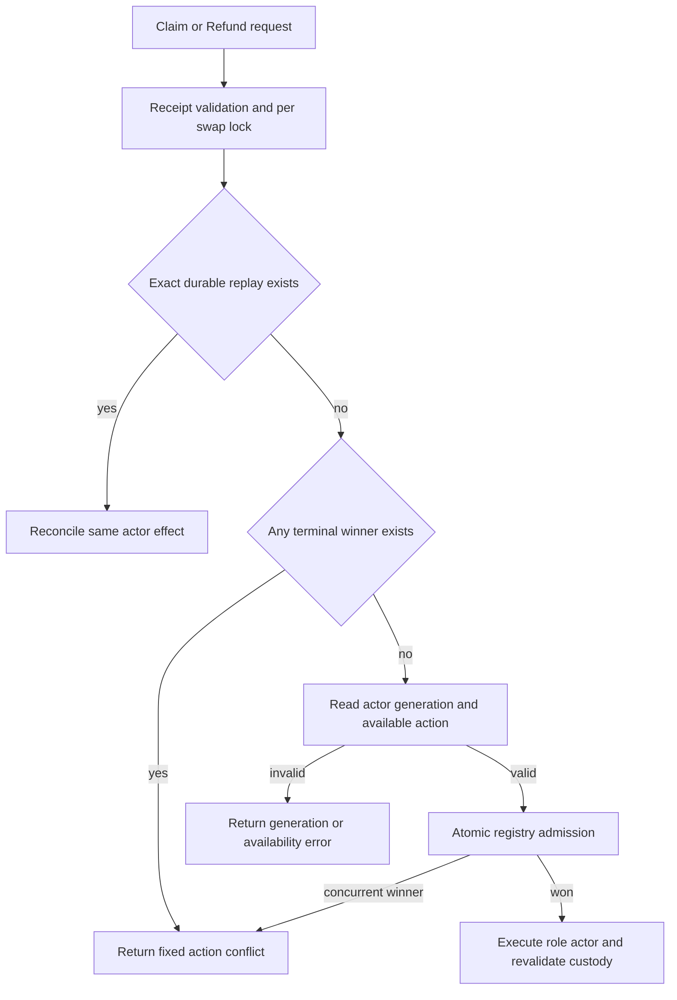
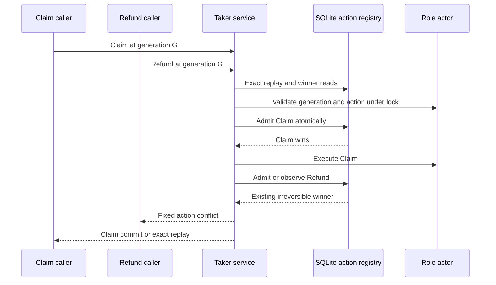

# ADR 0140: Prefer durable terminal conflicts

- Status: Accepted; process and race regressions GREEN
- Date: 2026-08-03
- Scope: M6 Taker Claim-versus-Refund decision precedence
- Extends: ADRs 0137 and 0139

## Context

Fresh run `m6refund538c629a` proved the 40-second outer action budget by
returning one durable Refund commit at generation two. The runner immediately
sent an opposite Claim to prove mutual exclusion. The service returned generic
action-unavailable because it checked the actor's current advertised action
before reading the existing Refund authorization.

The registry already guarantees one irreversible terminal winner, but its
atomic concurrent-winner error was also mapped to unavailable. Both paths hid
the stronger durable fact from the caller. The run was stopped and
quarantined; its funds and swap are not reused.

## Decision

While holding the per-swap actor lock and validated receipt custody, terminal
requests resolve in this order:

1. look up the exact request, action, swap, and generation for replay;
2. if another sole durable terminal authorization exists, return the fixed
   action-conflict result;
3. only with no durable authorization, read actor status and validate the
   expected generation and currently available action;
4. atomically admit the new action; and
5. execute the role actor while retaining the lock and custody checks.

If another process wins between steps three and four, the registry's
`ActionGenerationConflict` maps to the same action-conflict result. New
admission is not moved before actor validation.

## Components and decision flow

## Concurrent sequence

## Atomicity and consequences

The precheck is read-only and improves error truthfulness; it does not replace
