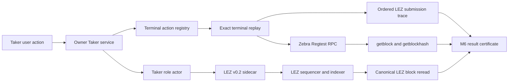
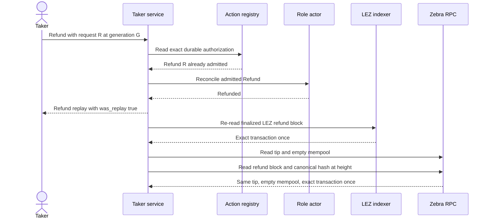

# ADR 0141: Certify terminal Refund replay

- Status: Accepted; focused runner contract GREEN, actual-node proof pending
- Date: 2026-08-03
- Scope: M6 service-driven ZEC Refund evidence and replay atomicity
- Extends: ADRs 0137, 0139, and 0140

## Context

The Refund runner previously treated a singleton mempool followed by one mined
block as confirmation, but did not prove which canonical block contained the
transaction. It also replayed the admitted Refund only while execution was in
progress. A terminal monitor response could therefore be certified without
showing that the same user request remains idempotent after both actors finish.

## Decision

The Refund certificate requires all of the following:

1. derive the newly generated block hash from the single-block mining response;
2. read that block at verbosity one and require the exact refund transaction
   identifier once;
3. require the block height to equal the deterministic initial tip plus six,
   and require `getblockhash(height)` to return the same hash;
4. after both actors report `refunded`, replay the exact same service request
   ID, swap ID, action, and admitted generation;
5. require `was_replay:true`;
6. compare the ordered successful LEZ submission trace byte-for-byte and
   require unchanged Zebra height plus an empty mempool before and after; and
7. re-read both canonical refund blocks and bind every receipt into the final
   result by SHA-256.

No additional mining is allowed around the terminal replay.

## Components and evidence flow

## Terminal replay sequence

## Atomicity argument

The replay cannot choose a new terminal action because the durable registry
lookup resolves the original request before availability or admission. The
actor and sidecar journals retain the already committed effect identity.
Byte-identical ordered LEZ submissions prove the replay did not add even a
second successful submission record. An unchanged Zebra height and empty
mempool prove it neither mined nor submitted another Zcash effect. Canonical
block rereads prove both original effects remain on their selected chains.

This evidence does not make two independent chains share a transaction. The
protocol remains atomic because each role can claim only with the counterparty
secret before its deadline, while the mutually exclusive refund path becomes
available after the relevant deadlines. The terminal registry winner and
chain-specific timelocks prevent a user-facing Claim and Refund authorization
from both succeeding for one swap.

## Bounded runner liveness

Fresh run `m6refund8e0ed10a` reached finalized LEZ Refund and Maker recovery
but consumed the old 130-second runner ceiling before Zcash recovery. The fixed
60-second refund deadline, two measured service-to-actor reconciliations, and
finalized LEZ observation accounted for the budget. The outer ceiling is now
190 seconds so the Zcash refund and terminal replay retain bounded headroom.
This does not alter a chain timelock, block cadence, finality rule, or the
15-second query and 40-second action limits, and a successful run does not wait
for the ceiling.

## Consequences

- Mempool disappearance is no longer accepted as confirmation.
- In-progress replay remains useful liveness evidence but is not the terminal
  idempotency certificate.
- The proof adds bounded read-only RPC calls and no new chain mutation; its
  complete Refund corridor has a 190-second fail-safe ceiling.
- A fresh actual-node run is still required before the Refund path is GREEN.
