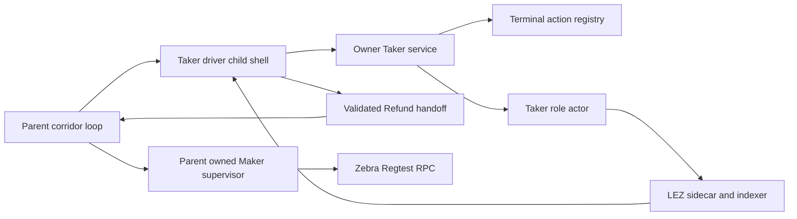
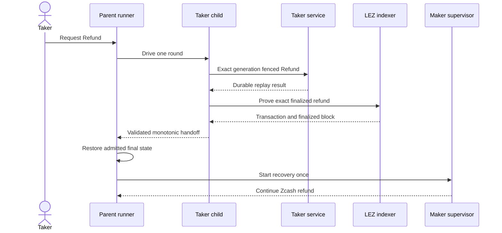

# ADR 0142: Handoff Refund control state to the parent

- Status: Accepted; executable runner contract GREEN, actual-node proof pending
- Date: 2026-08-03
- Scope: M6 service-driven ZEC Refund runner authority and liveness
- Extends: ADRs 0137, 0140, and 0141

## Context

The main corridor loop captures the Taker driver with Bash command
substitution. That driver therefore runs in a child shell. During Refund, the
child committed a service authorization, pinned the starting finalized LEZ
tip, discovered and finalized the LEZ refund, and started Maker recovery by
mutating shell globals. Those mutations and the child-owned process identity
did not return to the parent.

Fresh run `m6refund734db82a` made the failure observable: the Maker reached
durable Refund, but later parent rounds still treated the Taker Refund as
unadmitted and stopped issuing exact service replays. Increasing the outer
ceiling could not repair this process boundary.

## Decision

The Taker-driver child never starts Maker recovery. After each admitted exact
Refund replay it emits one JSON control envelope containing:

- the immutable admitted generation;
- the immutable finalized-tip search start;
- an explicit finalized boolean; and
- an empty transaction ID before finality or one lowercase 64-hex LEZ refund
  transaction ID after finality.

The parent validates and applies this envelope immediately after command
substitution. It rejects replacement of an admitted generation or start tip,
rejects finalized-state regression, and requires the transaction identifier
when finality becomes true. Only the parent may start the Maker supervisor,
and it does so once after finalized LEZ Refund.

## Components

## Refund handoff sequence

## Atomicity argument

The handoff carries control metadata, not new signing or chain authority. The
service registry remains the one-winner Claim-or-Refund authorization point,
and the actor and sidecar journals remain the exact effect authorities. A
child cannot replace an admitted generation or finalized search window, and
cannot claim finality without a syntactically valid transaction identity that
the child already proved against finalized LEZ blocks.

Moving Maker startup to the parent removes duplicate process authority. Exact
handoff replay is inert after the parent records that the supervisor was
restarted. Thus process retries converge on the same durable terminal action
and cannot authorize a second chain effect.

This does not make the two chains transactionally synchronous. Cross-chain
atomicity still comes from secret-gated claims and ordered timelocked refunds;
the handoff preserves the runner's ability to complete that already selected
Refund branch without losing its durable control state.

## Consequences

- Parent state now survives the Bash command-substitution boundary explicitly.
- Invalid, replaced, or regressive handoffs fail closed.
- The executable contract covers pending, finalized, exact replay,
  replaced-generation, and regressive-finality cases.
- No chain deadline, block cadence, per-call timeout, or outer ceiling changes.
- Run `m6refund734db82a` remains quarantined; a fresh isolated-node Refund
  certificate is still required.
