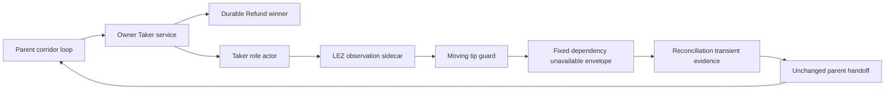

# ADR 0143: Retry admitted Refund reconciliation

- Status: Accepted; executable runner contract GREEN, actual-node proof pending
- Date: 2026-08-03
- Scope: M6 service-driven ZEC Refund reconciliation liveness
- Extends: ADRs 0137, 0140, 0142

## Context

Fresh run `m6refund5320572a` proved the parent handoff on actual local nodes.
The Taker Refund was durably admitted, the opposite Claim lost, the LEZ Refund
finalized, and the parent started Maker recovery. The next exact service replay
encountered the sidecar's bounded `moving_tip` guard and returned:

- JSON-RPC code `-32010`;
- message `Taker dependency unavailable`; and
- object field `error.data.category` equal to
  `taker_action_execution_unavailable`.

The service response was intentionally transient, but the runner required every
post-admission replay to succeed immediately and aborted the corridor.

## Decision

After Refund is already admitted, the runner classifies only that exact error
envelope as retryable reconciliation. It persists the response with phase,
round, and full public envelope, then returns the same validated parent handoff
without changing the selected action, generation, start tip, or finalized
transaction identity. The next bounded main-loop round submits the identical
request again.

A scalar `error.data`, another category, another code or message, malformed
JSON, or a response outside the already-admitted Refund path remains fatal.
The exact response must also have JSON-RPC version `2.0`, ID
`m6-refund-replay`, no extra fields, and the exact nested error object.

The fresh run consumed the 190-second provision-to-completion ceiling when the
transient arrived. The outer fail-safe is now 300 seconds so one later bounded
round remains possible. All attempts remain bounded.

## Components



## Reconciliation sequence

```mermaid
sequenceDiagram
    actor User as Taker
    participant Parent as Parent runner
    participant Service as Taker service
    participant Registry as Action registry
    participant Actor as Taker actor
    participant Sidecar as LEZ sidecar

    User->>Parent: Continue admitted Refund
    Parent->>Service: Same request and generation
    Service->>Registry: Resolve durable winner
    Registry-->>Service: Same Refund
    Service->>Actor: Reconcile exact action
    Actor->>Sidecar: Observe finalized state
    Sidecar-->>Actor: Moving tip transient
    Actor-->>Service: Dependency unavailable
    Service-->>Parent: Fixed error envelope
    Parent->>Parent: Persist transient and retain handoff
    Parent->>Service: Retry in later bounded round
```

## Atomicity argument

Transient continuation occurs only after the registry has durably selected
Refund. The request ID, swap, action, and generation are unchanged, while the
actor and sidecar journals retain exact effect intent and observation
authority. The transient response itself authorizes no effect and changes no
parent control identity.

The opposite Claim remains rejected by the durable one-winner registry. A
later retry can only reconcile the same Refund journal; it cannot admit a new
terminal branch. All malformed or differently categorized failures remain
fatal, and the global monotonic ceiling prevents unbounded retry.

## Consequences

- A normal moving finalized tip no longer aborts an admitted Refund.
- Reconciliation transients are explicit evidence rather than hidden retries.
- The change adds no new timeout, mining, signing, or submission authority.
- The outer fail-safe changed from 190 to 300 seconds; protocol and per-call
  limits did not change and successful execution does not wait for the ceiling.
- Run `m6refund5320572a` remains quarantined; a fresh isolated-node Refund
  certificate is still required.
