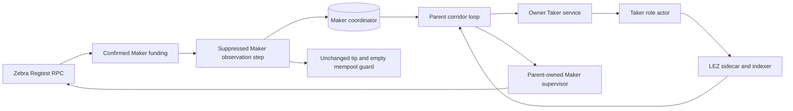
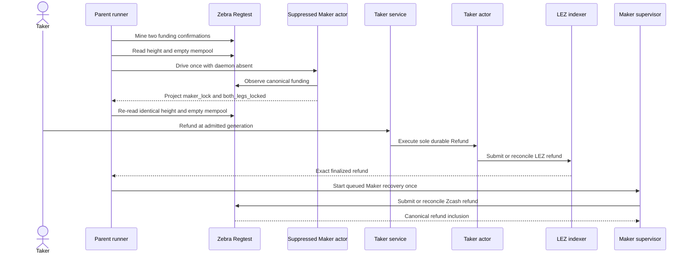

# ADR 0144: Reconcile the confirmed Maker lock before Refund

- Status: Accepted; executable runner contract and fresh actual-node proof GREEN
- Date: 2026-08-04
- Scope: M6 service-driven ZEC Refund state projection and recovery
- Extends: ADRs 0137, 0141, 0142, and 0143

## Context

Fresh run `m6refund7be4428a` reached a durable Taker Refund, rejected the
opposite Claim, finalized the LEZ refund, and handed recovery to the parent.
The Zcash refund was never submitted. The Maker daemon had been stopped after
its Zcash funding transaction was mined but before the Maker actor projected
that canonical lock into its coordinator. Its durable phase therefore remained
`taker_lock_confirmed` while the Taker actor correctly reached
`both_legs_locked`.

When the restarted Maker supervisor first observed the finalized Taker-side LEZ
refund from that stale phase, the coordinator truthfully selected terminal
`refunded`: from its own durable view the second lock did not exist. The actual
Zcash lock did exist, so this truthful but incomplete local view omitted the
corresponding Zcash refund. More timeout or retry headroom cannot repair a
missing durable observation.

## Decision

For the M6 Refund evidence journey only, reconcile the Maker's already-mined
Zcash lock after the funding confirmations and transport cutover, but before
the Taker Refund is driven. The runner permits exactly one direct Maker
`drive` only when:

- the M6 Maker supervisor is explicitly suppressed;
- the Maker daemon identity and both daemon sockets are absent;
- post-lock transport cutover is complete;
- exactly two funding-confirmation blocks were mined; and
- Zebra has an empty mempool.

The call uses the existing corridor-derived actor deadline and a hard kill
timeout. The actor result must be an exact Maker `maker_lock` projection into
`both_legs_locked` with `claim_lez` next. Zebra height must remain equal and the
mempool must remain empty before and after. The runner writes an owner-private
evidence object declaring `direct_observation_only` and
`new_chain_effect:false`; final acceptance validates it and binds its SHA-256
into `result.json`. Any mismatch fails before the Refund branch starts.

Actual Refund authority remains unchanged: the Taker service durably selects
Refund, the Taker actor submits the LEZ refund, and only the parent-owned Maker
supervisor may submit or reconcile the Zcash refund.

## Components

## Refund sequence

## Atomicity argument

The reconciliation is an observation boundary, not a new swap effect. It is
allowed only while normal Maker daemon authority is absent, after the funding
effect is already confirmed. Unchanged height plus empty mempool prove that
this step neither mined nor submitted a transaction in the deterministic local
certificate. It merely makes the Maker's durable coordinator agree with the
canonical lock already used by the Taker actor.

Once both durable role views contain both locks, ADR 0137's one-winner registry
selects only Claim or Refund and the actor journals preserve at-most-once
submission. In the Refund branch, the Taker's timelocked LEZ recovery finalizes
before the parent starts Maker Zcash recovery. Exact post-terminal replay must
leave both ordered LEZ submissions and Zebra state unchanged under ADR 0141.

This is conditional cross-chain atomicity, not a distributed transaction. It
depends on canonical local-chain observations, secret-gated claim branches,
ordered timelocks, and sufficient liveness for each actor to take its available
recovery branch. A future public deployment still needs rollback/reorg fencing
and independent production review.

## Consequences

- A confirmed lock cannot be silently omitted from the recovery decision just
  because the daemon was deliberately cut over between submission and local
  projection.
- Direct and supervisor authorities never overlap.
- The executable contract rejects unsuppressed/live-daemon use, unexpected RPC
  or actor calls, moving tips, and nonempty mempools.
- Run `m6refund7be4428a` remains quarantined. It proves the missing-projection
  diagnosis, not a completed Refund.
- Fresh run `m6refund8f76d87a` closes the isolated-node Refund proof; see
  [`m6-zec-service-refund-certificate-20260804.json`](../evidence/m6-zec-service-refund-certificate-20260804.json). The subsequent Claim regression remains required.
