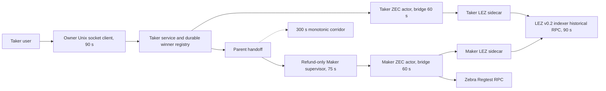
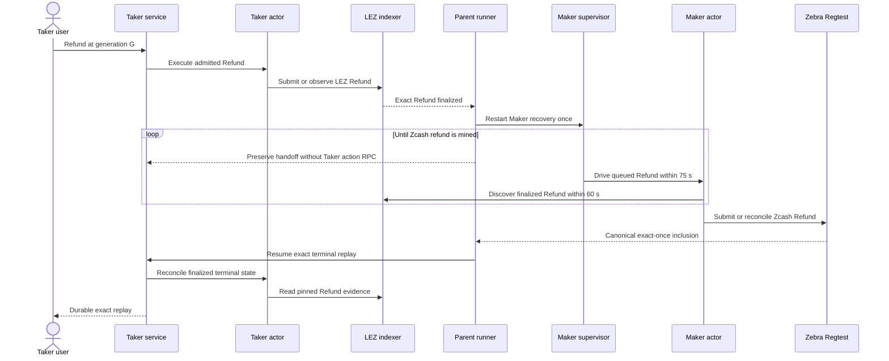

# ADR 0145: Serialize Refund observation and layer local timeouts

- Status: Accepted; executable and actor-config regressions GREEN, fresh actual-node proof pending
- Date: 2026-08-04
- Scope: M6 service-driven ZEC Refund liveness without weakening chain evidence
- Extends: ADRs 0138, 0139, 0141, 0142, 0143, and 0144

## Context

Fresh isolated run `m6refund43f2cbca` reached one finalized LEZ Refund at block
157 and correctly restarted parent-owned Maker recovery. The Maker's durable
manual Refund remained queued at `both_legs_locked`; no Zcash refund entered
the empty Zebra mempool before the 300-second corridor ended.

The discovery window was valid at heights 144 through 399, the refund was
inside it, and scanning blocks 143 through 157 took about 2.4 milliseconds.
The slow operation was Logos LEZ v0.2 `getAccountAtBlock`, which reconstructs
state from genesis for every requested account. Two repeated metadata reads at
block 157 took 10.84 and 11.39 seconds.

Maker discovery needs two sequential metadata/custody snapshot phases: one at
the containing block and one at the pinned finalized tip. Taker exact replay
can need three phases: a pre-scan tip state, containing-block validation, and a
post-scan pinned-tip state. Each phase reads metadata and custody concurrently.
Running Maker discovery and redundant Taker replay together produced four
historical reads against an effective capacity of three. Even without
contention, the old 20-second Maker attempt could not contain two measured
phases, and the old 30-second actor bridge could not reliably contain Taker's
three phases.

## Decision

After the Taker Refund is durably admitted, finalized on LEZ, and handed to a
restarted Maker supervisor, the parent runner temporarily stops invoking the
Taker action RPC until the Maker's Zcash refund is mined. It emits the same
strict parent handoff from the monitor response. The predicate is exact:
admitted, LEZ-finalized, Maker-supervisor-restarted, and Zcash-not-mined.
Changing any one condition disables quiescence.

The deterministic local ZEC actor bridge budget is 60 seconds. The
refund-only restarted Maker supervisor receives 75 seconds per attempt, and
the owner service action caller receives 90 seconds. The query budget remains
15 seconds, ordinary pre-cutover supervisor attempts remain 20 seconds, and
the Refund corridor remains 300 seconds. The enforced nested order is service
caller 90 seconds, supervisor 75 seconds, actor bridge 60 seconds, all below
the corridor.

The historical-account client retains its separate 90-second per-request
ceiling. It is inside the sidecar rather than an outer layer around the service
caller. No duplicate historical state check is removed. Containing-block and
finalized-tip bindings remain part of the atomicity evidence.

## Components and RPC flow

## Refund recovery sequence

## Atomicity argument

Quiescence begins only after the unique service winner is durable and the LEZ
Refund is finalized. At that point Taker has no legitimate new effect: its
Refund transaction already exists on the canonical finalized chain and Claim
is durably excluded. The next ordered recovery effect belongs to Maker on
Zcash. Temporarily withholding redundant Taker observation therefore removes
read contention without changing effect authority or effect order.

The parent resumes Taker reconciliation only after the exact Zcash refund is
mined. Final acceptance still requires both actors and the service to report
`refunded`, one exact finalized LEZ Refund, one exact canonical Zcash Refund,
and terminal replay that adds no LEZ or Zcash effect. Actor and sidecar
journals retain uncertain-send reconciliation and at-most-once submission.

The larger local timeouts add liveness headroom only. They do not change the
signed refund deadline, chain cadence, discovery window, finality test,
generation fence, request identity, or 300-second fail-safe. A timeout remains
uncertain observation and never proves absence.

## Consequences

- The executable contract proves the quiescent branch invokes neither the
  Taker actor nor service action RPC and preserves the parent handoff.
- The timeout contract proves 60-second bridge, 75-second refund supervisor,
  and 90-second service caller nesting below the 300-second corridor.
- The local actor-config regression is GREEN at 60 seconds.
- Run `m6refund43f2cbca` remains quarantined; it diagnosed liveness but did not
  complete both legs.
- A fresh LEZ deployment, fresh role allocations, and fresh Zebra Regtest
  funds are required for the certificate.
- Production should add historical-state batching or caching, coalesce
  identical in-flight observations, and enforce shared indexer concurrency.
  Those Logos v0.2 performance limitations are recorded upstream-release
  blockers, not local M6 PoC certification blockers.
