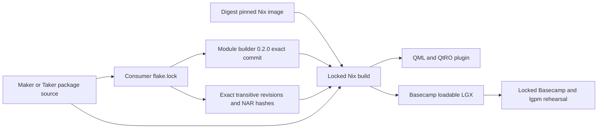
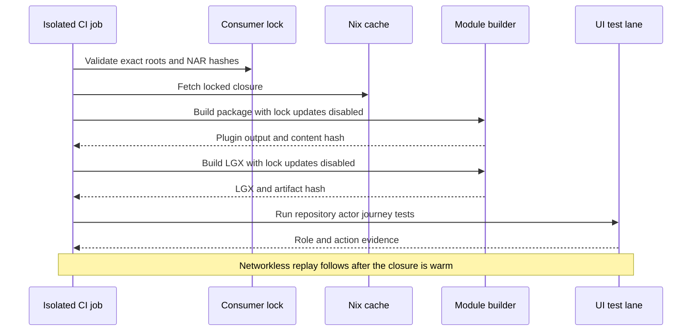

# ADR 0146: Pin Basecamp builds behind consumer locks

Status: Accepted for M6 implementation on 2026-08-04

## Context

The official Logos tutorial at commit
`bfc34c451c08da9f78072dd825756a1e071a051d` documents the current C++/QML
package shape and corrects the generated module-builder input to tag `0.2.0`.
The tag resolves to commit
`92ef691ea72844134f6c68fb447d37f855fc9690`. The tagged scaffold itself still
generates a floating builder input, and the tutorial ships no consumer
`flake.lock`. Its transitive lock graph also contains several revisions of the
same Logos repositories. A reproducible M6 package therefore cannot depend on
the naked scaffold command or an unlocked tag reference.

An isolated rehearsal generated a consumer lock, built the official C++/QML
calculator package, and emitted an LGX using the exact Nix image
`nixos/nix@sha256:d78540374f6a886653cba47d5c3f61c5a41d42e2a8db2607b8d68cb226fd463e`.
The default package NAR hash was
`sha256-UoyshKh+zzMVigumE3BhjMgQUEFaM8HsuyFcXvCEdpk=`. The LGX file SHA-256
was `d184c0423dc7dc5bee98e74eb1cf51c4edc3e381ce017ab88a38caf857e13bd5`.
The all-output `nix flake check --no-build` failed while evaluating the
upstream integration-test derivation because it referenced a missing Nix-store
source path; the default package and LGX builds themselves completed.

## Decision

Each production Maker and Taker package will own and commit its consumer
`flake.lock`. The input URL will name module-builder `0.2.0`, while the lock
must resolve the exact commit and NAR hash. The orchestration used to install
or load the packages will similarly lock Basecamp `0.2.0` and Logos package
manager `0.2.0`. CI will build from the lock with updates disabled. A release
cannot substitute a fresh scaffold, floating tag, or mutable container tag.

The package build and the upstream integration harness are separate evidence
lanes. The package and LGX lanes must be green. M6 will add repository-owned
actor-real UI tests and will also exercise the official integration output if
the pinned upstream builder can evaluate it. An upstream harness defect is not
allowed to erase repository-owned UI coverage or to turn a failed check into a
pass.

The production candidate will additionally inventory the realized closure,
generate an SBOM, run vulnerability and license policy checks, and repeat the
build without network access after warming the exact closure. Qt distribution
obligations and direct Logos dependencies without an explicit license grant
remain release findings in the upstream blocker register. Under the accepted
Logos-owned dependency policy they do not block the private local M6 PoC, but
they do block an unqualified distributable-production claim.

## Consequences

- Basecamp integration remains a configuration and packaging boundary rather
  than a reason to move role authority into QML.
- A tag name is human-readable provenance; the committed consumer lock is the
  reproducibility authority.
- M6 local certification may proceed around disclosed Logos-owned build and
  license defects, but repository source, tests, locks, artifact hashes, and CI
  policy remain fail-closed.
- Explicit prototype sign-off from ADR 0128 still precedes production Maker
  and Taker UI source.
