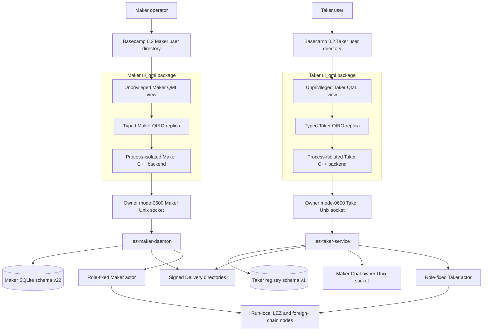
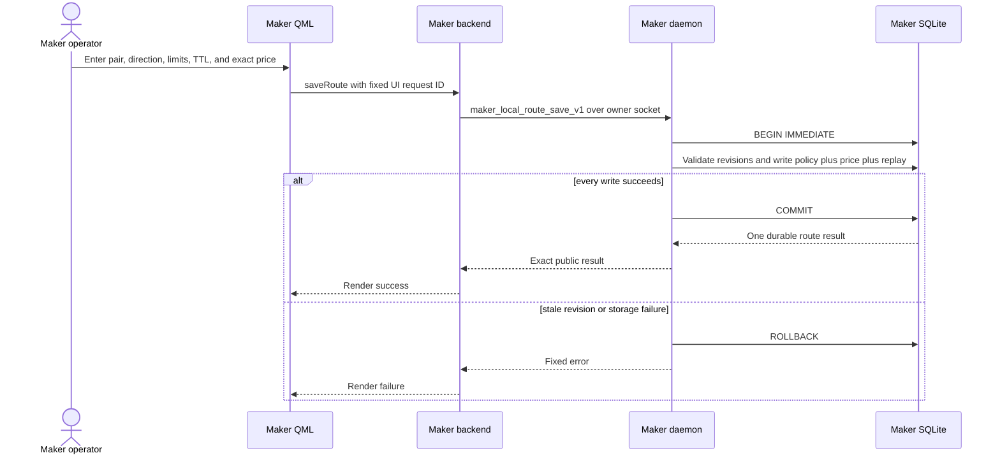
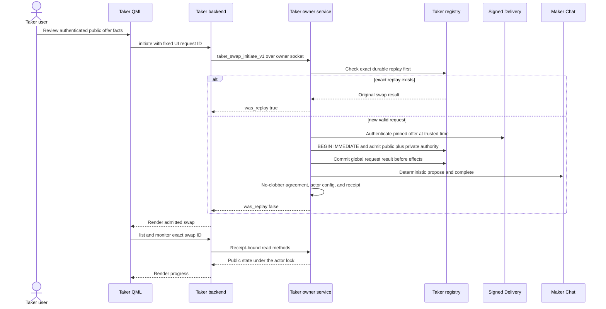
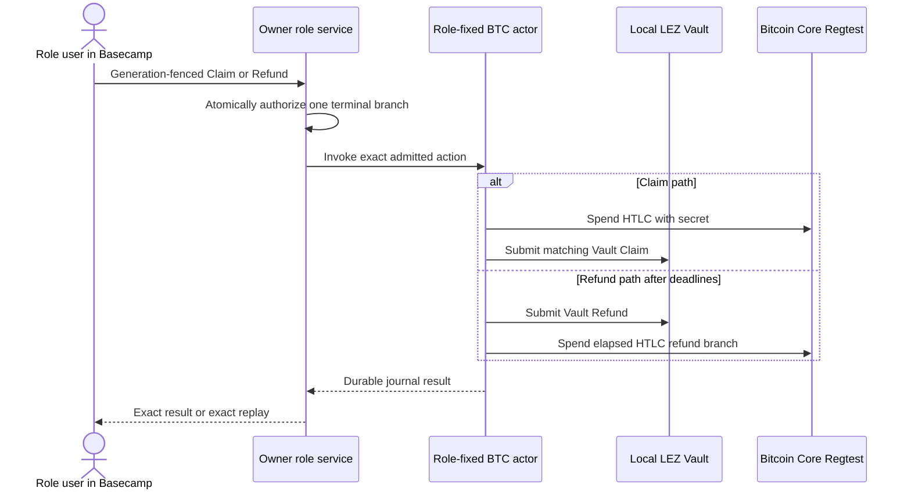
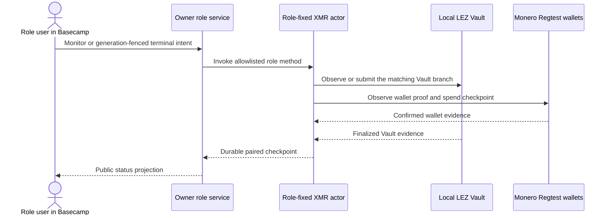
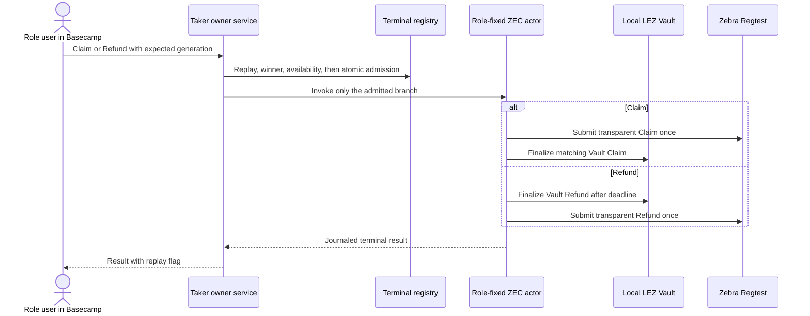

# ADR 0147: Isolate Basecamp role packages over owner services

Status: Accepted and implemented for the M6 local-functional PoC on 2026-08-04

## Context

Issue #112 requires a Maker mini-app, a Taker mini-app, and a Basecamp-loadable
repository. Basecamp 0.2.0 loads `ui_qml` packages whose C++ plugins run outside
the QML process and communicate through typed Qt Remote Objects. The existing
swap authority already belongs to the Maker daemon and the Taker owner service.
Moving keys, paths, arbitrary RPC methods, or chain endpoints into QML would
create a second authority boundary and invalidate the role-correct M2/M3/M5
evidence.

## Decision

Build two independent, consumer-locked `ui_qml` packages. Each package contains
one view, one typed QtRO replica contract, and one process-isolated C++ backend.
The backend translates only a fixed role allowlist to JSON-RPC over an
effective-user-owned, mode-0600 Unix socket beneath a mode-0700 directory.
QML receives no socket path, node URL, wallet credential, signing key, receipt,
database path, or generic method selector.

The Maker package exposes six typed operations: health, atomic local-route save,
history, monitor, claim, and refund. The Taker package exposes seven: health,
authenticated offer list, prepared initiation, swap list, monitor, claim, and
refund. Both use the same bounded local transport implementation, but compile it
into separate role packages and connect to separate owner services.

Basecamp runtime tests use a different user directory for each role. They run
as the same effective UID as the corresponding service, bind only the one role
socket, and run the product container with `--network none`. The Qt inspector
uses loopback only inside that container. Missing or invalid owner endpoints
return one fixed unavailable result and never fall back to TCP or a public RPC.

## Maker route-save sequence and atomicity

The click is atomic at the owner-store boundary because the pair policy, exact
price, and global replay result commit in one immediate SQLite transaction.
There is no intermediate enabled route. Exact request replay returns the first
result; changed request-ID reuse conflicts. This is local configuration
atomicity, not a claim that a later cross-chain swap is one database transaction.

## Taker acceptance sequence and atomicity

Admission is atomic at the Taker registry boundary: exact public facts, private
authority, and the request/result replay row commit before Chat or filesystem
effects. Deterministic transport IDs, transactional Maker handling, and
no-clobber local publication make a lost response converge on exact replay.
This prevents two accepted meanings for one request or swap; it is not a
distributed transaction across SQLite, Chat, and both chains.

The product test drives the actual Basecamp QML through the official Logos MCP
harness, enters the prepared offer values, observes `was_replay: false`, repeats
the exact click and observes `was_replay: true`, then lists and monitors the
same swap. After Basecamp exits, the Rust rendezvous test reads the real registry
and proves request `taker-ui-initiate-001` durably maps to
`m6-process-zec-swap-001`.

## Pair terminal sequences and conditional atomicity

The Basecamp controls select the already-proven role services; they do not
implement a second protocol. Each pair remains conditionally atomic because the
foreign-chain spend and the LEZ Vault branch require the same secret or the
corresponding refund deadline. Durable actor journals and generation-fenced
service authorization make exact retries idempotent. The current UI product
test proves composition through acceptance, replay, list, and monitor. Retained
actual-node certificates prove terminal chain effects at the service/actor
layer; they are deliberately not represented as effects caused by that UI run.

### LEZ and Bitcoin

Bitcoin Script enforces hash and timeout branches; LEZ enforces the matching
Vault state transition. A party that learns the claim secret can complete its
counter-leg, while staggered deadlines preserve a refund path. Reorg and
finality assumptions are explicit in the M2 evidence and are not weakened by
the UI boundary.

### LEZ and Monero

Monero has no Bitcoin-style HTLC script. Atomicity is therefore expressed by
the protocol's adaptor/key-share and evidence checkpoints plus the LEZ Vault
branch, not by treating one wallet marker as a completed swap. M3 documents the
exact cryptographic assumptions and deliberately reports current terminal
routes as effect checkpoints until semantic receipt-v2 production hardening.

### LEZ and Zcash transparent pool

The registry admits only one generation-fenced Claim or Refund. Zcash script
conditions and the LEZ Vault enforce the corresponding secret/deadline branch;
actor journals handle uncertain sends. Fresh local certificates prove exact-once
canonical Zcash membership, finalized LEZ effects, opposite-action conflict,
and no-effect terminal replay for both Claim and Refund.

## Failure behavior

- A missing, symlinked, wrong-owner, or wrong-mode socket fails before a request.
- QML cannot select a path, method, command, node, wallet, or credential.
- QtRO/backend failure produces a bounded UI error and grants no fallback.
- Changed initiation replay conflicts; an exact replay returns the durable result.
- Claim and Refund cannot both win for one swap generation.
- Delivery or Chat loss after a retained receipt does not prevent exact replay,
  list, or monitor; malformed retained custody fails closed.
- A service timeout does not authorize another terminal effect. The existing
  registry and actor journals remain the recovery authority.

## Evidence and limits

The package contract is GREEN for two `ui_qml` packages, thirteen typed slots,
and one owner-local transport implementation. Both official standalone tests,
both missing-service Basecamp tests, and both real-service Basecamp tests pass.
The Maker product run saves a route and reads history through the real daemon.
The Taker product run browses offers and the prepared rendezvous run completes
the acceptance/replay/list/monitor journey through the real service and registry.

Package construction may fetch immutable GitHub flake inputs and NARs from
`cache.nixos.org` on a cold store. That setup can be flaky; product runtime is
networkless and uses no public RPC, faucet, public funds, or public deployment.
LOGOS-025 retains upstream license, signature, graph, and offline-rebuild work
for production distribution. These Logos-owned findings do not weaken the
repository-owned role, transport, replay, atomicity, security, or quality gates.
