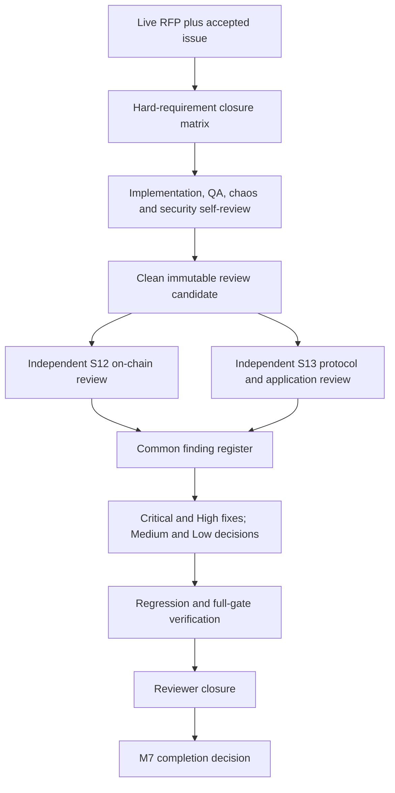
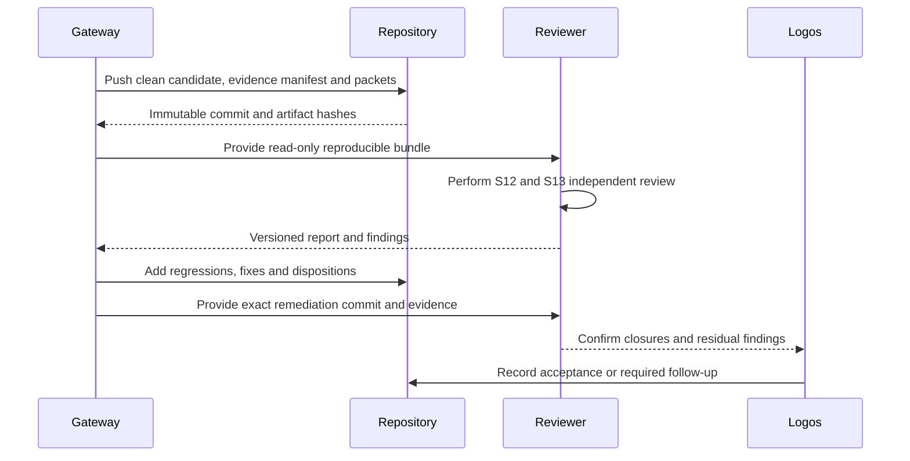

# ADR 0148: Enter M7 through independent-review readiness

Status: Accepted on 2026-08-04; repository-controlled preparation active

## Context

RFP-003 and accepted issue #112 make M7 a formal S12 review of all on-chain
locking logic, formal S13 review of the cross-chain implementation, remediation,
hard-requirement CI closure, a mainnet-readiness write-up and five Logos doc
packets. An implementation team can prepare, self-review, test and remediate
what it discovers, but it cannot independently attest to its own work.

## Decision

M7 uses two explicit gates. The repository-controlled gate closes every
implementation, QA, chaos, security, production-readiness, documentation and
review-handoff item that Gateway can prove. Only then is the immutable candidate
sent to the mutually agreed reputable reviewer. The external gate closes only
after the report is received, Critical/High findings are independently verified
as remediated, and Medium/Low dispositions are recorded.

The five documentation packets pin the exact official template. Review scope,
assumptions, commands, evidence and finding state are versioned in the same
repository; external reports may be linked or stored according to their
publication terms, but their identity and SHA-256 must be recorded.

## Review handoff flow

## Consequences

- A `review-ready` result may be proven without mislabeling it M7 complete.
- No Logos-owned exception can waive repository-controlled safety findings.
- Public deployment evidence remains optional under the owner's stealth/local
  policy, but public/mainnet activation remains blocked until configuration,
  program deployment, calibration, upstream and review gates are actually met.
- The first unavoidable external blocker is raised only after the candidate is
  independently reproducible and every self-owned gap has been resolved.

