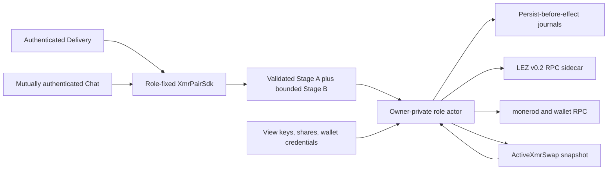
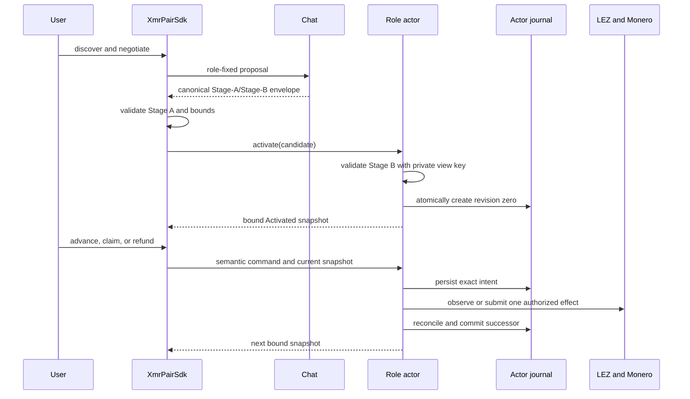

# ADR 0149: Expose the XMR lifecycle through role-fixed actors

Status: Accepted on 2026-08-04

## Context

The XMR SDK already validates DLEQ proofs, Stage A, Stage B, adaptor sessions,
the shared address and the initial coordinator. Actual local claim/refund flows
already keep view keys, adaptor shares, wallet credentials and effect journals
inside independent role processes. A conventional in-process SDK facade would
duplicate that authority and could accidentally make Delivery or Chat a
post-lock dependency.

## Decision

Expose a public pre-lock `XmrPairSdk` over the shared Delivery and Chat traits.
Chat returns one bounded canonical Stage-A/Stage-B envelope. The SDK fully
validates Stage A, but treats Stage B as a bounded candidate until a
`XmrRoleActorPort` validates it with the owner-private view key and durably
creates revision zero. The returned `ActiveXmrSwap` erases Delivery and Chat;
all advance, claim and refund commands go only to the actor that owns
persist-before-effect journals and unknown-outcome reconciliation.

Actor snapshots bind role, swap ID, Stage-A commitment, Stage-B commitment,
phase and canonical revision. Exact replay is accepted; identity substitution,
revision skip/regression, branch crossing, early claim/refund and noncanonical
terminal transitions fail before local state changes. The application retains
the public four-field lifecycle identity independently and must present it on
resume, so a restarted actor cannot substitute another agreement or activation.

## Lifecycle flow

## Consequences

- U1/S8 gain a public lifecycle/errors/example surface without moving secrets.
- Post-lock progress needs only the role actor, its journal, and chain nodes.
- The facade defines semantic claim/refund/punishment phases; concrete actor
  adapters remain responsible for exact Tag 14 through Tag 17 and Monero
  transaction evidence.
- Formal S12/S13 review must cover both the facade transition validator and the
  concrete actor adapter that implements this port.
