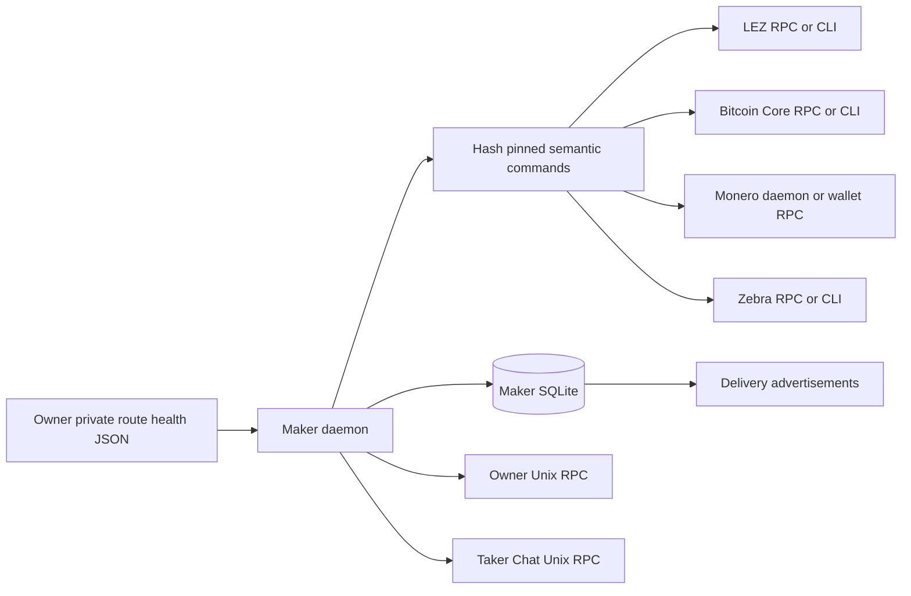
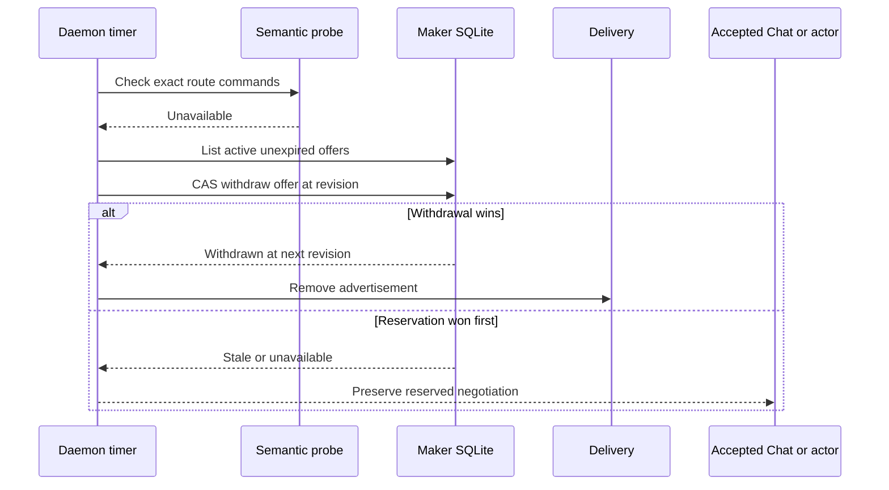
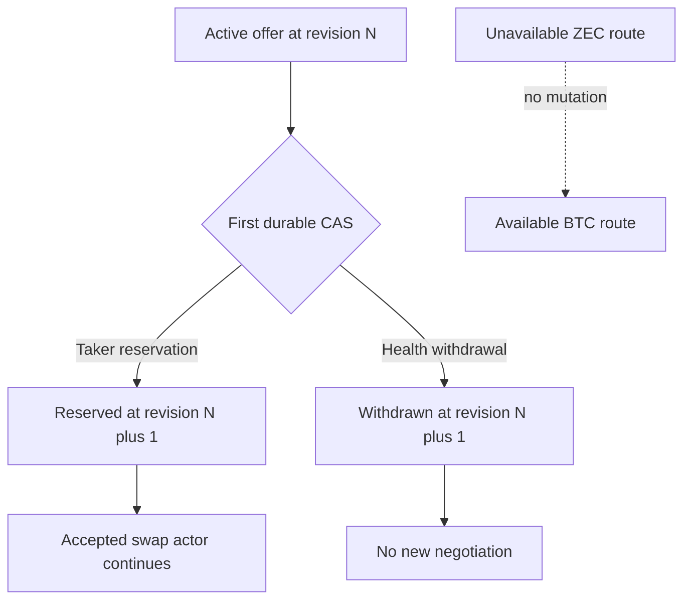
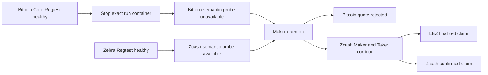
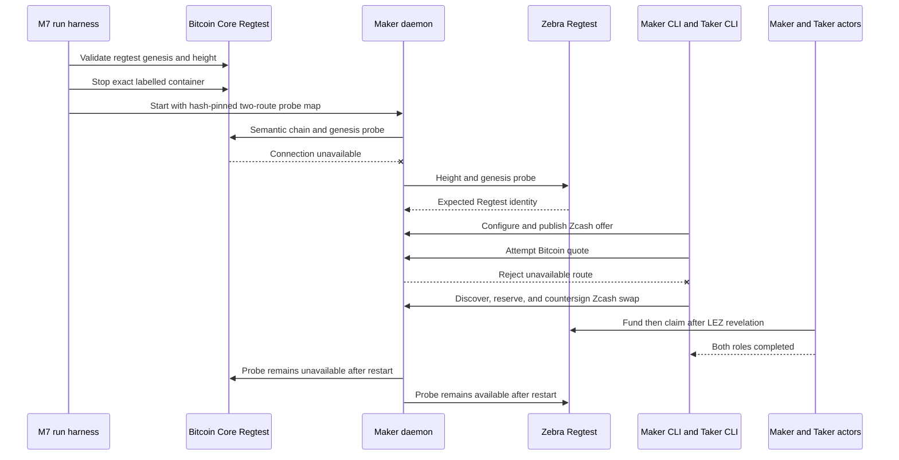

# ADR 0150: Withdraw only unhealthy-route advertisements

- Status: Accepted for the automatic Maker route-health control plane
- Date: 2026-08-04

## Context

ADR 0115 made explicit route disablement pair-scoped, but a stopped chain node
did not automatically affect advertisements. A Maker could therefore continue
offering a route whose LEZ or foreign-chain dependency was unavailable. The
repair must not revoke already accepted terms, expose authority to a probe, run
an arbitrary shell, or stall other pairs while a node is slow.

## Decision

The daemon accepts an owner-private strict JSON map from exact routes to one or
more semantic health commands. Operators normally configure one command for the
LEZ dependency and one for the foreign node. Each executable is absolute,
owner/root controlled, non-writable, single-linked, SHA-256 pinned, and checked
before and after each invocation. Arguments are bounded. The daemon clears the
environment, supplies no stdin, discards output, invokes no shell, enforces a
maximum five-second command timeout, kills and reaps timeouts, and treats every
nonzero exit or validation failure as unavailable.

The daemon samples on a bounded periodic cadence in one `spawn_blocking` task.
Missed ticks are skipped and another probe cannot overlap it, so a slow node
cannot accumulate work or block the async owner/Chat accept loop. Quote and new
publication also consult the selected route synchronously and fail before price
or Delivery I/O when it is unavailable.

## Automatic withdrawal flow

Only unexpired `Active` offers are candidates. For an unavailable route, the
daemon derives a stable 64-character SHA-256 request ID from the operation
domain, offer ID, and expected revision, then uses the existing SQLite
compare-and-swap withdrawal. The durable withdrawal precedes best-effort
Delivery cleanup. A concurrent reservation wins by advancing the offer
revision; the stale withdrawal is ignored and the reserved negotiation stays
valid. Reserved and consumed records are never selected for withdrawal.

## Pair isolation and atomicity argument

This control plane creates no chain effect and does not claim distributed
cross-chain atomicity. Its atomic property is the SQLite offer-state
linearization point. An offer can transition from `Active` to exactly one of
`Reserved` or `Withdrawn`; compare-and-swap revisions prevent both from winning.
Once reserved, expiry or later dependency loss cannot revoke the signed terms.
Post-lock actors retain their independent journals and chain authority and do
not depend on Delivery, Chat, or this health map.

Route keys contain pair plus direction. Health loss for one key neither mutates
another key nor disables its RPC path. The focused contract proves an unhealthy
Zcash offer is withdrawn, a reserved Zcash negotiation survives, an independent
Bitcoin offer and quote remain active, and new Zcash quote/publication fail
closed. The process contract proves the periodic daemon performs withdrawal
without a health request.

## Consequences and evidence boundary

- The health executable is an adapter, not a new chain implementation; official
  node CLIs or small reviewed semantic adapters can be used per deployment.
- Program and argument changes are configuration changes, while executable
  identity drift fails closed.
- A route absent from a configured map is unavailable and fails closed. When no
  probe map is configured at all, routes report `disabled` for legacy behavior;
  the additive health response defaults missing route rows for rolling clients.
- A failed Delivery cleanup cannot reactivate the durable offer. Delivery health
  exposes stale projection state and startup reconciliation removes it.
- `run-m7-unaffected-pair-outage-poc.sh` composes the literal proof boundary. It
  provisions an isolated Bitcoin Core 31.1 Regtest service, authenticates its
  network and genesis, stops that exact labelled container, and then runs the
  ordinary Zcash application corridor. The same Maker daemon probes both the
  unavailable Bitcoin route and surviving Zebra route through one hash-pinned
  adapter. A fresh retained successful execution is still required before F1
  or R3 changes from `open` to `green`.
- Fresh run `m7outage-5e9d47d-a` proved the stopped Bitcoin node was
  semantically unavailable, then failed before daemon readiness and before any
  swap submission because the checked-out `scripts/` directory was group
  writable and therefore correctly rejected by the executable-custody policy.
  The harness now copies the source-hashed probe into its owner-private `0700`
  proof directory with mode `0500`, checks the staged digest is identical, and
  passes only that immutable path to the daemon. The retained run is RED
  diagnostic evidence, not an F1/R3 certificate.

- Clean run `m7outage-f482acd-a` passed immutable probe custody, reported the
  stopped Bitcoin route unavailable and live Zcash route available before and
  after Maker restart, rejected the Bitcoin quote, and atomically accepted the
  Zcash application. It then stopped before actor handoff because the baseline
  restart assertion expected only one configured route while the M7 harness
  intentionally retains the disabled Bitcoin route for operator visibility.
  The assertion is now mode-aware: normal M5 still requires exactly one Zcash
  route, while M7 requires that route plus the exact disabled Bitcoin route.
  No role actor or chain submission ran; this remains bounded RED evidence.

The outage harness changes no swap atomicity argument. The Zcash corridor keeps
the signed foreign-first ordering: confirmed Zcash funding precedes the
revealing LEZ claim, and only that revelation enables the Zcash claimant. The
route-health control has no chain authority and cannot make a partial swap; it
only gates new offers and quotes before acceptance. Once accepted, the
role-separated actor journals continue independently of route health, Delivery,
and Chat.
