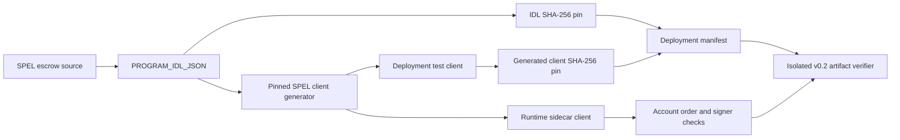
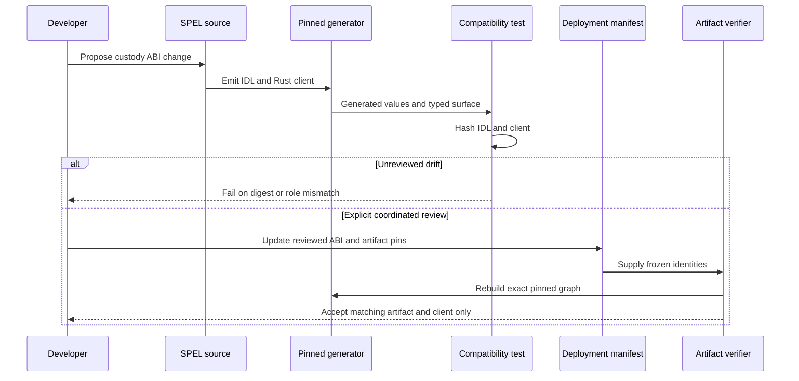

# ADR 0151: Freeze the generated SPEL custody ABI

- Status: Accepted for the current local LEZ v0.2 release candidate
- Date: 2026-08-04

## Context

The escrow is authored with SPEL and consumed through generated Rust clients.
The deployment tooling and the long-running sidecar must agree on instruction
tags, account order, signer roles, and custody-program identities. Merely
pinning a dependency commit does not prove that the deployed manifest, generated
client, and runtime adapter describe the same ABI. In particular, an official
ATA is an account and never an authority signer; token owners or aggregate
authorities sign the operations assigned to them.

## Decision

The escrow crate's `PROGRAM_IDL_JSON` is the single interface source. Both the
provisional deployment package and the production-sidecar package invoke the
exact pinned SPEL generator on that value. The raw IDL SHA-256 and generated
Rust-client SHA-256 are frozen in the deployment manifest and independently
checked by the compatibility test and artifact verifier. The sidecar build
additionally rejects native, XMR, or token account-order and signer-role drift.

The pins identify LEZ `v0.2.0`, SPEL commit
`df17acd98436be4f09c55877dae1fe2e73cbcdca`, the 18-instruction interface,
and the locally checked guest artifact. Changing any custody instruction now
requires an explicit ABI review and a coordinated update of the tests,
manifest, runtime client, and checked artifact identity.



## Change and verification flow

The fast M7 contract is network-free and checks that every binding remains
wired into ordinary quality gates. The focused Rust test computes both digests
from live generated values and exercises generated types. The heavier isolated
verifier rebuilds and tests the pinned compatibility graph and checks the same
manifest pins. CI runs both layers; a local developer can run the focused layer
without starting a chain node or occupying a port.



## Runtime custody flows

The generated client serializes the exact instruction and ordered accounts.
For native custody the depositor signs funding and the authenticated-transfer
program owns the balance. For token custody the official Token and ATA programs
derive and validate the metadata, custody, depositor, and claimant accounts;
the owner signs funding, while aggregate-witness claims are signed by the
aggregate authority. Permissionless custody creation and refund intentionally
have no fabricated ATA signer.

```mermaid
sequenceDiagram
    participant Actor as Role-fixed swap actor
    participant Sidecar as Generated-client sidecar
    participant Escrow as LEZ escrow program
    participant Native as Authenticated transfer
    participant Token as Token and ATA programs
    Actor->>Sidecar: Prepare exact operation and role authority
    Sidecar->>Sidecar: Re-derive accounts and enforce signer role
    alt Native asset
        Sidecar->>Escrow: Ordered native accounts and instruction
        Escrow->>Native: Custody transfer in one LEZ transaction
        Native-->>Escrow: Success or whole transaction fails
    else Custom token
        Sidecar->>Escrow: Ordered metadata, definition and ATA accounts
        Escrow->>Token: Validate or create official ATA and transfer
        Token-->>Escrow: Success or whole transaction fails
    end
    Escrow-->>Sidecar: Committed effect or no effect
    Sidecar-->>Actor: Typed prepared or observed result
```

## Atomicity and security argument

This decision does not make a two-chain swap one distributed transaction. It
preserves the narrower but essential LEZ atomicity boundary: the escrow state
transition and its authenticated native or token custody call execute in one
LEZ transaction, so a failed account, authority, program, or transfer check
rolls the transaction back. The generated client cannot silently reorder
accounts or promote an ATA to signer because semantic build assertions and the
client digest fail before release.

Cross-chain atomicity still comes from the pair protocol's conditional secret,
aggregate-witness, refund, and punishment paths documented in the pair ADRs.
Freezing this ABI ensures those paths invoke the reviewed LEZ custody operation;
it does not replace actual-node claim/refund/punishment and reorg evidence.

## Consequences

- A legitimate SPEL formatting or generator change can alter the client digest
  even if the logical ABI is unchanged. That is a deliberate review event, not
  an automatic pin refresh.
- Deployment evidence remains local under ADR 0023. The manifest's pending
  public transaction fields are not treated as live deployment proof.
- The current SPEL and LEZ pins are upstream dependencies. Their future release
  availability is recorded separately and does not prevent local milestone
  certification of the exact checked versions.
