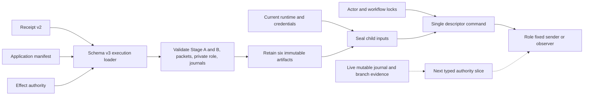
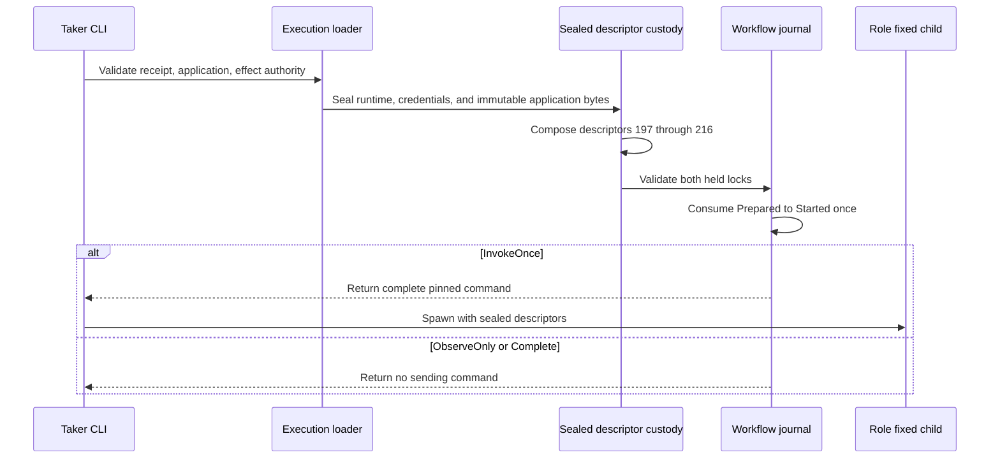

# ADR 0152: Seal XMR application material for effect workers

- Status: Accepted as an M7 semantic-effect prerequisite
- Date: 2026-08-04

## Context

Schema-v3 effect authority already selected one role-fixed sender or observer,
pinned its executable and runtime credentials, held both journals, and consumed
one durable invocation authority. The child received only the runtime,
capability, and Monero credentials on descriptors 200 through 210. A real tag
14, tag 16, or Monero sweep also needs the exact agreement, activation, role
packets, and private role material that the application loader validated.

Passing their named paths in argv would reopen pathname races and expose secret
locations. Passing the provisioning-time role-journal bytes would be worse:
that journal is live branch state and its old snapshot becomes stale as the
protocol progresses.

## Decision

The schema-v3 execution loader retains six immutable artifacts from its existing
semantic validation and seals them into read-only memfds before workflow
authorization. Sender and observer children receive this fixed extension:

| Descriptor | Exact content |
|---:|---|
| 211 | signed Stage-A wire |
| 212 | activated Stage-B wire |
| 213 | local role public packet |
| 214 | peer role public packet |
| 215 | private-role manifest |
| 216 | private Monero view key |

The private manifest and view key remain zeroizing, never appear in argv, env,
serialization, or debug output, and are copied only into sealed kernel-backed
files. ADR 0153 subsequently assigns descriptor 217 to a canonical secret-free
execution plan, never to a stale role-journal snapshot. Mutable role-journal
state and later branch artifacts such as final signatures, finalized
observations, and extracted adaptor scalars require live, typed authorities.

The lower-level effect-authority custody API retains its original 200 through
210 contract. Only a fully validated schema-v3 execution can add 211 through
216, preventing authority-only callers from implying application validation.

## Components

## Invocation flow and atomicity

This change preserves the local effect atomicity boundary: every executable and
input is fixed before the one-attempt CAS, so invalid application material
cannot consume sending authority. The child sees the exact bytes that produced
the workflow identity even if a named source is later replaced. Seals prevent
the child from modifying those inputs. This does not itself make an XMR swap
cross-chain atomic and does not claim a semantic transaction; that still
depends on live finalized-event gates, branch-specific signature/share
material, one-attempt chain submission, and exact reconciliation.

## Consequences

- Sender and observer process tests require descriptors 211 through 216 for
  application material; ADR 0153 extends the command through descriptor 217.
- No Docker, node, public RPC, faucet, public funds, or external network is used
  by this test. It isolates custody ABI behavior from chain flakiness.
- U3, U4, and F9 remain open. The next repository-owned work is a typed live
  journal and branch-artifact plan plus semantic workers that consume this ABI.
