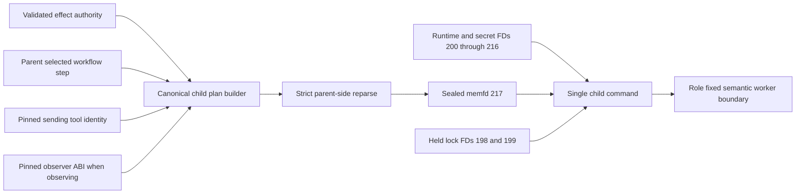
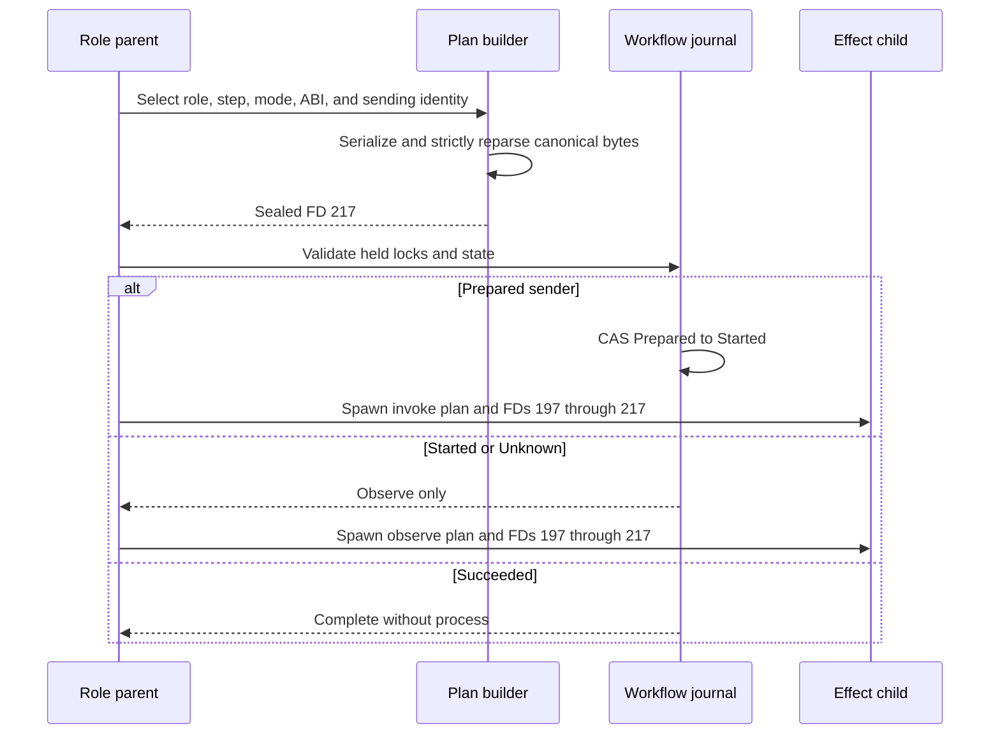

# ADR 0153: Bind the XMR effect child execution plan

- Status: Accepted as an M7 semantic-worker prerequisite
- Date: 2026-08-04

## Context

ADR 0152 gives a role-fixed child the exact immutable application bytes and
keeps all credentials off argv and env. A semantic sender or observer still
needs to know why it was started: role, send-versus-observe authority, workflow
step, run and swap identity, commitments, executable ABI, evidence destination,
live adaptor-journal address, and validated local RPC origins.

Reconstructing those values from ambient environment variables or independent
configuration would allow drift from the authority that selected and
hash-pinned the child. Passing them as many argv fields would create an
unbounded, inspectable process interface.

## Decision

Every schema-v3 sender and observer receives one canonical secret-free JSON plan
on sealed read-only memfd 217. The parent constructs and reparses the plan
before validating locks and consuming workflow authority. The plan binds:

- schema, pair, role, invoke-or-observe mode, and exact workflow step;
- run, swap, Stage-A agreement, and Stage-B activation identities;
- selected executable ABI and the original sending-tool plan SHA-256;
- normalized live adaptor-journal path and owner-private evidence root; and
- validated literal-loopback LEZ sidecar, Monero daemon, funding wallet, shared
  wallet, and role-wallet origins.

Credential paths and values, capability, view key, signing material, and later
branch artifacts are absent. Those values remain on their dedicated sealed
descriptors or future typed authorities. Observer plans name the observer ABI
but retain the sender-plan digest used for exact reconciliation.

The public child loader opens only FD 217 and rejects missing or non-file
descriptors, wrong mode, incomplete seals, oversized or changing bytes,
noncanonical JSON, crossed role/step, invalid labels or identities, unsafe
paths, non-loopback RPCs, and a zero sending identity.

## Components

## Send and observe flow

## Atomicity and security argument

Plan construction, canonical validation, executable pinning, input sealing,
command composition, and lock validation all precede the one-attempt CAS.
Consequently an invalid plan cannot burn Prepared, and a child cannot switch
its role, step, mode, ABI, RPC origin, or sending identity after authorization.
The observer cannot grant itself sending authority; the parent selects its mode
and reconciliation source.

This is process and retry atomicity, not cross-chain completion. The plan names
the locked live journal but does not yet prove that a semantic worker safely
opens and advances it, and it does not supply final signatures, finalized
observations, or extracted adaptor scalars. Actual LEZ/Monero effects and their
conditional atomicity still require those branch authorities and local-node
replay.

## Consequences

- Sender and observer process tests require FDs 197 through 217 and prove 218
  absent. The sender test parses the exact plan and verifies role, mode, step,
  run, ABI, journal, evidence root, RPC origin, and sending digest.
- This contract is network-free and uses no Docker, node, public RPC, faucet,
  public funds, or DNS.
- The next slice can implement one semantic worker against a stable typed
  interface instead of duplicating the effect-authority file format.
