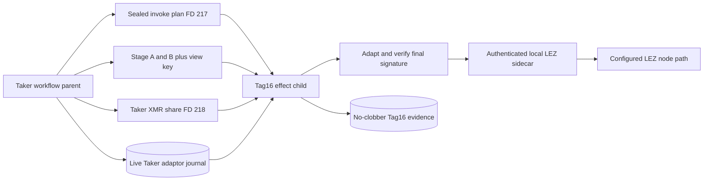
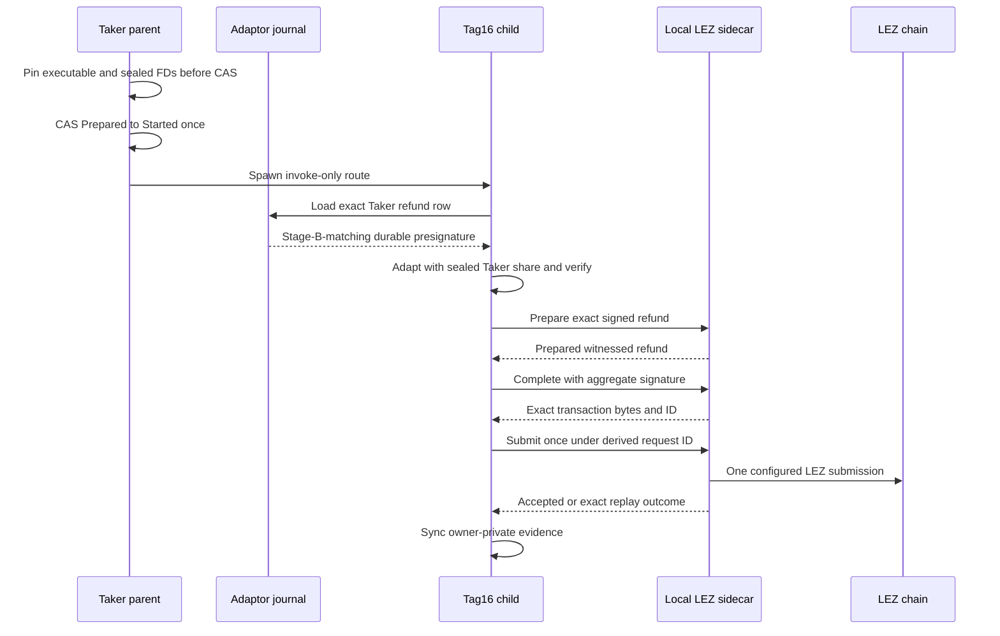

# ADR 0154: Derive Tag16 in the sealed effect child

- Status: Accepted as an M7 semantic-worker checkpoint
- Date: 2026-08-04

## Context

ADRs 0152 and 0153 give a role-fixed effect child immutable application bytes
and one canonical execution plan. The refund route still used a marker. The
real Tag16 program previously accepted mutable file paths and a prebuilt final
signature, so it could not safely consume the parent's sealed descriptor ABI
or prove that its signature came from the live role journal selected by the
workflow.

The capability file factory also cannot read a sealed memfd through
`/proc/self/fd`: its correct on-disk policy requires mode `0600` and link count
one, while the child ABI deliberately supplies a fully sealed mode-`0400`
memfd with link count zero. Weakening the file policy would make ordinary
manual operation less safe.

## Decision

The no-argument `xmr-reference-tag16` mode is the Taker-only semantic effect
child for `refund_lez_tag16`. It accepts no secret in argv or the environment.
It reconstructs and independently checks:

- the invoke-only Taker route, exact step, ABI, run, swap, Stage-A agreement,
  Stage-B activation, live adaptor journal, evidence root, and loopback sidecar
  origin from sealed FD 217;
- the exact runtime, capability, Stage A, Stage B, private view key, and Taker
  Monero spend share from sealed FDs 200, 201, 211, 212, 216, and 218;
- the exact Taker refund-session identity and `PresignatureVerified` live
  journal row; and
- byte equality between the live durable presignature and the presignature
  committed by Stage B.

Only invocation steps that can spend Monero or adapt the LEZ refund receive FD
218. Tag14, every observer, and unrelated children do not. The child adapts the
durable presignature in memory, cryptographically verifies the final signature,
uses deterministic prepare/complete request IDs, and performs one authenticated
prepare, complete, and exact transaction submission. It reserves a no-clobber
owner-private evidence file before the network attempt.

Manual path-based invocation retains the strict mode-`0600`, owner, single-link
capability-file factory. The sealed child instead parses FD 201 once with the
same bounded bearer grammar and constructs one authenticated client directly;
the on-disk policy is not relaxed.

## Components

## Invocation flow

## Atomicity argument

There is no distributed transaction across LEZ and Monero. Atomicity is
conditional on the validated protocol construction and finality assumptions:

1. Stage B commits the refund message, nonce transcript, both partials, and the
   aggregate refund presignature before either chain lock.
2. The Taker alone holds the DLEQ-bound Monero share needed to adapt that
   presignature, and only the Tag16 invoke child receives it.
3. A valid finalized Tag16 signature is the completed form of that exact
   presignature. The Maker, who retained the presignature, can extract the
   Taker share from the observed final signature.
4. Combining the extracted Taker share with the Maker share reconstructs the
   shared Monero spend authority, enabling the Maker recovery sweep after the
   LEZ refund. Thus a successful LEZ refund discloses the information needed
   for the opposite Monero refund; without Tag16 disclosure the Maker cannot
   derive that Taker share.

Process atomicity is narrower. All descriptor, plan, application, journal, and
signature checks occur before RPC use. The parent consumes the one-attempt CAS
before spawn, so an interrupted send remains `Started` or `Unknown` and must be
resolved by read-only finalized observation; it must never be blindly sent
again. A changed journal presignature fails before any sidecar call or evidence
write. No-clobber evidence prevents a later invocation from overwriting the
first attempt's record.

This checkpoint proves the real semantic child against an authenticated local
sidecar double, not actual LEZ finality or the later Maker Monero sweep. The
historical isolated two-devnet refund corridor proves those downstream
conditional steps separately. Literal receipt-v2 CLI composition, pre-CAS
refund-window admission, actual-node replay through this child, Tag17, adverse
reorgs, and independent cryptographic review remain open.

## Verification and resources

The Tag16 process suite is GREEN 4 of 4, including the real sealed child and a
live-journal drift rejection before RPC. The effect-route suite is GREEN 6 of
6 and proves FD 218 reaches only the three sending steps that require it.

These focused tests use temporary owner-private files, sealed memfds, SQLite,
deterministic cryptographic fixtures, and an authenticated in-process loopback
sidecar. They use no Docker service, public RPC, DNS, faucet, public funds,
external node, or deployment. Cold compilation, filesystem sync, crypto work,
and host scheduling are the only expected flakiness sources.
