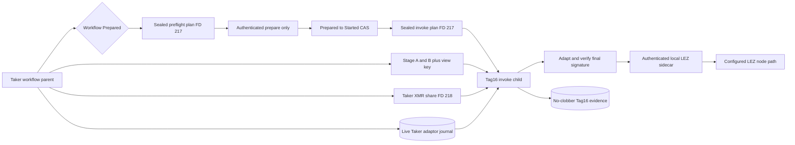
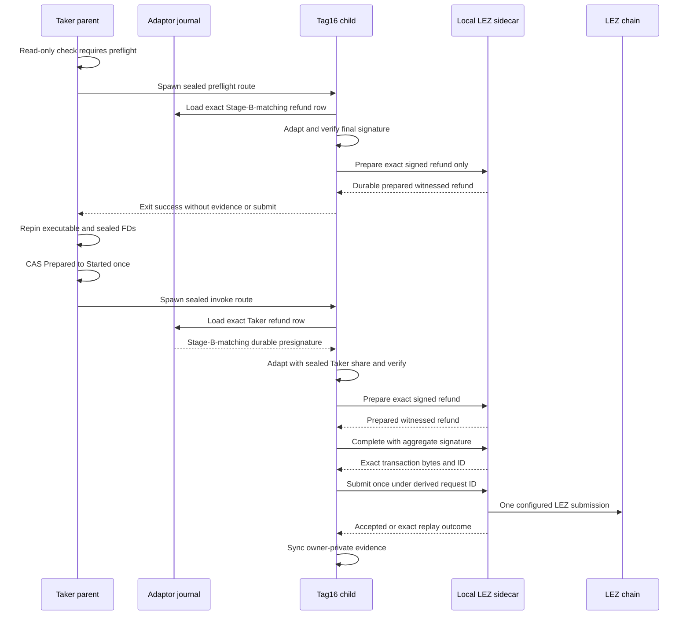

# ADR 0154: Derive Tag16 in the sealed effect child

- Status: Accepted as an M7 semantic-worker checkpoint
- Date: 2026-08-04

## Context

ADRs 0152 and 0153 give a role-fixed effect child immutable application bytes
and one canonical execution plan. The refund route still used a marker. The
real Tag16 program previously accepted mutable file paths and a prebuilt final
signature, so it could not safely consume the parent's sealed descriptor ABI
or prove that its signature came from the live role journal selected by the
workflow.

The capability file factory also cannot read a sealed memfd through
`/proc/self/fd`: its correct on-disk policy requires mode `0600` and link count
one, while the child ABI deliberately supplies a fully sealed mode-`0400`
memfd with link count zero. Weakening the file policy would make ordinary
manual operation less safe.

## Decision

The no-argument `xmr-reference-tag16` modes are the Taker-only semantic effect
children for `refund_lez_tag16`. They accept no secret in argv or the
environment. A read-only workflow check starts `preflight` only while the
step is `Prepared`; after the preflight succeeds, the parent consumes the
one-attempt CAS and starts `invoke`. `Started`, `Unknown`, and `Succeeded`
restart paths never preflight or re-send.
It reconstructs and independently checks:

- the preflight-or-invoke Taker route, exact step, ABI, run, swap, Stage-A
  agreement, Stage-B activation, live adaptor journal, evidence root, and
  loopback sidecar origin from sealed FD 217;
- the exact runtime, capability, Stage A, Stage B, private view key, and Taker
  Monero spend share from sealed FDs 200, 201, 211, 212, 216, and 218;
- the exact Taker refund-session identity and `PresignatureVerified` live
  journal row; and
- byte equality between the live durable presignature and the presignature
  committed by Stage B.

Only Tag16 preflight/invocation and invocation steps that can spend Monero
receive FD 218. Tag14, every observer, and unrelated children do not. Both
Tag16 modes adapt the durable presignature in memory and cryptographically
verify the final signature. Preflight makes only the deterministic,
sidecar-durable prepare call, then exits without reserving evidence, completing,
or submitting. Invoke reserves a no-clobber owner-private evidence file and
performs prepare, complete, and exact transaction submission under deterministic
request identities. The sidecar prepare operation is non-sending and
idempotently returns the exact prepared bytes.

Manual path-based invocation retains the strict mode-`0600`, owner, single-link
capability-file factory. The sealed child instead parses FD 201 once with the
same bounded bearer grammar and constructs one authenticated client directly;
the on-disk policy is not relaxed.

## Components

## Invocation flow

## Atomicity argument

There is no distributed transaction across LEZ and Monero. Atomicity is
conditional on the validated protocol construction and finality assumptions:

1. Stage B commits the refund message, nonce transcript, both partials, and the
   aggregate refund presignature before either chain lock.
2. The Taker alone holds the DLEQ-bound Monero share needed to adapt that
   presignature, and only the Tag16 invoke child receives it.
3. A valid finalized Tag16 signature is the completed form of that exact
   presignature. The Maker, who retained the presignature, can extract the
   Taker share from the observed final signature.
4. Combining the extracted Taker share with the Maker share reconstructs the
   shared Monero spend authority, enabling the Maker recovery sweep after the
   LEZ refund. Thus a successful LEZ refund discloses the information needed
   for the opposite Monero refund; without Tag16 disclosure the Maker cannot
   derive that Taker share.

Process atomicity is narrower. All descriptor, plan, application, journal, and
signature checks occur before RPC use. While the workflow is `Prepared`, a
failed or too-early prepare-only preflight leaves the one-attempt CAS untouched,
so the operator can retry when the refund window opens. A successful preflight
does not imply a send: the parent repins all invocation inputs, consumes the CAS,
and only then starts the sending mode. An interruption after CAS remains
`Started` or `Unknown` and must be resolved by read-only finalized
observation; it must never be blindly sent again. A window or chain-state race
after successful preflight is consequently treated as sending ambiguity rather
than grounds to rearm. A changed journal presignature fails before any sidecar
call or evidence write. No-clobber evidence prevents a later invocation from
overwriting the first attempt's record.

This checkpoint proves the real semantic child against an authenticated local
sidecar double, not actual LEZ finality or the later Maker Monero sweep. The
historical isolated two-devnet refund corridor proves those downstream
conditional steps separately. Literal receipt-v2 CLI composition and pre-CAS
admission are now process-GREEN; actual-node replay through this child, Tag17,
adverse reorgs, and independent cryptographic review remain open.

## Verification and resources

The Tag16 process suite is GREEN 6 of 6, including invoke, successful
prepare-only preflight, rejected preflight, and live-journal drift rejection.
The effect-route suite is GREEN 7 of 7 and proves rejected preflight leaves the
one-attempt CAS available. The literal receipt-v2 refund journey is GREEN 1 of
1 in 106.26 seconds and proves rejected-preflight retry without CAS
consumption, one accepted preflight, one invoke, restart observation,
process-free completion, and losing-branch exclusion.

These focused tests use temporary owner-private files, sealed memfds, SQLite,
deterministic cryptographic fixtures, and an authenticated in-process loopback
sidecar. They use no Docker service, public RPC, DNS, faucet, public funds,
external node, or deployment. Cold compilation, filesystem sync, crypto work,
and host scheduling are the only expected flakiness sources.
