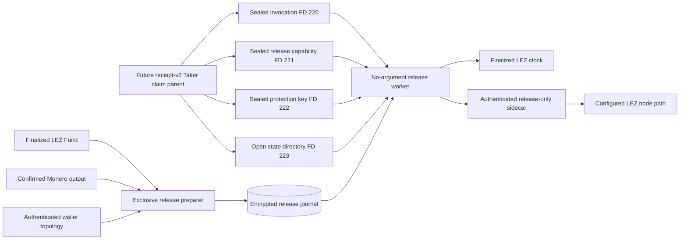
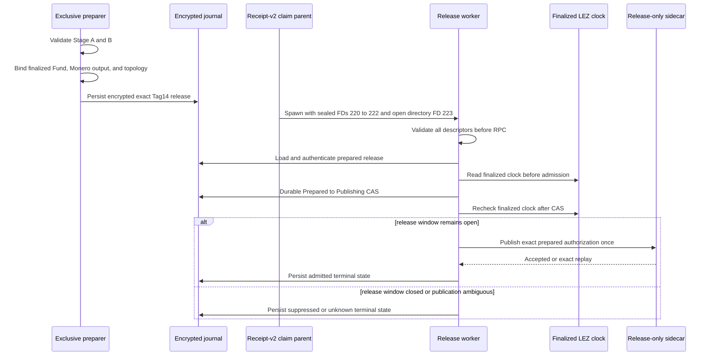

# ADR 0155: Invoke the XMR release worker through sealed descriptors

- Status: Accepted as an M7 Tag14-composition prerequisite
- Date: 2026-08-04

## Context

The receipt-v2 Taker claim route still selects a marker for
`AuthorizeLezTag14`. Replacing that marker with a generic sender would be
unsafe: the role-local workflow predecessor proves only LEZ tag 13, not the
counterparty Monero lock needed before releasing the tag-14 authorization.

The existing v0.2 XMR release path already has the stronger authority. Its
exclusive preparer consumes the validated Stage A/B application, a finalized
LEZ Fund capability, the exact confirmed Monero output, authenticated wallet
topology, and the release-journal protection key. It encrypts the exact release
material in a durable SQLite journal. The release-only service then rechecks
the finalized LEZ clock after its durable publication CAS and never retries an
ambiguous publication.

That service previously accepted mutable paths and secrets through CLI
arguments, so the receipt-v2 sealed-child supervisor could not safely invoke it.

## Decision

The `lez-v0-2-xmr-release-service` binary now has two explicit entry paths:

- the retained manual path-based CLI with its existing owner, mode, link, and
  non-aliasing checks; and
- a no-argument child ABI using fixed, fully sealed Linux memfds.

The no-argument ABI is:

| FD | Bounded content |
|---|---|
| 220 | schema-v1 invocation with public configuration |
| 221 | release-only sidecar capability |
| 222 | lowercase 32-byte release-journal protection key encoded as hex |
| 223 | already-open owner-private release-state directory |

FDs 220 through 222 must be owner-owned, mode-`0400`, unlinked regular
memfds with write, grow, shrink, and further-seal prevention. Their reads are
bounded and length-exact. FD 223 must already reference an owner-owned
mode-`0700` directory; the worker retains that open descriptor and addresses
the journal relative to it, so a pathname rename or replacement cannot redirect
the open. Invocation schema, configuration, directory, capability, and
protection key are validated before the journal is opened or any RPC is used.
Secrets remain zeroizing and never enter argv, environment, reports, or errors.

Both entry paths call one common release routine. The new ABI therefore does
not duplicate or weaken the established finalized-clock, encrypted-journal,
durable-CAS, exact-release, and at-most-once publication semantics.

This decision is a prerequisite only. The receipt-v2 claim route must still
gain a versioned release authority that supplies these three descriptors and
must select this service instead of the marker. Until that composition exists,
semantic Tag14 remains open.

## Components

## Publication flow

## Atomicity argument

Tag14 is safe only when its authorization is released after both prerequisites
are proven: finalized LEZ funding and the exact confirmed Monero lock. The
exclusive preparer binds those facts to the encrypted journal before the
publication worker can act. The worker cannot manufacture or substitute release
bytes; it decrypts the prepared row with the separately supplied protection key
and publishes through a release-only capability.

The post-CAS finalized-clock recheck closes the admission race: if the release
window ends after durable ownership is taken, the service suppresses rather
than publishes. Once publication could have happened, ambiguity is terminal and
never converted into a blind retry. Thus process crashes can reduce liveness
but cannot authorize a second independent release attempt.

The sealed ABI adds custody atomicity at exec: mutable path replacement,
unsealed input, truncation, aliasing through argv, and credential exposure fail
before journal or network use. It does not itself prove actual-chain finality or
compose the receipt-v2 workflow with the release journal.

## Verification and resources

`M4_RELEASE_PROCESS_OFFLINE=1
./scripts/test-m4-xmr-release-worker-process.sh` is GREEN 1 of 1. The proof
rejects a group-writable legacy public configuration and an unsealed protection
key before any indexer or sidecar call. Two fresh no-argument processes then
produce exactly one accepted sidecar publication followed by an observe-only
restart, with redacted output throughout.
The release-store unit suite additionally proves descriptor-relative open
survives renaming the original directory path and rejects empty, relative, and
nested database names.

The test uses in-process authenticated sidecar and finalized-indexer doubles,
temporary owner-private SQLite state, sealed memfds, and deterministic
cryptographic material. It starts no Docker service, LEZ node, Monero node,
wallet RPC, DNS lookup, public RPC, faucet, peer, or funds. It therefore proves
the release-service process boundary, not actual-chain Tag14 finality.
