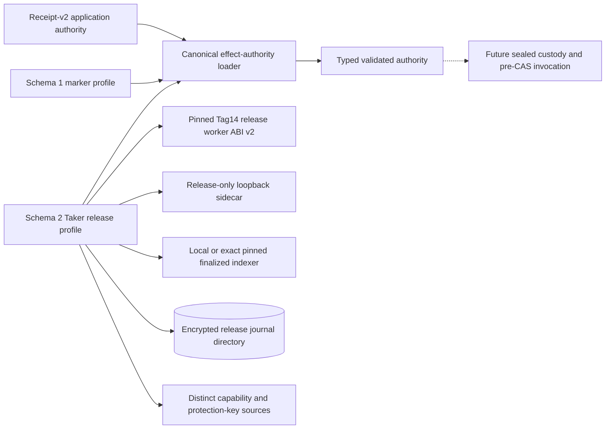
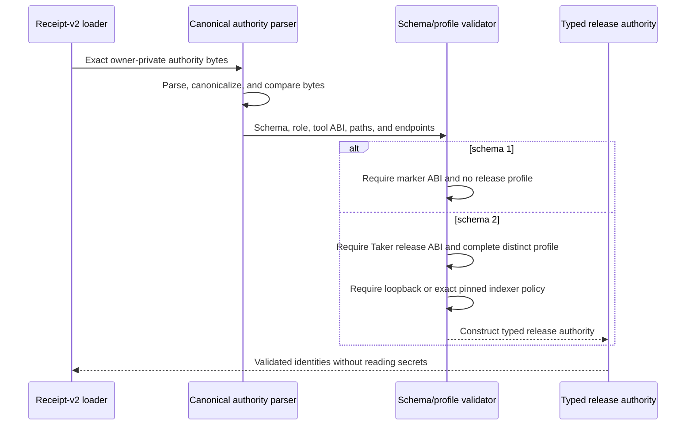

# ADR 0156: Version the Tag14 release authority

- Status: Accepted as an M7 receipt-v2 composition checkpoint
- Date: 2026-08-04

## Context

ADR 0155 makes the established finalized-gated release service safe to invoke
as a sealed child. The receipt-v2 Taker authority still names a schema-v1
`lez_xmr_tag14_authorize_v1` marker, however. Reinterpreting that existing
schema or ABI would let old receipts appear to authorize a semantic release
without binding the encrypted journal, release-only capability, protection
key, finalized indexer, or dedicated sidecar.

## Decision

Effect-authority schema 1 remains byte-for-byte compatible with the marker ABI
and must not contain release authority. A Taker may instead use schema 2, which
requires all of the following together:

- the `lez_xmr_tag14_release_v2` tool ABI;
- a distinct release-only literal-loopback sidecar;
- a local literal-loopback finalized indexer or the exact pinned
  `https://testnet.lez.logos.co/` origin;
- an owner-private encrypted-release-journal directory;
- distinct release-only capability and journal-protection-key files; and
- a bounded protection-key rotation identifier.

Schema 2 is Taker-only. Missing release fields, schema-1 fields combined with a
release profile, the legacy ABI under schema 2, public local endpoints, path
aliasing, release secrets inside the journal directory, and a changed official
origin fail during canonical authority validation.

The public validated type exposes the selected schema and a typed,
non-secret-bearing release profile. It does not read release secrets, open the
journal, invoke the worker, or consume workflow authority in this checkpoint.

## Components

## Validation flow

## Atomicity argument

This checkpoint does not add a chain effect. It strengthens authorization
atomicity by making semantic Tag14 authority all-or-none: the worker identity,
release-only transport, finalized-clock source, encrypted journal location,
and protection-key identity cross the canonical validation boundary as one
versioned object. An old marker receipt cannot be reinterpreted as that object,
and a schema-v2 authority cannot omit one prerequisite or reuse the general
sidecar capability.

Conditional cross-chain atomicity still comes from the release journal prepared
from finalized LEZ Fund plus the exact confirmed Monero output, as described by
ADR 0155. Sealed at-use custody, release-worker preflight, workflow CAS,
finalized Tag14 observation, and actual-node replay remain subsequent steps.

## Verification and resources

The focused Taker authority suite is GREEN 8 of 8. It covers schema-v1
compatibility, the valid local schema-v2 profile, exact pinned-public indexer
portability, missing/downgraded profiles, public-local endpoint rejection,
general/release capability alias rejection, tool drift, at-use executable
pinning, secret/runtime custody, descriptor composition, and filesystem alias
hardening. The full XMR reference-actor suite remains GREEN.

These tests read temporary owner-private files and use deterministic JSON and
hash fixtures. They start no Docker service, LEZ or Monero node, RPC listener,
DNS lookup, public request, faucet, peer, or funds.
